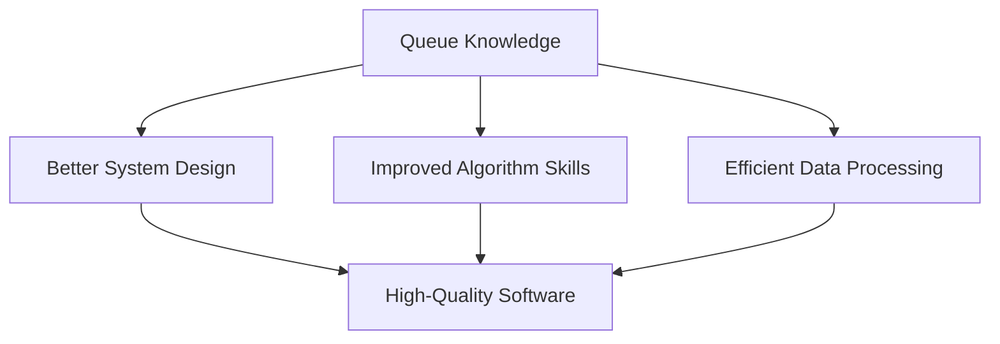

# 🎓 Queue Algorithm Mastery - Conclusion

Congratulations on completing this in-depth exploration of the queue data structure! Let's summarize what we've learned and reflect on how this knowledge will help you in your programming journey.

## 🔑 Key Concepts Reviewed

Throughout this lesson, we've covered:

1. **Queue Fundamentals**
   - The FIFO (First-In-First-Out) principle
   - Core operations: enqueue, dequeue, peek
   - Helper methods: isEmpty, isFull, size

2. **Implementation Approaches**
   - Array-based queues with circular logic
   - Linked list-based queues with dynamic memory
   - Tradeoffs between different implementations

3. **Real-World Applications**
   - Process scheduling
   - Web request handling
   - Message brokers
   - Data processing pipelines
   - And many more practical use cases

4. **Common Challenges**
   - Edge case handling
   - Performance optimizations
   - Architectural decisions

## 💪 Why Queues Matter

Queues are more than just a theoretical concept—they're a practical tool you'll use throughout your programming career:

> [!NOTE]
> Understanding queues deeply helps you build systems that are efficient, robust, and correctly ordered. The FIFO principle applies to countless scenarios in software development.

## 🧠 Mental Models for Queue Problems

When you encounter a problem that might need a queue, ask yourself:

1. **Does order matter?** If processing items in arrival order is important, a queue is likely appropriate.
2. **Do producers and consumers work at different rates?** Queues help balance uneven processing speeds.
3. **Do you need to manage resources?** Queues help control access to limited resources.

## 📈 Next Steps for Queue Mastery

To deepen your understanding of queues, consider these next steps:

1. **Implement specialized queue variations**
   - Priority queues
   - Double-ended queues (deques)
   - Blocking queues

2. **Apply queues to solve algorithmic problems**
   - Breadth-first search
   - Level-order tree traversal
   - Task scheduling problems

3. **Explore queue implementations in different languages and frameworks**
   - Study professional queue implementations
   - Understand how thread-safe queues work
   - Explore message queue systems like RabbitMQ, Kafka, etc.

## 🔄 Connecting Queues to Other Data Structures

Queues don't exist in isolation. They relate to other important data structures:

- **Stacks**: The "opposite" of queues (LIFO vs FIFO)
- **Lists**: The foundation for queue implementations
- **Trees**: Queues help with level-order traversal
- **Graphs**: Essential for breadth-first search

🧩 The Complete Data Structure Picture

Queues fit into a larger ecosystem of data structures, each with their own strengths:

| Data Structure | Order | Access Pattern | Best For |
|---------------|-------|----------------|----------|
| Array | Indexed | Random access | Known size, frequent access by index |
| Linked List | Sequential | Sequential access | Dynamic size, frequent inserts/deletes |
| Stack | LIFO | Last element only | Tracking state, parsing, backtracking |
| **Queue** | **FIFO** | **First element only** | **Ordering, buffering, BFS** |
| Tree | Hierarchical | Parent/child access | Representing hierarchies, searching |
| Graph | Network | Node/edge access | Relationships between items |
| Hash Table | Key-based | Key access | Fast lookups, caching |

Understanding when to use each data structure is a crucial skill for any programmer.

## 🌟 Final Thoughts

The queue is a beautifully simple data structure with profound implications. Its philosophy of "first come, first served" mirrors many fair systems in the real world, and its efficient implementation makes it a workhorse in countless applications.

> [!TIP]
> As you work with queues in your own code, remember that the implementation details matter. Choose the right approach based on your specific requirements, and always handle edge cases carefully.

Remember this journey doesn't end here. Each time you implement a queue or use one in a new context, you'll gain deeper insights into this fundamental data structure.

Happy coding! 🚀 