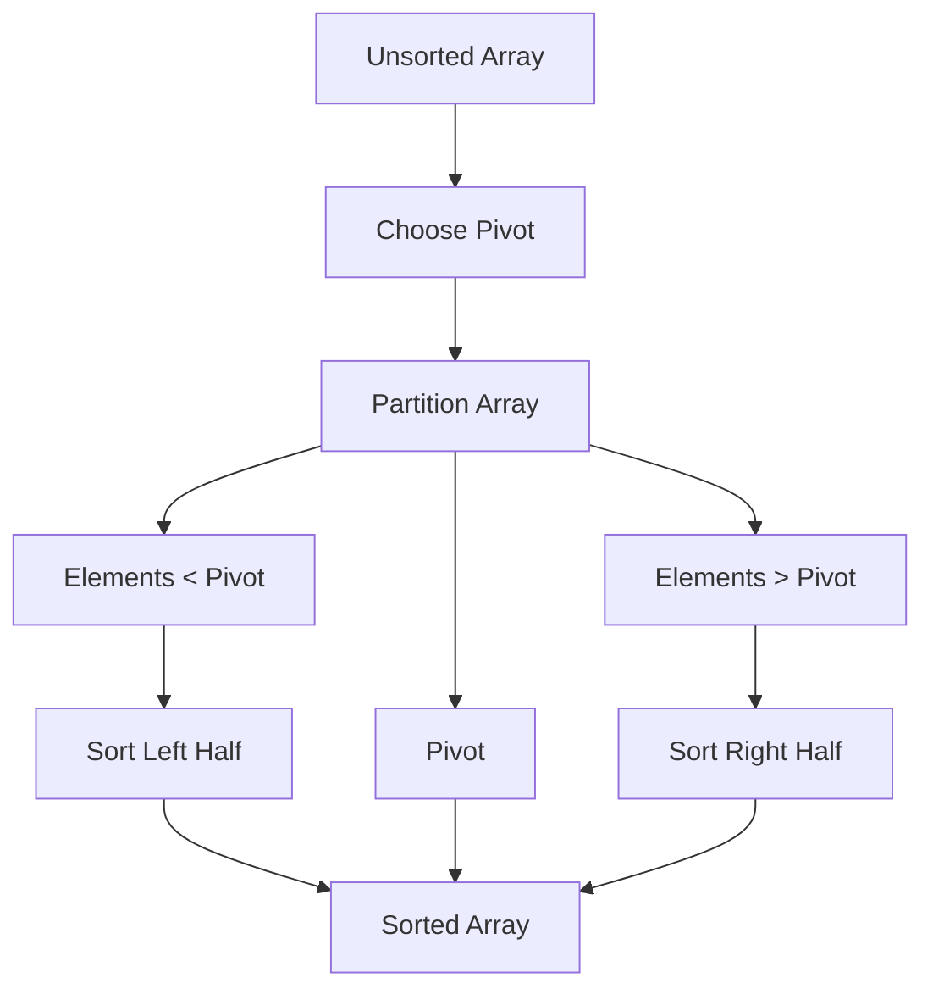

# Divide and Conquer: Tackling Complexity 🧠

> [!NOTE]
> In this lesson, we'll explore the powerful "divide and conquer" strategy that makes Quick Sort so efficient.

## The Big Idea 💡

Have you ever faced a challenge that seemed overwhelming? What if you could break it down into smaller, more manageable pieces?

That's exactly what **divide and conquer** does in algorithms:

1. **Divide**: Break the problem into smaller sub-problems
2. **Conquer**: Solve the sub-problems recursively
3. **Combine**: Merge the solutions to get the answer to the original problem

## Real-World Analogy 🌍

Click for a relatable analogy

Imagine cleaning a messy house with friends:

- **Divide**: Each person takes one room to clean
- **Conquer**: Everyone cleans their assigned room
- **Combine**: When everyone finishes, the whole house is clean!

This is much faster than one person cleaning everything sequentially.

## How Quick Sort Uses Divide and Conquer 🧩

Quick Sort applies this strategy to sorting:

1. **Divide**: Pick an element (called a "pivot") and partition the array into two sub-arrays:
   - Elements less than the pivot
   - Elements greater than the pivot

2. **Conquer**: Recursively sort both sub-arrays

3. **Combine**: Since the elements are sorted in-place around the pivot, no explicit "combine" step is needed!

## Why This Works So Well ✨

The beauty of this approach is that once the pivot is in its correct position, it never needs to be moved again!

> [!TIP]
> Think of it like finding the right spot for one card in a deck. Once it's in its proper place, you can focus on sorting the cards before and after it separately.

Each recursive partition makes the problem space smaller, leading to an overall efficient algorithm.

## The Power of Recursion 🔄

Quick Sort relies on solving the same problem (sorting) on smaller inputs (subarrays).

This is recursion in action - a function that calls itself with a simpler version of the original problem.

How does recursion fit with divide and conquer?

Recursion is the perfect tool for divide and conquer because:

1. It naturally expresses the "solve smaller versions of the same problem" pattern
2. It keeps track of all the sub-problems automatically through the call stack
3. It allows us to focus on solving one level of the problem at a time

## Reflection Question 🤔

Before moving on, consider:

Why might dividing a sorting problem into two smaller sorting problems be more efficient than tackling the entire array at once?

In the next lesson, we'll explore the critical concept of "pivoting" - the heart of the Quick Sort algorithm. 