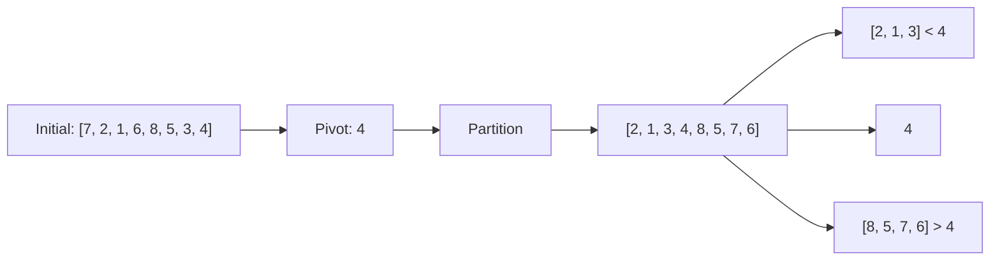

# The Power of the Pivot 🔄

> [!NOTE]
> In this lesson, we'll explore the crucial concept of the "pivot" element in Quick Sort and how it enables efficient partitioning.

## What Is a Pivot? 🎯

The **pivot** is a special element from the array that serves as a dividing point. It's the foundation of Quick Sort's divide-and-conquer approach.

The goal is to position the pivot such that:
- All elements to its left are less than the pivot
- All elements to its right are greater than the pivot

Once placed in this "final position," the pivot is exactly where it would be in the fully sorted array!

## Choosing a Pivot 🤔

The choice of pivot can significantly impact the efficiency of Quick Sort:

| Pivot Selection | Advantages | Disadvantages |
|-----------------|------------|---------------|
| First element | Simple implementation | Poor performance on already sorted arrays |
| Last element | Simple implementation | Poor performance on already sorted arrays |
| Middle element | Better for partially sorted data | Slightly more complex |
| Random element | Avoids worst-case scenarios | Requires random number generation |
| "Median-of-three" | Best average performance | Most complex implementation |

> [!WARNING]
> A poor pivot choice can reduce Quick Sort's performance from O(n log n) to O(n²) in the worst case!

## Real-World Analogy 🌍

Click for a helpful comparison

Think of the pivot like a dividing point on a measuring scale:

If you want to find where "5" belongs on a number line, you place it at position 5, then everything less than 5 goes to the left, and everything greater goes to the right.

Now both sides are separate problems that can be solved independently!

## Visualizing Pivot Selection and Partitioning

Let's see a simple example with the array: `[7, 2, 1, 6, 8, 5, 3, 4]`

If we choose the last element (`4`) as our pivot:

After partitioning, `4` is in its final sorted position!

## The Impact of Pivot Choice ⚖️

Example: Good vs. Poor Pivot Selection

Consider sorting: `[1, 2, 3, 4, 5, 6, 7, 8]`

- **Poor Choice:** Using the first element `1` as pivot
  - Partitioning results in: `[]` and `[2, 3, 4, 5, 6, 7, 8]`
  - Very unbalanced! We've only sorted one element

- **Good Choice:** Using the middle element `4` as pivot
  - Partitioning results in: `[1, 2, 3]` and `[5, 6, 7, 8]`
  - Much more balanced, leading to better performance

> [!TIP]
> A good pivot divides the array into roughly equal parts, maximizing the efficiency of the divide-and-conquer approach.

## Think About It 💭

If you were implementing Quick Sort, which pivot selection strategy would you choose and why?

Consider the trade-off between implementation complexity and performance guarantees.

In our next lesson, we'll dive into the most critical operation in Quick Sort: the partitioning process. 