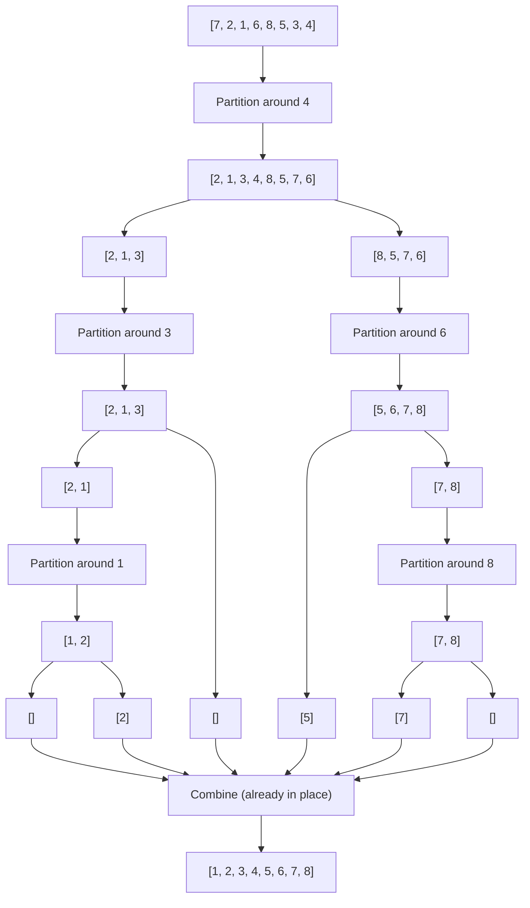

# The Recursive Quick Sort Algorithm 🔄

> [!NOTE]
> In this lesson, we'll put together everything we've learned to implement the complete Quick Sort algorithm using recursion.

## Putting It All Together 🧩

Now that we understand pivoting and partitioning, we can implement the complete Quick Sort algorithm:

1. If the array has 0 or 1 elements, it's already sorted (base case)
2. Otherwise:
   - Choose a pivot element
   - Partition the array around the pivot
   - Recursively sort the left subarray (elements less than pivot)
   - Recursively sort the right subarray (elements greater than pivot)

## Visualizing the Complete Process 📊

Let's trace through the entire Quick Sort process with our example: `[7, 2, 1, 6, 8, 5, 3, 4]`



## The Recursive Quick Sort Code 💻

Here's the complete implementation in JavaScript:

```javascript
function quickSort(nums) {
  // Create a copy to avoid mutating the original array
  const arr = [...nums];
  
  // Call the helper function with initial bounds
  quickSortHelper(arr, 0, arr.length - 1);
  
  return arr;
}

function quickSortHelper(arr, low, high) {
  // Base case: If the partition has 0 or 1 elements, it's already sorted
  if (low < high) {
    // Partition the array and get the pivot index
    const pivotIndex = partition(arr, low, high);
    
    // Recursively sort the left subarray
    quickSortHelper(arr, low, pivotIndex - 1);
    
    // Recursively sort the right subarray
    quickSortHelper(arr, pivotIndex + 1, high);
  }
}

function partition(arr, low, high) {
  const pivot = arr[high]; // Using last element as pivot
  let i = low;             // Index of smaller element
  
  for (let j = low; j < high; j++) {
    // If current element is smaller than the pivot
    if (arr[j] < pivot) {
      // Swap arr[i] and arr[j]
      [arr[i], arr[j]] = [arr[j], arr[i]];
      i++;
    }
  }
  
  // Swap arr[i] and arr[high] (put the pivot in its final position)
  [arr[i], arr[high]] = [arr[high], arr[i]];
  return i; // Return the pivot's index
}
```

## Understanding the Recursion 🧠

<details>
<summary>Click to explore the recursive nature of Quick Sort</summary>

The recursive structure of Quick Sort might seem complex, but it follows a simple pattern:

1. Each recursive call works on a smaller subarray
2. The base case (arrays of size 0 or 1) stops the recursion
3. As the recursion unwinds, the array becomes fully sorted

Think of it like a tree of tasks, where each branch handles a smaller and smaller portion of the array until everything is sorted!
</details>

## The Base Case ⛔

Every recursive algorithm needs a base case to prevent infinite recursion. For Quick Sort, the base case is when the subarray has 0 or 1 elements.

Why? Because an array with a single element is already sorted! There's nothing to do.

This is represented by the condition `if (low < high)` - if this is false, it means the subarray has 0 or 1 elements.

## The Space Complexity of Recursion 📚

<details>
<summary>Click to understand space usage in recursive Quick Sort</summary>

Each recursive call adds a new frame to the call stack, requiring space to store local variables and return addresses.

In the best case (balanced partitions), the maximum recursion depth is log₂n, giving O(log n) space complexity.

In the worst case (highly unbalanced partitions), the recursion depth could be n, leading to O(n) space complexity.
</details>

> [!TIP]
> If you're concerned about recursion depth (especially for large arrays), an iterative version using an explicit stack can be implemented.

## Try It Yourself 🎯

By hand, trace through the quick sort algorithm for the array: `[5, 3, 7, 6, 2, 9]`

In the next lesson, we'll look at an alternative iterative implementation that achieves the same results without using recursion. 