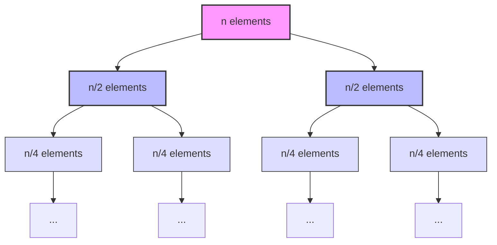
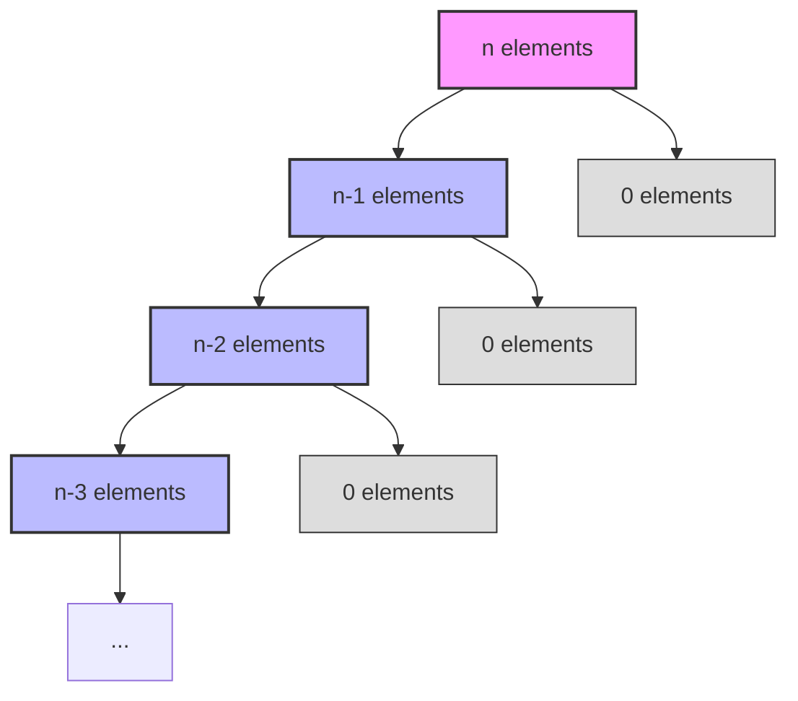

# Understanding Quick Sort's Efficiency 📊

> [!NOTE]
> In this lesson, we'll analyze the time and space complexity of Quick Sort and compare it with other popular sorting algorithms.

## Time Complexity Analysis 🕒

Quick Sort's time complexity varies depending on the choice of pivot and the input data distribution:

### Best Case: O(n log n) ✨

The best case occurs when each partition divides the array into roughly equal halves:

- Each partition takes O(n) time
- We need log(n) levels of recursion for balanced partitioning
- Total: O(n log n)

### Average Case: O(n log n) 📈

Even with somewhat unbalanced partitions, Quick Sort maintains O(n log n) performance on average.

### Worst Case: O(n²) ⚠️

The worst case occurs when:
- The pivot is always the smallest or largest element
- This creates extremely unbalanced partitions (one empty, one with n-1 elements)
- Happens with already sorted arrays if first/last element is chosen as pivot

Why is worst case O(n²)?

In the worst case:
- First partition: process n elements
- Second partition: process n-1 elements
- Third partition: process n-2 elements
- ...and so on

This forms an arithmetic series: n + (n-1) + (n-2) + ... + 2 + 1 = n(n+1)/2
Which simplifies to O(n²)

## Space Complexity Analysis 📦

Quick Sort's space complexity comes from:
1. The recursion call stack
2. Any temporary variables

### Best/Average Case: O(log n) 🌲

In balanced partitioning, the recursion depth is log(n).

### Worst Case: O(n) 📏

In extremely unbalanced partitioning, the recursion depth can reach n.

## Quick Sort vs. Other Sorting Algorithms ⚖️

| Algorithm | Time (Best) | Time (Average) | Time (Worst) | Space | Stability |
|-----------|-------------|----------------|--------------|-------|-----------|
| **Quick Sort** | O(n log n) | O(n log n) | O(n²) | O(log n) | Unstable |
| Merge Sort | O(n log n) | O(n log n) | O(n log n) | O(n) | Stable |
| Heap Sort | O(n log n) | O(n log n) | O(n log n) | O(1) | Unstable |
| Bubble Sort | O(n) | O(n²) | O(n²) | O(1) | Stable |
| Insertion Sort | O(n) | O(n²) | O(n²) | O(1) | Stable |

> [!TIP]
> **Stability** means that equal elements maintain their relative order after sorting. Quick Sort is naturally unstable, though it can be modified to become stable with additional overhead.

## When to Choose Quick Sort 🎯

**Choose Quick Sort when:**
- Average-case performance is important
- In-place sorting is required (minimal extra memory)
- Worst-case scenarios are rare or can be avoided

**Consider alternatives when:**
- Guaranteed O(n log n) worst-case is required (use Merge Sort)
- Stability is important (use Merge Sort)
- Working with nearly-sorted data (use Insertion Sort)
- Memory is extremely limited (use Heap Sort)

## Optimizing Quick Sort 🚀

Common Quick Sort optimizations

1. **Median-of-three pivot selection:** Choose the median of the first, middle, and last elements as the pivot
2. **Switch to Insertion Sort for small subarrays:** Quick Sort has overhead that makes it less efficient for very small arrays
3. **Tail recursion elimination:** Only recurse on the smaller partition and iterate on the larger one
4. **Three-way partitioning:** Handle duplicates efficiently by creating three partitions (less than, equal to, and greater than)

## Real-World Performance 🌐

Despite its O(n²) worst-case, Quick Sort is often faster in practice than other O(n log n) algorithms because:

1. It has good **cache locality**
2. Its inner loop is very **efficient**
3. It has lower **constant factors** in its operations
4. It sorts **in-place**, reducing memory overhead

This is why many programming languages use Quick Sort (or variants) in their standard libraries!

In the next lesson, we'll explore advanced variants of Quick Sort that address some of its limitations. 