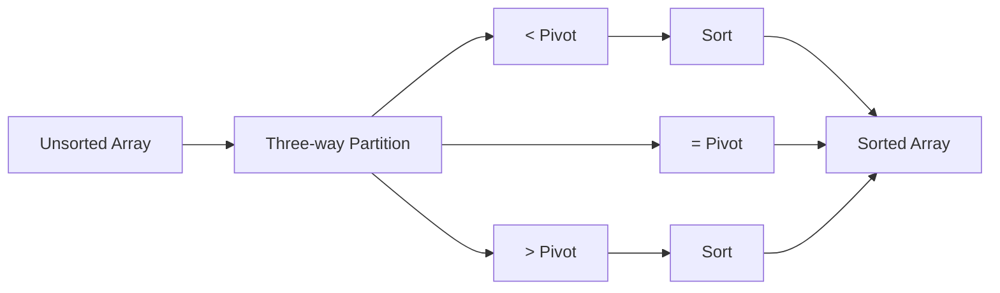
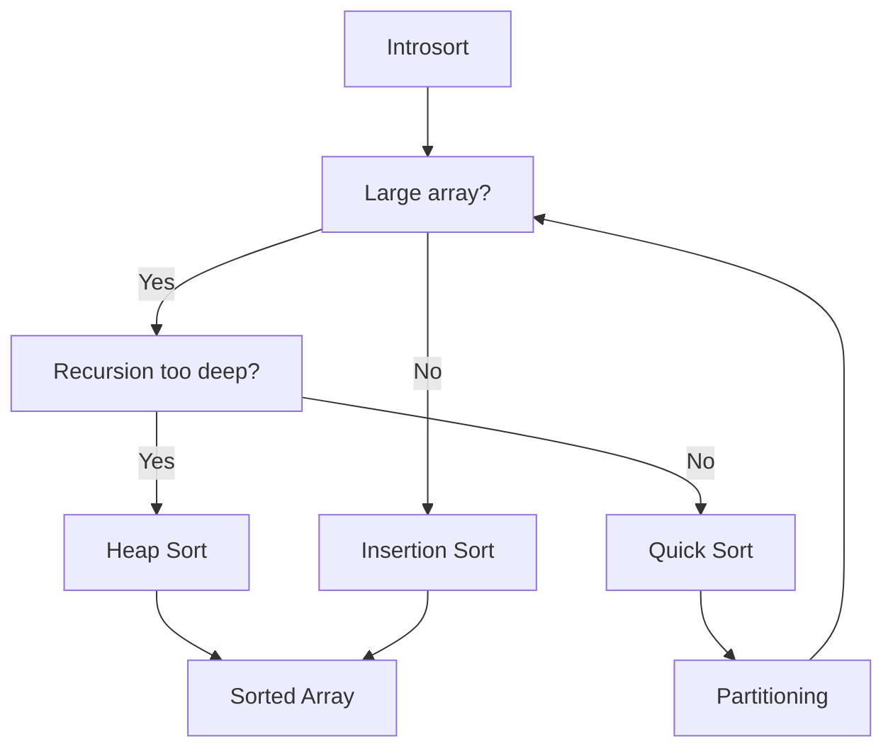

# Advanced Quick Sort: Variants and Optimizations 🚀

> [!NOTE]
> In this lesson, we'll explore advanced variations of Quick Sort that address its limitations and provide further optimizations.

## Beyond Basic Quick Sort 🌟

While the classic Quick Sort algorithm is powerful, several variants have been developed to:
- Improve worst-case performance
- Handle duplicates more efficiently
- Reduce memory usage
- Increase speed

Let's explore the most important variants:

## Randomized Quick Sort 🎲

One of Quick Sort's vulnerabilities is its poor performance on already-sorted data. **Randomized Quick Sort** addresses this:

```javascript
function randomizedPartition(arr, low, high) {
  // Generate a random index between low and high (inclusive)
  const randomIndex = Math.floor(Math.random() * (high - low + 1)) + low;
  
  // Swap random element with the high element
  [arr[randomIndex], arr[high]] = [arr[high], arr[randomIndex]];
  
  // Proceed with standard partition
  return partition(arr, low, high);
}
```

> [!TIP]
> Randomized pivot selection makes the worst-case O(n²) extremely unlikely, effectively making Quick Sort's performance O(n log n) with high probability, regardless of input.

## Three-Way Quick Sort (Dutch National Flag) 🚩

Standard Quick Sort doesn't handle duplicate elements efficiently. **Three-Way Quick Sort** creates three partitions:
- Elements less than the pivot
- Elements equal to the pivot
- Elements greater than the pivot



### Implementation:

```javascript
function threeWayQuickSort(arr, low, high) {
  if (low >= high) return;
  
  let lt = low;      // Elements < pivot go before this index
  let gt = high;     // Elements > pivot go after this index
  let i = low + 1;   // Current element being examined
  const pivot = arr[low];
  
  while (i <= gt) {
    if (arr[i] < pivot) {
      [arr[lt], arr[i]] = [arr[i], arr[lt]];
      lt++;
      i++;
    } else if (arr[i] > pivot) {
      [arr[i], arr[gt]] = [arr[gt], arr[i]];
      gt--;
    } else { // arr[i] == pivot
      i++;
    }
  }
  
  // Recursively sort the partitions
  threeWayQuickSort(arr, low, lt - 1);
  threeWayQuickSort(arr, gt + 1, high);
}
```

> [!WARNING]
> Three-way partitioning significantly improves performance when there are many duplicate elements, reducing the time complexity from O(n²) to O(n) in the extreme case where all elements are identical!

## Dual-Pivot Quick Sort 🔀

**Dual-Pivot Quick Sort** uses two pivots instead of one, creating three ranges:
- Elements less than the first pivot
- Elements between the first and second pivot
- Elements greater than the second pivot

This variant often performs fewer comparisons than the standard approach.

<details>
<summary>Show Dual-Pivot Implementation</summary>

```javascript
function dualPivotQuickSort(arr, low, high) {
  if (low < high) {
    if (arr[low] > arr[high]) {
      [arr[low], arr[high]] = [arr[high], arr[low]];
    }
    
    // p and q are the pivots
    const p = arr[low];
    const q = arr[high];
    
    let l = low + 1;   // Index for elements < p
    let k = low + 1;   // Current scanning index
    let g = high - 1;  // Index for elements > q
    
    while (k <= g) {
      if (arr[k] < p) {
        [arr[k], arr[l]] = [arr[l], arr[k]];
        l++;
      } else if (arr[k] >= q) {
        while (arr[g] > q && k < g) {
          g--;
        }
        [arr[k], arr[g]] = [arr[g], arr[k]];
        g--;
        
        if (arr[k] < p) {
          [arr[k], arr[l]] = [arr[l], arr[k]];
          l++;
        }
      }
      k++;
    }
    
    l--;
    g++;
    
    [arr[low], arr[l]] = [arr[l], arr[low]];
    [arr[high], arr[g]] = [arr[g], arr[high]];
    
    // Recursively sort the three partitions
    dualPivotQuickSort(arr, low, l - 1);
    dualPivotQuickSort(arr, l + 1, g - 1);
    dualPivotQuickSort(arr, g + 1, high);
  }
}
```
</details>

> [!NOTE]
> Java's `Arrays.sort()` method uses a Dual-Pivot Quick Sort implementation since Java 7, showing its practical efficiency.

## Hybrid Approaches 🔄

### Introsort (Introspective Sort)

**Introsort** combines Quick Sort, Heap Sort, and Insertion Sort:
1. Start with Quick Sort
2. Monitor recursion depth
3. Switch to Heap Sort if depth exceeds a threshold (avoiding Quick Sort's worst-case)
4. Use Insertion Sort for small subarrays



> [!TIP]
> Introsort provides the best of all worlds: Quick Sort's average-case efficiency, Heap Sort's worst-case guarantees, and Insertion Sort's performance on small arrays. C++'s `std::sort` uses Introsort!

## Practical Optimizations 💯

### 1. Insertion Sort for Small Arrays

When subarrays become small (typically under 10-20 elements), switch to Insertion Sort:

```javascript
function optimizedQuickSort(arr, low, high) {
  while (low < high) {
    if (high - low < 10) { // Small array threshold
      insertionSort(arr, low, high);
      break;
    } else {
      const p = partition(arr, low, high);
      
      // Recurse on smaller subarray, iterate on larger
      if (p - low < high - p) {
        optimizedQuickSort(arr, low, p - 1);
        low = p + 1;
      } else {
        optimizedQuickSort(arr, p + 1, high);
        high = p - 1;
      }
    }
  }
}
```

### 2. Median-of-Three Pivot Selection

Choose the median of the first, middle, and last elements as the pivot:

```javascript
function medianOfThreePivot(arr, low, high) {
  const mid = Math.floor((low + high) / 2);
  
  // Sort low, mid, high elements
  if (arr[mid] < arr[low]) 
    [arr[low], arr[mid]] = [arr[mid], arr[low]];
  if (arr[high] < arr[low]) 
    [arr[low], arr[high]] = [arr[high], arr[low]];
  if (arr[high] < arr[mid]) 
    [arr[mid], arr[high]] = [arr[high], arr[mid]];
  
  // Place the pivot (median) at high-1
  [arr[mid], arr[high-1]] = [arr[high-1], arr[mid]];
  return arr[high-1];
}
```

### 3. Tail Call Elimination

Optimize the recursion by only making recursive calls on the smaller partition:

```javascript
function tailRecursiveQuickSort(arr, low, high) {
  while (low < high) {
    const p = partition(arr, low, high);
    
    // Recursively sort the smaller partition
    if (p - low < high - p) {
      tailRecursiveQuickSort(arr, low, p - 1);
      low = p + 1; // Iterate on the larger partition
    } else {
      tailRecursiveQuickSort(arr, p + 1, high);
      high = p - 1; // Iterate on the larger partition
    }
  }
}
```

## Choosing the Right Variant 🤔

<details open>
<summary>Quick reference for choosing variants</summary>

| Scenario | Recommended Variant |
|----------|---------------------|
| General purpose use | Randomized Quick Sort |
| Many duplicate elements | Three-Way Quick Sort |
| Need worst-case guarantees | Introsort |
| Standard library implementation | Dual-Pivot or Introsort |
| Small datasets | Quick Sort + Insertion Sort hybrid |
| Educational purposes | Classic Quick Sort |

</details>

## Beyond the Algorithm: System Considerations 🖥️

In real-world implementations, consider:

1. **Cache efficiency** - Designing algorithms to be cache-friendly
2. **Parallel processing** - Multi-threaded Quick Sort for very large arrays
3. **Memory hierarchy** - Optimizing for CPU caches and memory access patterns
4. **Hardware specifics** - SIMD instructions, branch prediction, etc.

> [!TIP]
> Don't prematurely optimize! Start with a clean implementation of Randomized Quick Sort, and only add complexity if profiling shows it's necessary.

In our final lesson, we'll explore real-world applications and practical considerations when using Quick Sort. 