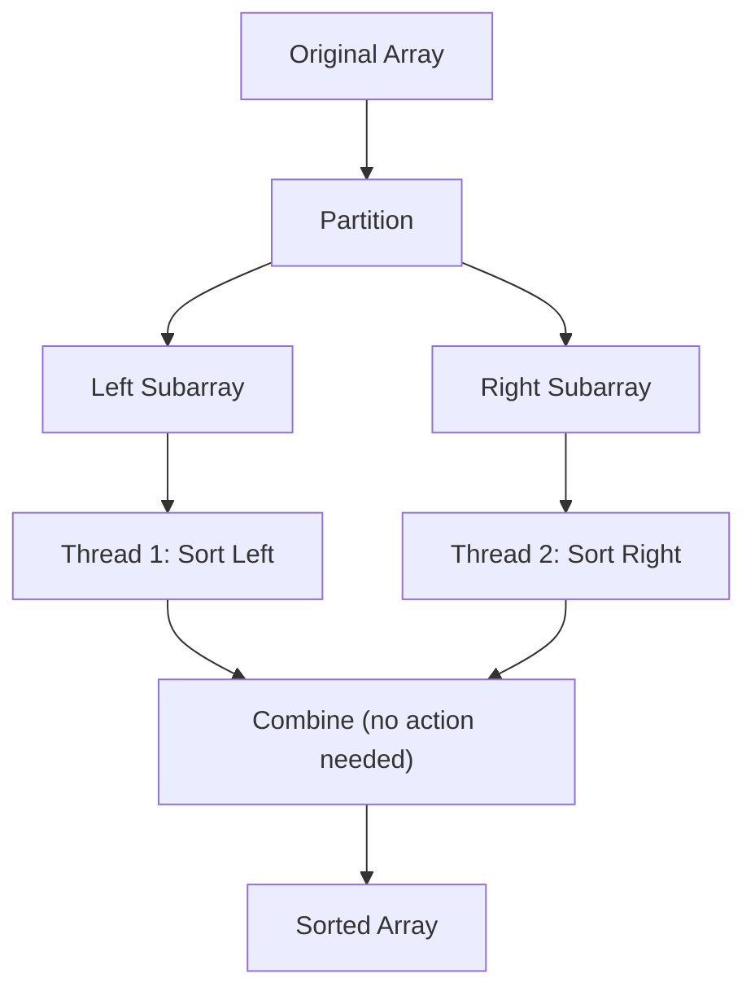

# Quick Sort in the Real World 🌐

> [!NOTE]
> In this lesson, we'll explore how Quick Sort is used in real-world applications and practical considerations when implementing it for production use.

## Quick Sort in Programming Languages 💻

Many programming language standard libraries implement Quick Sort (or its variants) for their sorting functions:

| Language | Sorting Implementation |
|----------|------------------------|
| Java | Dual-Pivot Quick Sort (since Java 7) |
| C++ | Introsort (combination of Quick Sort, Heap Sort, and Insertion Sort) |
| Python | Timsort (hybrid of Merge Sort and Insertion Sort) |
| JavaScript | Engine-dependent (V8 uses a Quick Sort variant) |
| C# | Introspective Sort (similar to C++'s Introsort) |
| Swift | Introsort |
| Rust | Dual-Pivot Quick Sort |

> [!TIP]
> When working with large datasets, it's often better to use your language's built-in sorting function rather than implementing Quick Sort yourself. These implementations have been extensively optimized and battle-tested.

## Real-World Applications 🏢

Quick Sort and its principles are used in various domains:

### 1. Database Systems 📊

Databases use sorting algorithms like Quick Sort for:
- Organizing records for efficient retrieval
- Index creation and maintenance
- Query optimization (ORDER BY operations)
- Join operations

### 2. Operating Systems 🖥️

Operating systems apply sorting in:
- File system organization
- Process scheduling
- Memory management
- Resource allocation

### 3. Graphics and Gaming 🎮

Sorting is essential in:
- Rendering pipelines (z-buffer sorting)
- Collision detection optimizations
- Spatial partitioning
- View frustum culling

### 4. Machine Learning 🤖

ML applications use sorting for:
- Feature selection
- K-nearest neighbors algorithms
- Decision tree construction
- Clustering algorithms

### 5. Network Routing 🌐

Network applications leverage sorting for:
- Packet prioritization
- Routing table organization
- Load balancing
- Traffic shaping

## Implementing Quick Sort in Production 🏭

When implementing Quick Sort for production use, consider these practical aspects:

### 1. Stability Requirements 🧱

If maintaining the relative order of equal elements is important (stable sorting):
- Quick Sort is naturally unstable
- Consider using Merge Sort instead
- Or implement a stable version of Quick Sort (with additional overhead)

### 2. Memory Constraints 📦

When working with limited memory:
- Quick Sort's in-place nature is advantageous
- Favor iterative implementations over recursive ones
- Monitor stack depth in recursive implementations
- Consider Heap Sort for extremely memory-constrained environments

### 3. Data Characteristics 📈

Tailor your implementation based on your data:
- Nearly sorted data? Consider Insertion Sort or adaptive algorithms
- Many duplicates? Use Three-Way Quick Sort
- Large datasets? Consider parallel implementations
- Small arrays? Switch to Insertion Sort for small partitions

### 4. Error Handling and Edge Cases ⚠️

Robust implementations must handle:
- Empty arrays
- Arrays with a single element
- Arrays with all identical elements
- Very large arrays (stack overflow prevention)
- Custom comparison functions that might throw exceptions

## Parallel Quick Sort 🔄

For very large datasets, parallel implementations can significantly improve performance:



<details>
<summary>Parallel implementation considerations</summary>

1. **Granularity** - Only parallelize above a certain subarray size threshold
2. **Load Balancing** - Ensure work is distributed evenly across threads
3. **Thread Overhead** - Balance the cost of creating threads with sorting speedup
4. **Thread Coordination** - Minimize synchronization points
5. **Hardware Utilization** - Consider the number of available cores

```javascript
function parallelQuickSort(arr, low, high, availableThreads) {
  if (availableThreads <= 1 || high - low < THRESHOLD) {
    // Regular sequential sort if we're out of threads or array is small
    quickSort(arr, low, high);
    return;
  }
  
  const pivotIndex = partition(arr, low, high);
  
  // Split threads between subarrays
  const leftThreads = Math.floor(availableThreads / 2);
  const rightThreads = availableThreads - leftThreads;
  
  // Create parallel tasks
  const leftTask = new Promise(resolve => {
    parallelQuickSort(arr, low, pivotIndex - 1, leftThreads);
    resolve();
  });
  
  const rightTask = new Promise(resolve => {
    parallelQuickSort(arr, pivotIndex + 1, high, rightThreads);
    resolve();
  });
  
  // Wait for both subarrays to be sorted
  return Promise.all([leftTask, rightTask]);
}
```
</details>

## External Sorting 🔍

What if your data doesn't fit in memory?

For extremely large datasets that don't fit in RAM, external sorting techniques combine Quick Sort with:
1. Divide data into chunks that fit in memory
2. Sort each chunk using Quick Sort
3. Merge the sorted chunks (similar to Merge Sort)

This approach is used in:
- Big data processing frameworks
- Database query execution
- Large file processing systems
- External storage sorting utilities

## Beyond Comparison Sorting 🚀

In some cases, you might not need a comparison-based sort like Quick Sort:

- For integer arrays within a small range, **Counting Sort** can achieve O(n) time complexity
- For strings or fixed-length keys, **Radix Sort** can be more efficient
- For floating-point numbers in a fixed range, **Bucket Sort** might be faster

> [!TIP]
> Always choose the right algorithm for your specific data characteristics. Quick Sort is versatile but not always optimal for special cases.

## The Human Factor 👥

When implementing sorting algorithms for a team:

- **Documentation**: Clearly explain pivot selection strategy, optimizations used, and edge cases handled
- **Testing**: Include tests for various input distributions (sorted, reverse-sorted, random, duplicates)
- **Performance Metrics**: Benchmark against alternative implementations
- **Maintainability**: Favor clarity over clever optimizations unless performance is critical

## Final Thoughts 💭

Quick Sort has stood the test of time for over 60 years as one of the most practical and efficient sorting algorithms. Its elegant divide-and-conquer approach, in-place nature, and excellent average-case performance make it a cornerstone algorithm in computer science.

By understanding not just how Quick Sort works, but why it works and where it excels, you've gained insight into a fundamental algorithm that continues to power countless applications worldwide.

As you implement sorting in your own projects, remember that the best algorithm is the one that fits your specific needs - and now you have the knowledge to make that decision wisely! 