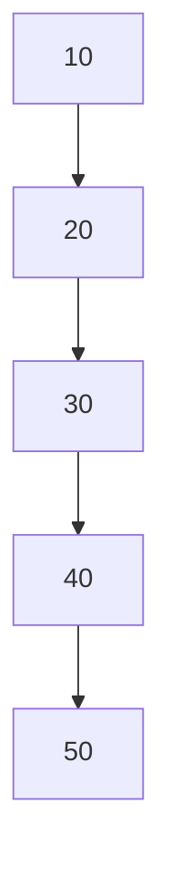

# The Problem: Why We Need Red-Black Trees 🌳

> [!NOTE]
> In this lesson, we'll understand the problem that Red-Black Trees solve and why they're a critical data structure in computer science.

## The Challenge 🏆

Imagine you're building a system that needs to efficiently:
- **Find** items quickly
- **Insert** new items
- **Remove** existing items
- Maintain items in **sorted order**

A regular Binary Search Tree (BST) seems perfect for this, right? After all, BSTs offer O(log n) time complexity for these operations... but there's a catch!

## The BST Problem 😱

Consider what happens when you insert elements in sorted order into a BST:

Yikes! Our "tree" has degenerated into a linked list! Now all our operations are O(n) instead of O(log n).

Why is this a problem?

For large datasets, the difference between O(log n) and O(n) is enormous:
- For n = 1,000,000:
  - O(log n) ≈ 20 operations
  - O(n) = 1,000,000 operations

That's a 50,000× performance difference!

## Enter Self-Balancing Trees ⚖️

This is where self-balancing trees come to the rescue! They maintain a balanced structure regardless of the insertion order.

> [!TIP]
> A balanced binary tree has a height of approximately log(n), ensuring that all operations remain efficient.

## What Makes Red-Black Trees Special 🔴⚫

Red-Black Trees are a type of self-balancing binary search tree with some unique properties that maintain balance through a clever coloring scheme and rotation operations.

They guarantee that:
- No path from root to leaf is more than twice as long as any other
- All operations (search, insert, delete) remain O(log n) even in worst-case scenarios
- They require less memory and fewer rotations than some other balanced tree types

## Think About It 🤔

Before diving into how Red-Black Trees work, consider:
1. What happens to search efficiency when a tree becomes unbalanced?
2. Why might keeping a perfectly balanced tree be too costly?
3. What's a reasonable compromise between perfect balance and efficient updates?

In the next lesson, we'll explore the fundamental properties of Red-Black Trees that make them so useful! 