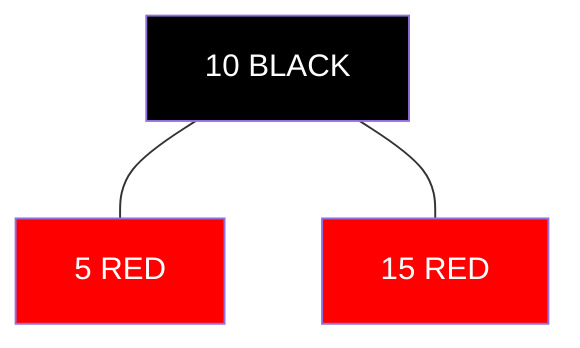
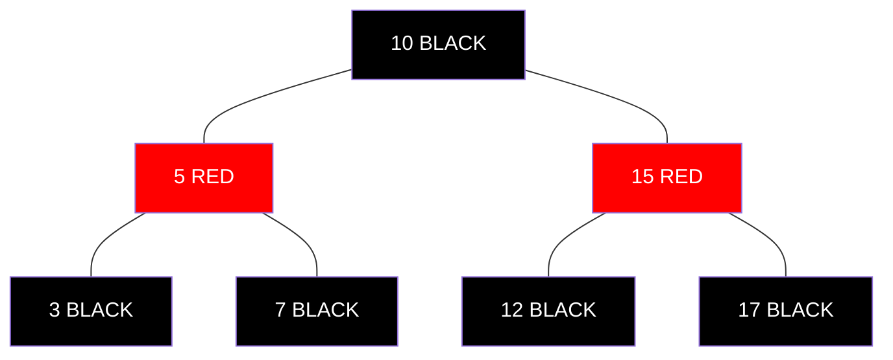

# Understanding Red-Black Tree Properties 🧩

> [!NOTE]
> In this lesson, we'll learn the five fundamental properties that define a Red-Black Tree and make it work.

## What Makes a Tree "Red-Black"? 🎨

Red-Black Trees get their name from the coloring scheme they use to maintain balance. Each node in the tree is colored either red or black according to specific rules.

> [!TIP]
> Think of the colors as a simple way to encode information about the tree's structure without adding extra pointers or complex metadata.

## The Five Essential Properties ✋

For a binary search tree to qualify as a valid Red-Black Tree, it must satisfy these five properties:

### 1. Color Property 🔴⚫
Every node is colored either RED or BLACK.

### 2. Root Property 🏠
The root node is always BLACK.

> [!WARNING]
> When a red node becomes the root (during insertion or deletion), it must be recolored black to maintain this property.

### 3. Leaf Property 🍃
All leaf nodes (NIL or null nodes) are considered BLACK.

What are NIL nodes?

In some implementations, we use special sentinel nodes called NIL nodes to represent the absence of a child, rather than using null references. These are always colored black and simplify some edge cases in the algorithm.

### 4. Red Property ❌🔴🔴❌
If a node is RED, then both its children must be BLACK (no two RED nodes can be adjacent).

### 5. Black Depth Property 🔢
For any node, all simple paths from this node to descendant leaf nodes contain the same number of BLACK nodes.

> [!NOTE]
> This is the most crucial property! It ensures the tree remains approximately balanced by guaranteeing that no path is more than twice as long as any other.

## Why These Properties Matter 🤔

Together, these five properties guarantee that:

- The tree remains approximately balanced
- The longest path from root to any leaf is no more than twice the length of the shortest path
- The height of the tree is O(log n), ensuring O(log n) time complexity for operations

Proving the height is logarithmic

Since no two red nodes can be adjacent, at least half the nodes on any path from root to leaf must be black. Combined with the Black Depth Property, this means the longest path can't be more than twice the shortest path, which guarantees logarithmic height.

## Think About It 💭

1. If the Black Depth Property ensures the same number of black nodes in every path, how does the tree accommodate having some paths longer than others?
2. Why do you think we color newly inserted nodes RED rather than BLACK?
3. What would happen if we allowed two RED nodes to be adjacent?

In the next lesson, we'll learn about the basic operations (search, insert, delete) on a Red-Black Tree! 