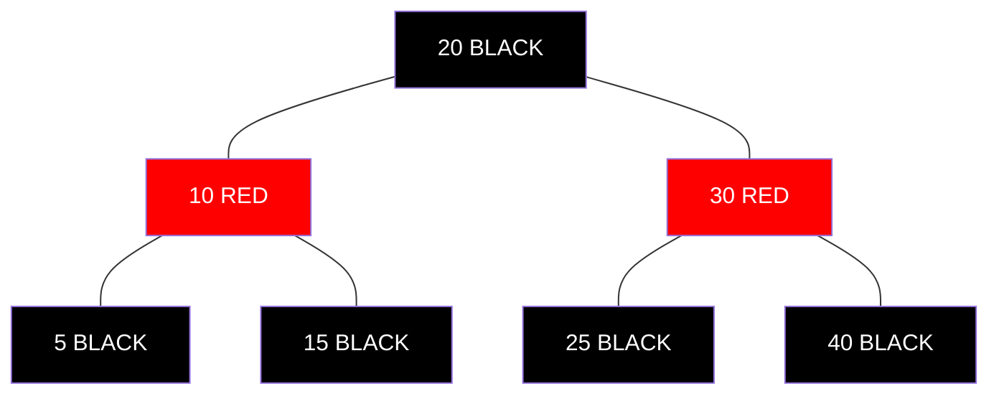

# Searching in a Red-Black Tree 🔍

> [!NOTE]
> In this lesson, we'll learn how to search for values in a Red-Black Tree.

## The Good News: It's Just Like a BST! 😃

One of the best things about Red-Black Trees is that **searching works exactly the same way as in a regular Binary Search Tree**. The colors don't affect the search algorithm at all!

> [!TIP]
> When searching, you can completely ignore the red and black coloring - it only matters for insertion and deletion operations.

## The Search Algorithm 🎯

Here's how to search for a value in a Red-Black Tree:

1. Start at the root node
2. Compare the target value with the current node's value
3. If they match, return the current node
4. If the target value is less than the current node's value, go to the left child
5. If the target value is greater than the current node's value, go to the right child
6. Repeat steps 2-5 until you find the value or reach a null (NIL) node
7. If you reach a null node, the value doesn't exist in the tree



### Example: Searching for value 25 ✨

1. Start at the root (20)
2. 25 > 20, so go right to 30
3. 25 < 30, so go left to 25
4. Found 25! Return this node

### Example: Searching for value 35 ❌

1. Start at the root (20)
2. 35 > 20, so go right to 30
3. 35 > 30, so go right to 40
4. 35 < 40, so go left
5. But there's no left child of 40! Return null (value not found)

## Implementation in Code 💻

Here's how the search algorithm looks in pseudocode:

```
function search(value):
    current = root
    
    while current is not null:
        if value == current.value:
            return current  // Found it!
        else if value < current.value:
            current = current.left
        else:
            current = current.right
    
    return null  // Not found
```

<details>
<summary>Recursive implementation</summary>

```
function recursiveSearch(node, value):
    if node is null:
        return null  // Base case: not found
    
    if value == node.value:
        return node  // Found it!
    else if value < node.value:
        return recursiveSearch(node.left, value)
    else:
        return recursiveSearch(node.right, value)
```
</details>

## Time Complexity ⏱️

The time complexity for search in a Red-Black Tree is **O(log n)**, where n is the number of nodes in the tree.

> [!TIP]
> This is guaranteed even in the worst case, unlike regular BSTs where the worst-case search could be O(n). That's the power of balancing!

## Think About It 🤔

1. Why can we ignore the colors during the search operation?
2. How does the guaranteed O(log n) height of a Red-Black Tree impact the search performance compared to a potentially unbalanced BST?
3. In what scenarios would a hash table be faster than a Red-Black Tree for lookups? When would a Red-Black Tree be preferable?

In the next lesson, we'll dive into the more complex operation of insertion in a Red-Black Tree! 