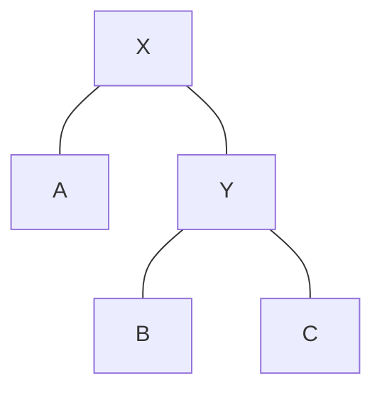
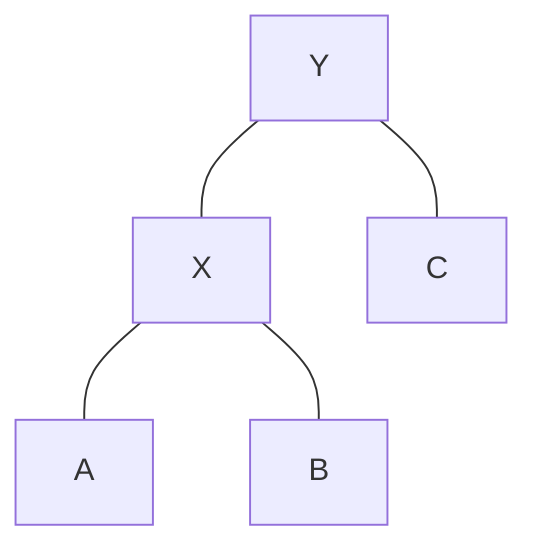

# Tree Rotations: The Balancing Act 🔄

> [!NOTE]
> In this lesson, we'll understand tree rotations - the fundamental operations used to maintain the balance in Red-Black Trees.

## Why Do We Need Rotations? 🤔

Before we insert or delete nodes in a Red-Black Tree, we need to understand the crucial mechanism that allows us to maintain the tree's balance: **rotations**.

Rotations are local operations that change the structure of the tree while preserving the binary search tree property (left < parent < right).

> [!TIP]
> Think of rotations as "rewiring" a small portion of the tree without affecting the rest of the tree or changing the in-order traversal sequence.

## Left Rotation ↩️

A left rotation moves a node down and to the left, making its right child the new "top" node.

### Before Left Rotation:


### After Left Rotation around X:


> [!WARNING]
> Notice that Y's left child (B) became X's right child. Make sure to handle this transfer properly in your implementation.

### Left Rotation Animation:

<details>
<summary>See how left rotation works step by step</summary>

1. Start with node X as parent, Y as right child
2. Y becomes the new parent
3. X becomes Y's left child
4. Y's original left child (B) becomes X's right child
5. The rest of the tree structure remains unchanged

This preserves the BST property: A < X < B < Y < C
</details>

## Right Rotation ↪️

A right rotation moves a node down and to the right, making its left child the new "top" node.

### Before Right Rotation:


### After Right Rotation around Y:


## Implementation in Code 💻

Here's how rotations look in pseudocode:

```
function leftRotate(x):
    y = x.right                  // Set y
    
    x.right = y.left             // Turn y's left subtree into x's right subtree
    if y.left != null:
        y.left.parent = x
    
    y.parent = x.parent          // Link x's parent to y
    if x.parent == null:
        root = y
    else if x == x.parent.left:
        x.parent.left = y
    else:
        x.parent.right = y
    
    y.left = x                   // Put x on y's left
    x.parent = y
```

<details>
<summary>Right Rotation Implementation</summary>

```
function rightRotate(y):
    x = y.left                   // Set x
    
    y.left = x.right             // Turn x's right subtree into y's left subtree
    if x.right != null:
        x.right.parent = y
    
    x.parent = y.parent          // Link y's parent to x
    if y.parent == null:
        root = x
    else if y == y.parent.left:
        y.parent.left = x
    else:
        y.parent.right = x
    
    x.right = y                  // Put y on x's right
    y.parent = x
```
</details>

## When to Use Rotations 🎯

Rotations are used when:
1. Inserting a new node might violate the Red-Black properties
2. Deleting a node might violate the Red-Black properties
3. We need to rebalance a portion of the tree

> [!TIP]
> Rotations are always combined with color changes to restore the Red-Black properties of the tree.

## Key Properties of Rotations ✨

1. **Local Operation**: Only affects a small portion of the tree
2. **In-Order Preservation**: Doesn't change the in-order traversal of the tree
3. **Height Adjustment**: Can decrease or increase the height of subtrees
4. **O(1) Operation**: Takes constant time to perform

## Think About It 🤔

1. How does a rotation help in balancing a tree?
2. What happens to the in-order traversal of the tree after a rotation?
3. Can you think of a situation where both a left and right rotation might be necessary?

In the next lesson, we'll dive into inserting nodes into a Red-Black Tree and see these rotations in action! 