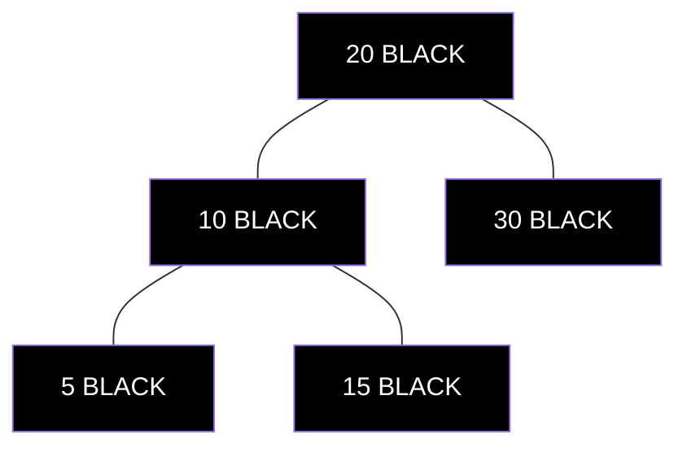
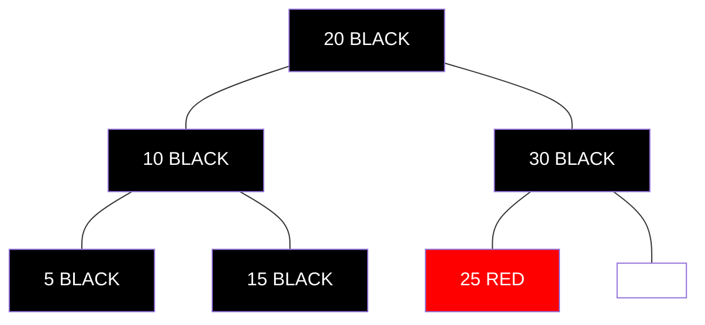
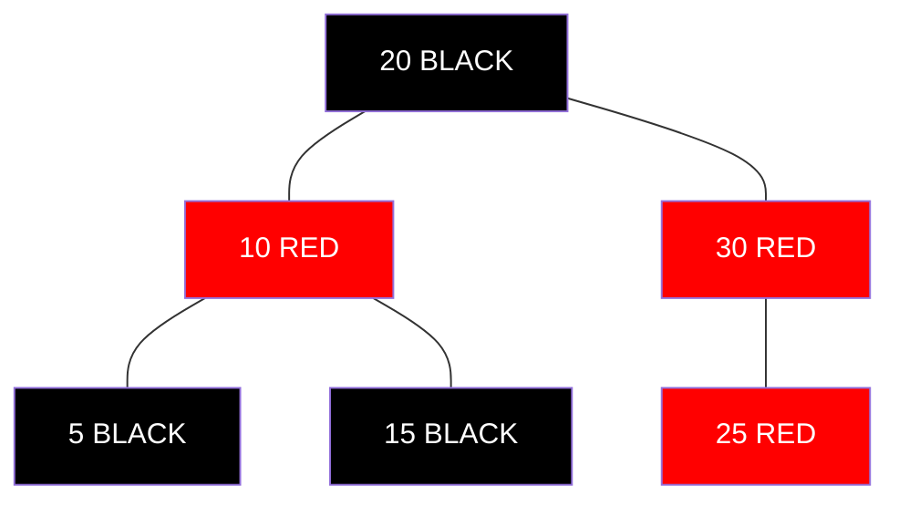
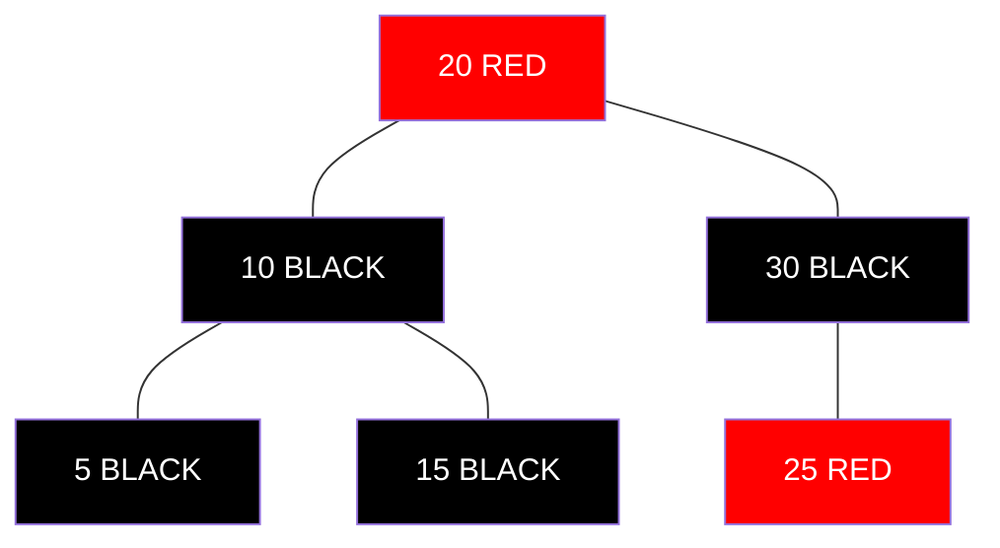
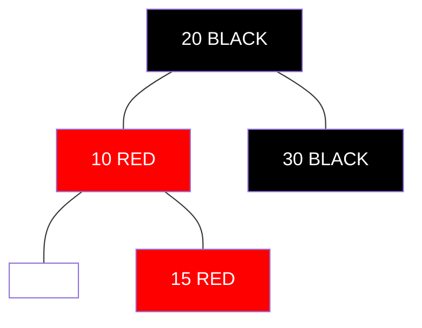
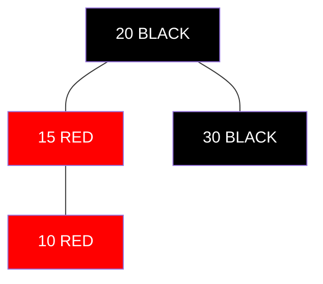
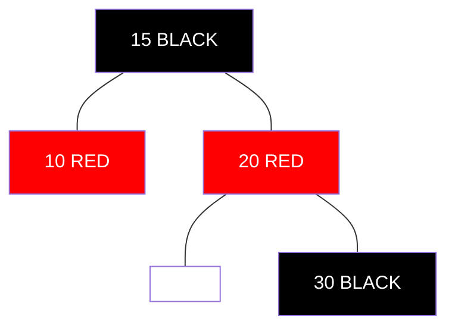

# Inserting Nodes into a Red-Black Tree 🌱

> [!NOTE]
> In this lesson, we'll learn how to insert new nodes into a Red-Black Tree while maintaining all its properties.

## Insertion Overview 📋

Inserting a node into a Red-Black Tree involves two main steps:

1. **Standard BST Insertion**: First, insert the node as you would in a regular Binary Search Tree
2. **Fix Red-Black Properties**: Then, fix any violations of the Red-Black properties

> [!TIP]
> We always color a newly inserted node **RED**. Why? Because it's easier to fix violations when adding a red node than a black one (which would immediately violate the Black Depth Property).

## Step 1: Standard BST Insertion 📥

This part is straightforward:

1. Start at the root and traverse down the tree, going left if the new value is smaller, right if it's larger
2. When you reach a null (NIL) position, insert the new node there
3. Color the new node RED
4. Set the parent, left, and right pointers appropriately



For example, inserting 25 would place it as the left child of 30:



## Step 2: Fix Red-Black Properties 🔧

After insertion, we need to check if any Red-Black properties are violated. There are three main cases to handle, based on the color of the node's "uncle" (the sibling of the node's parent).

> [!WARNING]
> Red-Black Tree insertion can be complex because we need to handle multiple cases. Take your time understanding each case and its solution.

### Case 1: Uncle is RED ❤️

When the uncle node is RED, we:
1. Recolor the parent and uncle to BLACK
2. Recolor the grandparent to RED
3. Recursively check the grandparent for violations

<details>
<summary>Case 1 Example</summary>



Here, after inserting 25 (RED), its parent (30) is RED, violating the Red Property. The uncle (10) is also RED.

After applying Case 1:



Now we need to check if the grandparent (20) causes any violations.
</details>

### Case 2: Uncle is BLACK (Triangle Case) 📐

When the uncle is BLACK and the node forms a "triangle" with its parent and grandparent:
1. Rotate the parent in the opposite direction of the node's position
2. This transforms it into Case 3

<details>
<summary>Case 2 Example (Left-Right Triangle)</summary>



Here, 15 forms a "triangle" with its parent (10) and grandparent (20).

After left rotation on parent (10):



Now we've transformed it into Case 3.
</details>

### Case 3: Uncle is BLACK (Line Case) 📏

When the uncle is BLACK and the node forms a "line" with its parent and grandparent:
1. Rotate the grandparent in the opposite direction of the node's position
2. Recolor the (old) parent to BLACK
3. Recolor the (old) grandparent to RED

<details>
<summary>Case 3 Example (Left Line)</summary>

Starting from Case 2's result:


After right rotation on grandparent (20) and recoloring:



Now the Red-Black properties are restored.
</details>

## Final Step: Ensure Root is BLACK 🏠

After all fixups, we ensure the root is colored BLACK to maintain Property 2.

```
if root.color == RED:
    root.color = BLACK
```

## Time Complexity ⏱️

Insertion in a Red-Black Tree has a time complexity of **O(log n)**, including both the standard BST insertion and the fixup operations.

> [!TIP]
> While the fixup might seem complex, we'll perform at most O(log n) color changes and O(1) rotations during any insertion.

## Think About It 🤔

1. Why do we color new nodes RED instead of BLACK?
2. In what situations would Case 1 (uncle is RED) propagate all the way to the root?
3. How do the rotations in Cases 2 and 3 help maintain the Red-Black properties?

In the next lesson, we'll explore the most challenging operation: deleting nodes from a Red-Black Tree! 