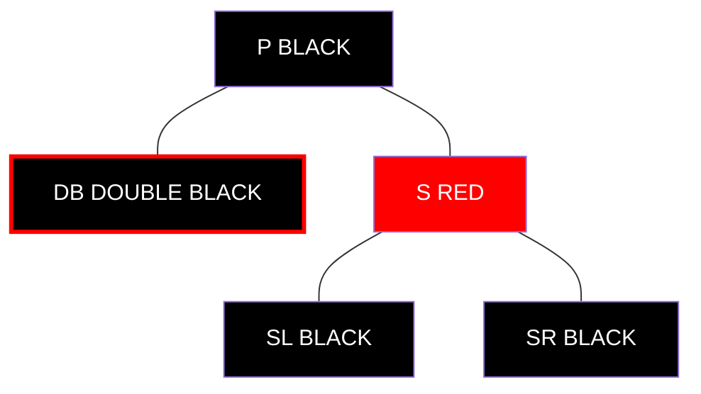
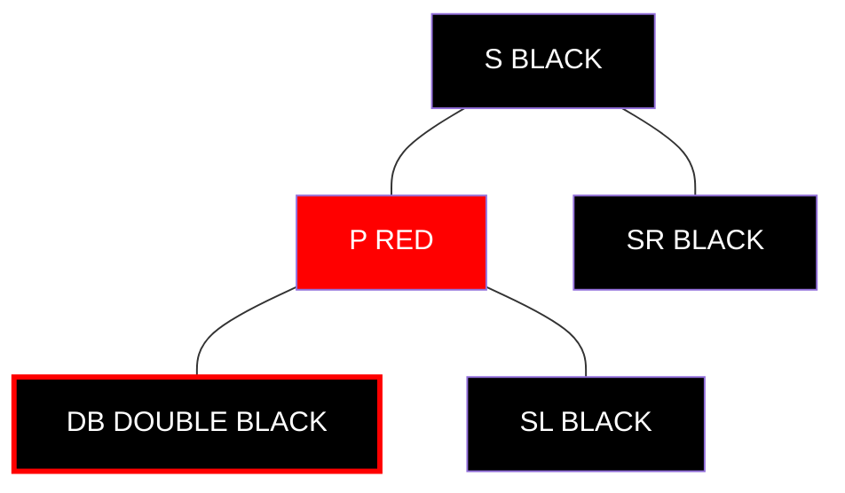
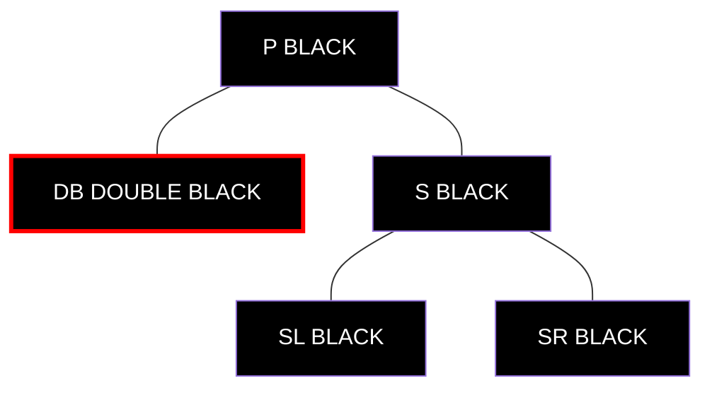
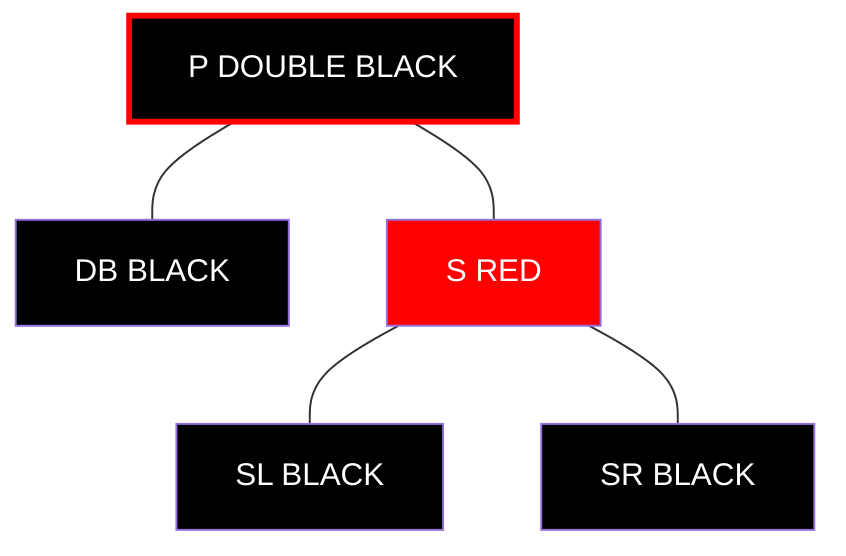
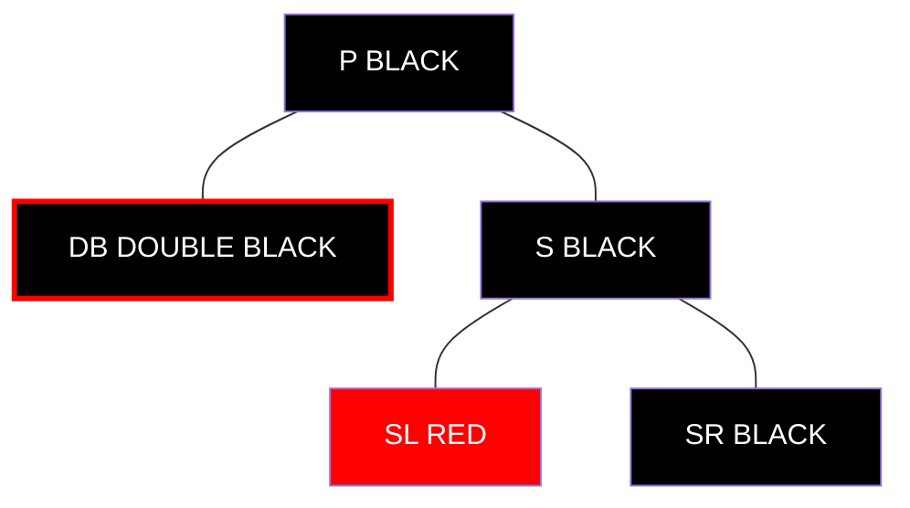
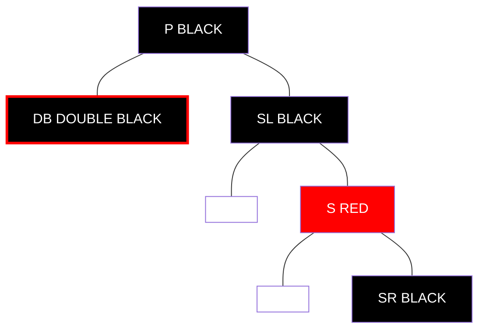
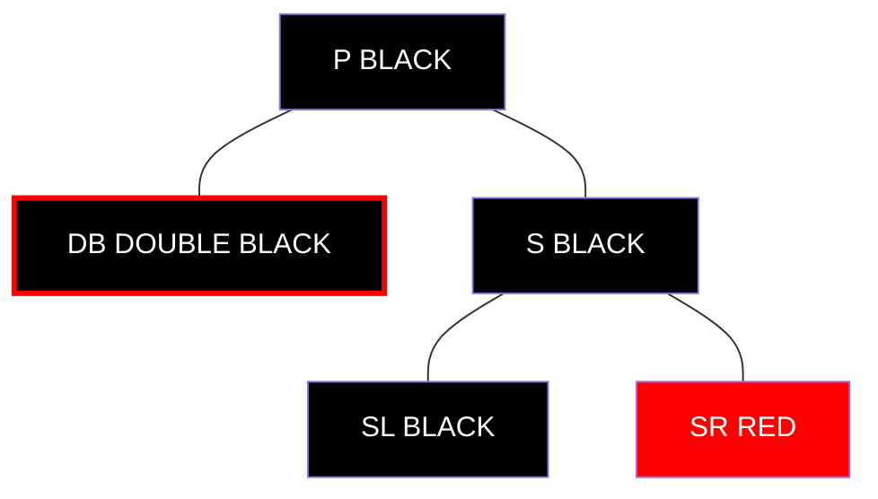
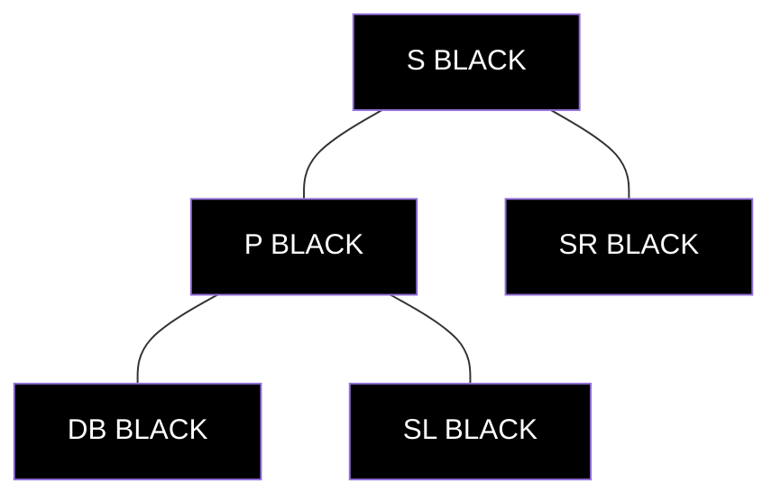

# Deleting Nodes from a Red-Black Tree 🗑️

> [!NOTE]
> In this lesson, we'll learn how to delete nodes from a Red-Black Tree while maintaining its properties.

## Deletion Overview 📋

Deleting a node from a Red-Black Tree is the most complex operation, following these main steps:

1. **Standard BST Deletion**: First, delete the node as you would in a regular Binary Search Tree
2. **Fix Red-Black Properties**: Then, fix any violations of the Red-Black properties

> [!WARNING]
> Deletion is significantly more complex than insertion because it can introduce various violations depending on the color of the deleted node and its replacement.

## Step 1: Standard BST Deletion 📤

The standard BST deletion has three cases:

### Case A: Node has no children 🍃
Simply remove the node from the tree.

### Case B: Node has one child 🌿
Replace the node with its only child.

### Case C: Node has two children 🌳
1. Find the in-order successor (smallest node in the right subtree)
2. Copy the successor's value to the node being deleted
3. Delete the successor (which will have at most one child)

## Step 2: Track the Node That Needs Fixing 🔍

Before deleting, we need to keep track of:
1. The replacement node (which will take the deleted node's position)
2. The original color of the deleted node

## Step 3: Fix Red-Black Properties 🔧

Depending on the colors of the deleted and replacement nodes, we have different scenarios:

### Scenario 1: Deleted RED node ❤️
If the deleted node was RED, no properties are violated (both black height and no-adjacent-reds remain satisfied).

### Scenario 2: Deleted BLACK node, replacement is RED ❤️⚫
If we delete a BLACK node but its replacement is RED:
1. Simply color the replacement BLACK
2. This maintains the black height property

### Scenario 3: Deleted BLACK node, no replacement (or BLACK replacement) ⚫⚫
This is the most complex case, as it creates a "double black" problem. We need to restore the black height property through a series of rotations and recoloring.

> [!TIP]
> The deletion fixup focuses on transferring the "extra blackness" until it either reaches a red node (which can absorb it by becoming black) or the root (where it can be removed).

## Deletion Fixup Cases 🛠️

The fixup algorithm has four main cases, determined by the sibling of the "double black" node:

### Case 1: Sibling is RED 🔴

1. Recolor the sibling to BLACK
2. Recolor the parent to RED
3. Rotate at the parent in the direction of the double black node
4. This changes the sibling, so we proceed to one of the other cases

Case 1 Example

After applying Case 1 (left rotation at P):

Now SL is the new sibling of the double black node.

### Case 2: Sibling is BLACK, both of Sibling's Children are BLACK ⚫

1. Recolor the sibling to RED
2. Move the double black problem up to the parent
3. If the parent was RED, simply color it BLACK and we're done
4. If the parent was BLACK, it becomes the new double black node, and we repeat the process

Case 2 Example

After applying Case 2:

Now we need to apply the fixup algorithm to the parent P.

### Case 3: Sibling is BLACK, Sibling's Child toward Double Black is RED ⚫🔴

1. Recolor sibling's red child to BLACK
2. Recolor sibling to RED
3. Rotate at the sibling away from the double black node
4. This transforms into Case 4

Case 3 Example (Left Double Black)

After applying Case 3 (right rotation at S):

Now SL is the new sibling, and we proceed to Case 4.

### Case 4: Sibling is BLACK, Sibling's Child away from Double Black is RED ⚫🔴

1. Recolor the sibling to the parent's color
2. Recolor the parent to BLACK
3. Recolor sibling's red child to BLACK
4. Rotate at the parent in the direction of the double black node
5. Remove the extra black from the double black node

Case 4 Example (Left Double Black)

After applying Case 4 (left rotation at P):

The double black issue is resolved, and all Red-Black properties are restored.

## Time Complexity ⏱️

Deletion in a Red-Black Tree has a time complexity of **O(log n)**, including both the standard BST deletion and the fixup operations.

> [!TIP]
> While deletion has more cases than insertion, we still perform at most O(log n) color changes and O(log n) rotations during any deletion.

## Think About It 🤔

1. Why is deletion generally more complex than insertion in a Red-Black Tree?
2. What's the significance of the "double black" concept in the deletion algorithm?
3. How do the various rotation cases in deletion fixup help maintain the Red-Black properties?

In the next lesson, we'll look at practical applications and usage patterns for Red-Black Trees! 