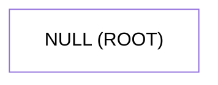
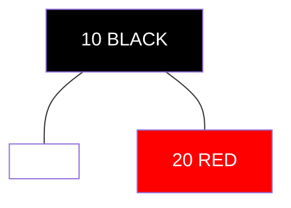
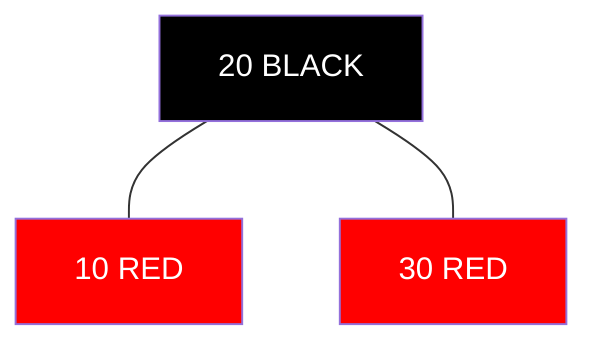
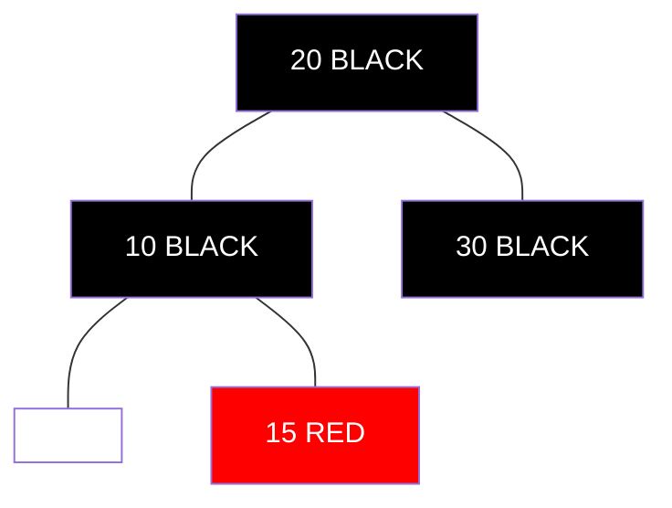
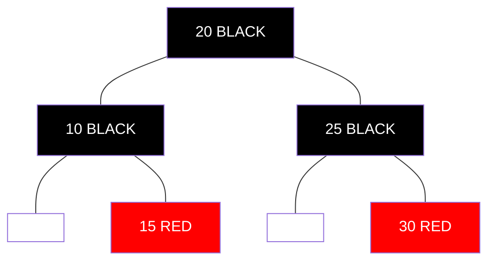
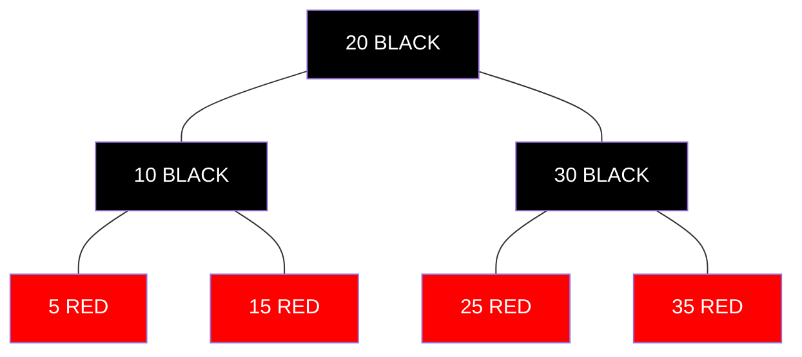
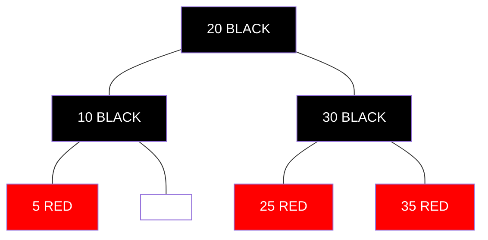
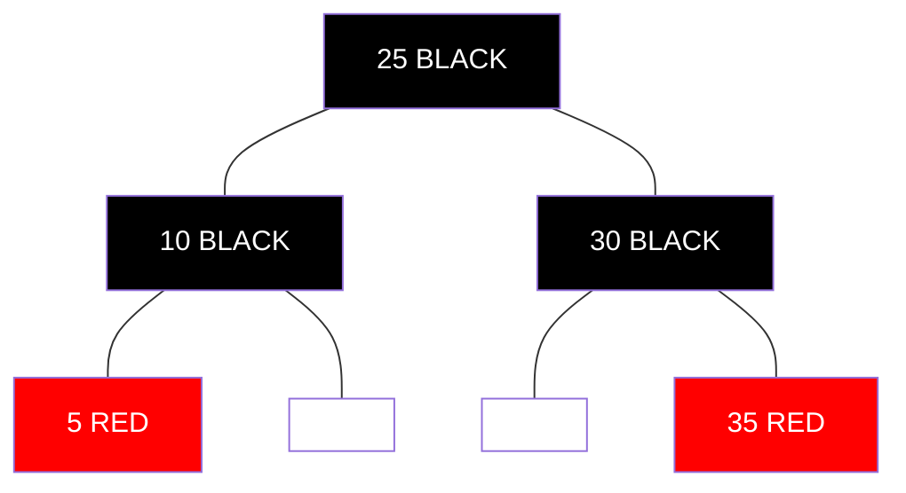
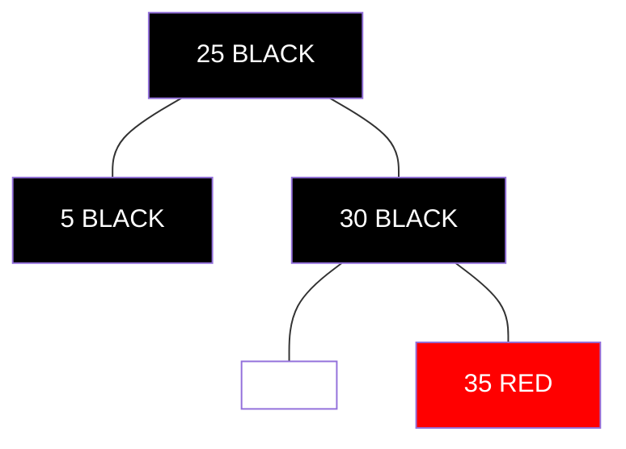

# Practical Examples: Red-Black Trees in Action 🎬

> [!NOTE]
> In this lesson, we'll see Red-Black Trees in action through step-by-step examples of insertion and deletion operations.

## Example 1: Building a Red-Black Tree from Scratch 🏗️

Let's insert numbers [10, 20, 30, 15, 25, 5, 35] into an initially empty Red-Black Tree and observe the transformations.

### Initial State:


### Step 1: Insert 10
1. Insert 10 as a RED node (standard BST insertion)
2. Since 10 is the root, recolor it to BLACK


### Step 2: Insert 20
1. Insert 20 as a RED node to the right of 10
2. No violations, so we're done



### Step 3: Insert 30
1. Insert 30 as a RED node to the right of 20
2. Violation: Two consecutive RED nodes (20 and 30)
3. Uncle is NULL (BLACK), and we have a line case (right-right)
4. Left rotate at 10 and recolor:
   - 20 becomes BLACK (new root)
   - 10 becomes RED
   - 30 stays RED



### Step 4: Insert 15
1. Insert 15 as a RED node between 10 and 20
2. Violation: Two consecutive RED nodes (10 and 15)
3. Uncle is 30 (RED)
4. Recolor:
   - 10 becomes BLACK
   - 30 becomes BLACK
   - 20 becomes RED (but it's the root, so back to BLACK)



### Step 5: Insert 25
1. Insert 25 as a RED node between 20 and 30
2. Violation: Two consecutive RED nodes (would be 25 and either parent or sibling)
3. Uncle is 10 (BLACK)
4. We have a triangle case, so right rotate at 30 first
5. Then left rotate at 20 and recolor



### Final Tree After All Insertions:
After inserting 5 (to the left of 10) and 35 (to the right of 30), with appropriate rebalancing, we get:



## Example 2: Deletion in Action 🗑️

Now, let's delete some nodes from our tree and see how the rebalancing works.

### Deleting Node 15 (Simple Case):
1. 15 is a RED node with no children
2. Simply remove it (no fixup needed since we're not changing black height)



### Deleting Node 20 (Root - Complex Case):
1. 20 has two children, so we find its successor (25)
2. Replace 20's value with 25's value
3. Delete the node containing 25 (which has at most one child)
4. Since 25 is RED, no fixup is needed



### Deleting Node 10 (BLACK node with one RED child):
1. Replace 10 with its only child (5)
2. Since 10 is BLACK and 5 is RED, we color 5 BLACK
3. This preserves the black height



## Real-World Code Example: Using a Red-Black Tree in Java 💻

Here's a practical example of using Java's `TreeMap` (which is implemented as a Red-Black Tree) for a student grading system:

```java
import java.util.Map;
import java.util.TreeMap;

public class StudentGradeTracker {
    public static void main(String[] args) {
        // Create a TreeMap to store student grades (sorted by student ID)
        TreeMap<Integer, String> studentGrades = new TreeMap<>();
        
        // Add some student records
        studentGrades.put(1001, "A");
        studentGrades.put(1002, "B+");
        studentGrades.put(1003, "A-");
        studentGrades.put(1004, "C");
        studentGrades.put(1005, "B");
        
        // Print all students in order of ID
        System.out.println("All students:");
        for (Map.Entry<Integer, String> entry : studentGrades.entrySet()) {
            System.out.println("ID: " + entry.getKey() + ", Grade: " + entry.getValue());
        }
        
        // Find students with IDs in a specific range (e.g., 1002-1004)
        System.out.println("\nStudents with IDs between 1002 and 1004:");
        Map<Integer, String> subMap = studentGrades.subMap(1002, true, 1004, true);
        for (Map.Entry<Integer, String> entry : subMap.entrySet()) {
            System.out.println("ID: " + entry.getKey() + ", Grade: " + entry.getValue());
        }
        
        // Find the student with the next higher ID
        int currentId = 1003;
        Map.Entry<Integer, String> nextHigher = studentGrades.higherEntry(currentId);
        System.out.println("\nStudent after ID " + currentId + ":");
        System.out.println("ID: " + nextHigher.getKey() + ", Grade: " + nextHigher.getValue());
    }
}
```

Output:
```
All students:
ID: 1001, Grade: A
ID: 1002, Grade: B+
ID: 1003, Grade: A-
ID: 1004, Grade: C
ID: 1005, Grade: B

Students with IDs between 1002 and 1004:
ID: 1002, Grade: B+
ID: 1003, Grade: A-
ID: 1004, Grade: C

Student after ID 1003:
ID: 1004, Grade: C
```

This example demonstrates:
1. **Ordered Storage**: The students are automatically kept in order by their IDs
2. **Range Queries**: We can easily get a subset of students within a specific ID range
3. **Successor Queries**: Finding the "next" student ID is efficient

## Performance Considerations 📊

When working with Red-Black Trees in practice, keep these performance considerations in mind:

| Operation | Time Complexity | Space Complexity |
|-----------|----------------|-----------------|
| Search    | O(log n)       | O(1)            |
| Insert    | O(log n)       | O(1)            |
| Delete    | O(log n)       | O(1)            |
| Traversal | O(n)           | O(log n) for recursion stack |

> [!TIP]
> While the theoretical worst-case time for Red-Black Tree operations is O(log n), the constant factors are often higher than simpler data structures like hash tables for single operations. Use Red-Black Trees when the ordering or range operations are needed.

## Think About It 🤔

1. In our insertion example, what would happen if we inserted the values in a different order? Would the final tree have the same structure?
2. For the student grading system example, how would Red-Black Trees perform compared to hash tables if we frequently need to find students by their exact ID?
3. Can you trace through the deletion process for node 30 in our example tree?

In the next and final lesson, we'll summarize everything we've learned and discuss how to further develop your understanding of Red-Black Trees! 