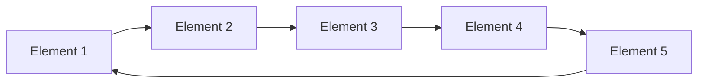

# 🔄 Ring Buffer: An Introduction

> [!NOTE]
> A Ring Buffer (also known as a circular buffer or circular queue) is a fixed-size data structure that efficiently handles First-In-First-Out (FIFO) operations while maintaining a constant memory footprint.

## 🤔 What Problem Does a Ring Buffer Solve?

Imagine you're working with streaming data, like audio samples in a music player or packets in a network application. You need a way to:

1. Store incoming data efficiently
2. Process data in the order it was received (FIFO)
3. Use a fixed amount of memory, regardless of how much data flows through
4. Efficiently handle the case when new data arrives faster than old data is processed

This is where a Ring Buffer shines! ✨

## 🎯 Real-World Applications

Ring Buffers are used in numerous practical scenarios:

- 🎵 **Audio Processing:** Buffering audio samples between recording and playback
- ⌨️ **Keyboard Input:** Storing keyboard events in operating systems
- 🌐 **Network Packet Processing:** Managing incoming and outgoing network data
- 📱 **Device Communication:** Buffering data between devices with different speeds
- 🎬 **Video Streaming:** Ensuring smooth playback by buffering video frames

## 💡 Key Insight: The "Ring" Concept

The magic of a Ring Buffer lies in its circular nature. Unlike a standard array or queue:

When we reach the end of our allocated memory, we simply wrap around to the beginning again. This eliminates the need to shift elements or allocate new memory!

## 🧩 The Challenge Ahead

In the lessons that follow, you'll learn how to:

1. Design a Ring Buffer data structure
2. Implement key operations like enqueue and dequeue
3. Handle edge cases like full or empty buffers
4. Master the circular pointer logic that makes Ring Buffers so efficient

> [!TIP]
> As you go through these lessons, consider: How would you solve these problems without a Ring Buffer? What would the performance implications be?

**Ready to dive in?** Let's explore the fundamental components in the next lesson! 