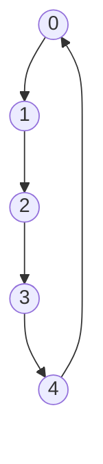

# 🧱 Building Blocks of a Ring Buffer

A Ring Buffer has a simple but clever structure that enables its efficient operation. Let's break down the essential components.

## 🔍 Core Components

Every Ring Buffer consists of these fundamental elements:

### 1. The Buffer Array 📊

```
[_, _, _, _, _]
 ↑  ↑  ↑  ↑  ↑
 0  1  2  3  4
```

- A fixed-size array (or similar data structure) that stores the actual elements
- The size is determined when the Ring Buffer is created and remains constant
- Elements can be of any type (numbers, strings, objects, etc.)

### 2. Head Pointer (Write Position) ✍️

```
  head
   ↓
[_, _, _, _, _]
```

- Points to the position where the next element will be written
- Moves forward after each enqueue operation
- When it reaches the end of the array, it wraps around to the beginning

### 3. Tail Pointer (Read Position) 📖

```
  tail
   ↓
[_, _, _, _, _]
```

- Points to the position of the next element to be read/removed
- Moves forward after each dequeue operation
- Also wraps around to the beginning when it reaches the end

### 4. Count or Size Tracker 🔢

- Keeps track of how many elements are currently in the buffer
- Used to determine if the buffer is empty or full
- Helps avoid ambiguity when head and tail pointers are at the same position

## 🔄 Visualizing the Circular Nature

What makes a Ring Buffer special is how it handles the "end" of the array:



When either pointer reaches the end of the array, it simply wraps around to index 0. This creates the circular or "ring" behavior that gives the data structure its name.

## 🧮 The Mathematics of Wrapping

The key mathematical operation that enables the circular behavior is the modulo operation:

```
nextPosition = (currentPosition + 1) % capacity
```

This formula ensures that:
- If `currentPosition` is less than `capacity-1`, `nextPosition` will simply be incremented by 1
- If `currentPosition` equals `capacity-1` (the end of the array), `nextPosition` will wrap around to 0

> [!TIP]
> Understanding this modulo-based wrapping is crucial for implementing a Ring Buffer correctly! It's what creates the "circular" property without physically rearranging elements in memory.

<details>
<summary>🤔 Why not just use a regular array or queue?</summary>

A standard array-based queue has these limitations:
- When elements are dequeued, remaining elements must be shifted (O(n) operation)
- Or, if elements aren't shifted, the usable space in the array shrinks over time
- Growing the array requires allocating new memory and copying elements

A Ring Buffer solves all these problems with its circular design!
</details>

## 💭 Reflect on This

Before moving to the next lesson, think about:

1. How would the head and tail pointers behave as elements are added and removed?
2. What would happen if we keep adding elements after the buffer is full?
3. How can we tell if the buffer is empty or full if head and tail are at the same position?

In the next lesson, we'll implement the core operations of a Ring Buffer to see these components in action! 