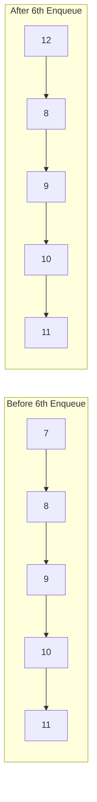

# ➕ Adding Elements: The Enqueue Operation

The enqueue operation is how we add new elements to our Ring Buffer. Let's explore how this works step by step.

## 🎯 Goal of Enqueuing

When we enqueue an element, we want to:
1. Add the element to the buffer at the head position
2. Update the head pointer for the next enqueue operation
3. Keep track of how many elements are in the buffer
4. Handle the case when the buffer is already full

## 🔄 Enqueue Operation: Step by Step

Let's walk through the process with a visual example, using a buffer with capacity 5:

### Initial State
```
  head/tail
     ↓
[ _, _, _, _, _ ]
  
Count: 0 (Empty buffer)
```

### Step 1: Add First Element (7)
```
     tail   head
       ↓      ↓
[ 7, _, _, _, _ ]
  
Count: 1
```

### Step 2: Add Second Element (8)
```
     tail        head
       ↓          ↓
[ 7,  8, _, _, _ ]
  
Count: 2
```

### Step 3: Add More Elements (9, 10)
```
     tail                head
       ↓                  ↓
[ 7,  8,  9, 10, _ ]
  
Count: 4
```

### Step 4: Add Final Element (11) - Buffer Is Now Full
```
     tail                     head
       ↓                       ↓
[ 7,  8,  9, 10, 11 ]
  
Count: 5 (Full buffer)
```

### Step 5: Add One More Element (12) - Overwriting Begins
```
         tail                 head
           ↓                   ↓
[ 7,  12,  9, 10, 11 ]
  
Count: 5 (Still full, oldest element was overwritten)
```

## 💻 Implementation in Code

Here's how the enqueue operation is typically implemented:

```typescript
enqueue(item: T): void {
  // 1. Place the new item at the head position
  this.buffer[this.head] = item;
  
  // 2. Move head pointer to the next position (with wrap-around)
  this.head = (this.head + 1) % this.capacity;
  
  // 3. Handle full buffer case
  if (this.count === this.capacity) {
    // Buffer is full, move tail pointer to overwrite oldest element
    this.tail = (this.tail + 1) % this.capacity;
  } else {
    // Buffer not full yet, increment count
    this.count++;
  }
}
```

## 🧠 Understanding the Logic

Let's analyze what's happening in this implementation:

1. **Placement**: We always place the new item at the current head position
2. **Head Movement**: The head always moves forward (with wrapping)
3. **Full Buffer Handling**: 
   - If the buffer is already full (count equals capacity), we move the tail pointer
   - This effectively "forgets" the oldest element to make room for the new one
   - The count remains the same (full)
4. **Not Full**: If the buffer still has space, we simply increment the count

> [!WARNING]
> This implementation overwrites the oldest data when the buffer is full. This is called an "overwriting" or "circular" buffer policy. Some applications might prefer to reject new data when full or implement a different policy.

## 🤔 Think About This

<details>
<summary>What happens to the overwritten data?</summary>

When data is overwritten, it's permanently lost. This is intentional in Ring Buffers, which are designed for scenarios where:

1. Newer data is more valuable than older data
2. Memory usage must be constant and predictable
3. Processing can't keep up with incoming data rate, so some data loss is acceptable

For applications where all data must be preserved, a Ring Buffer might not be the right choice.
</details>

<details>
<summary>How efficient is the enqueue operation?</summary>

Enqueuing in a Ring Buffer is extremely efficient:

- Time Complexity: O(1) - constant time regardless of buffer size
- Space Complexity: O(1) - no additional space required beyond the buffer itself

This is one of the main advantages of Ring Buffers over other queue implementations!
</details>

## 💡 Visualizing Enqueue with Wrapping



In the next lesson, we'll explore the complementary operation: dequeuing elements from our Ring Buffer! 