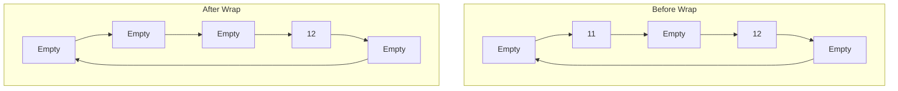

# ➖ Removing Elements: The Dequeue Operation

The dequeue operation is how we remove and retrieve elements from our Ring Buffer in a FIFO (First-In-First-Out) manner. Let's explore this critical operation.

## 🎯 Goal of Dequeueing

When we dequeue an element, we want to:
1. Retrieve the element at the tail position (the oldest element)
2. Update the tail pointer for the next dequeue operation
3. Update the count of elements in the buffer
4. Handle the case when the buffer is empty

## 🔄 Dequeue Operation: Step by Step

Let's walk through the process with a visual example, continuing from our enqueue example:

### Starting State (After Several Enqueues)
```
         tail                 head
           ↓                   ↓
[ 7,  12,  9, 10, 11 ]
  
Count: 5 (Full buffer)
```

### Step 1: Dequeue First Element (9)
```
              tail            head
                ↓              ↓
[ 7,  12,  _,  10, 11 ]
  
Count: 4
```

### Step 2: Dequeue Second Element (10)
```
                   tail       head
                     ↓         ↓
[ 7,  12,  _,   _,  11 ]
  
Count: 3
```

### Step 3: Dequeue Third Element (11)
```
                        tail  head
                          ↓    ↓
[ 7,  12,  _,   _,   _  ]
  
Count: 2
```

### Step 4: Dequeue Another Element (7) - Wrapping Occurs
```
     head     tail
       ↓        ↓
[ _,  12,  _,  _,  _  ]
  
Count: 1
```

### Step 5: Dequeue Final Element (12) - Buffer Is Now Empty
```
     head/tail
        ↓
[ _,  _,  _,  _,  _  ]
  
Count: 0 (Empty buffer)
```

## 💻 Implementation in Code

Here's how the dequeue operation is typically implemented:

```typescript
dequeue(): T | undefined {
  // 1. Check if buffer is empty
  if (this.isEmpty()) {
    return undefined;
  }
  
  // 2. Get the item at the tail position
  const item = this.buffer[this.tail];
  
  // 3. Clear the reference (optional, helps with garbage collection)
  this.buffer[this.tail] = undefined;
  
  // 4. Move tail pointer to the next position (with wrap-around)
  this.tail = (this.tail + 1) % this.capacity;
  
  // 5. Decrement the count
  this.count--;
  
  // 6. Return the retrieved item
  return item;
}
```

## 🧠 Understanding the Logic

Let's analyze what's happening in this implementation:

1. **Empty Check**: We first check if the buffer is empty to avoid errors
2. **Retrieval**: We get the element at the tail position (oldest element)
3. **Cleanup**: We clear the reference to the dequeued element (optional)
4. **Tail Movement**: We move the tail pointer forward (with wrapping)
5. **Count Update**: We decrement the element count
6. **Return**: We return the retrieved element to the caller

> [!TIP]
> Clearing the reference to dequeued elements (setting to undefined/null) can help with garbage collection in some languages, but isn't strictly necessary for the algorithm to work.

## 📊 Visualizing the Wrap-Around

One of the elegant aspects of a Ring Buffer is how the tail pointer wraps around when it reaches the end of the array:



Notice how the tail pointer wraps from the end of the array back to the beginning!

## ⚠️ Edge Cases to Consider

### Empty Buffer

```typescript
if (this.isEmpty()) {
  return undefined;  // or throw an exception, depending on your design
}
```

When the buffer is empty (count is 0), we typically return undefined (or null, or throw an exception, depending on your language and error-handling strategy).

### Single Element

Special care isn't needed for a buffer with just one element - our algorithm correctly handles this case by:
1. Retrieving the element at the tail position
2. Moving the tail pointer (possibly wrapping around)
3. Decrementing the count to 0 (making the buffer empty)

## 🤔 Think About This

<details>
<summary>What happens if we try to dequeue from an empty buffer?</summary>

Most implementations will:
- Return a special value (like undefined, null, or -1)
- Or throw an exception

This is a design decision you'll need to make based on your application's requirements. Some applications might want an error, while others might prefer a silent fail.
</details>

<details>
<summary>How does dequeueing affect performance?</summary>

Like enqueuing, dequeueing in a Ring Buffer is very efficient:

- Time Complexity: O(1) - constant time regardless of buffer size
- Space Complexity: O(1) - no additional space required

This consistent performance is a key advantage of Ring Buffers!
</details>

In the next lesson, we'll look at helpful utility functions that make our Ring Buffer more robust and user-friendly. 