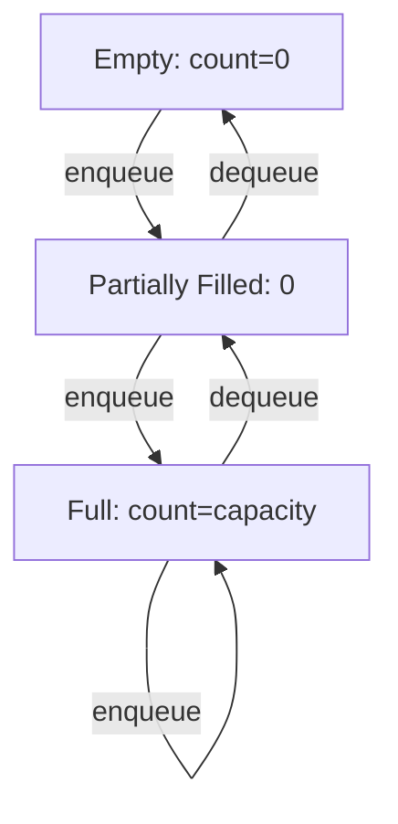

# 🛠️ Making Your Ring Buffer More Robust

Beyond the core enqueue and dequeue operations, several utility functions make a Ring Buffer more complete, easier to use, and help prevent errors. Let's explore these essential helpers.

## 🔍 State Checking Functions

These functions help you understand and verify the current state of your Ring Buffer.

### 1. isEmpty() - Is the Buffer Empty?

```typescript
isEmpty(): boolean {
  return this.count === 0;
}
```

This function tells you if there are no elements in the buffer. It's useful for:
- Preventing dequeue errors on empty buffers
- Controlling flow in consumer code
- Testing and debugging

### 2. isFull() - Is the Buffer Full?

```typescript
isFull(): boolean {
  return this.count === this.capacity;
}
```

This function tells you if the buffer has reached its maximum capacity. It's useful for:
- Deciding whether to enqueue more elements
- Implementing non-overwriting buffer policies
- Monitoring buffer utilization

### 3. getCount() - How Many Elements?

```typescript
getCount(): number {
  return this.count;
}
```

This function returns the current number of elements in the buffer. It's useful for:
- Monitoring buffer usage
- Determining how much data has been processed
- Calculating utilization percentages

## 🧐 The Empty vs. Full Dilemma

One tricky aspect of Ring Buffers is distinguishing between empty and full states when head and tail pointers are at the same position.

```
   head/tail
      ↓
[ ?, ?, ?, ?, ? ]
```

In this situation, is the buffer empty or full? 🤔

This is why keeping a separate count is so important - it resolves this ambiguity:
- If count = 0: The buffer is empty
- If count = capacity: The buffer is full

> [!WARNING]
> Some Ring Buffer implementations don't use a count variable and instead rely on other techniques like:
> - Keeping one slot always empty
> - Using additional flags
> - Track fullness with a separate boolean
>
> These approaches have their own trade-offs, but a count variable is straightforward and reliable.

## 🔄 Circular Relationship Functions

For more advanced Ring Buffer implementations, you might want functions that help navigate the circular structure.

### 4. peekNext() - View Without Removing

```typescript
peek(): T | undefined {
  if (this.isEmpty()) {
    return undefined;
  }
  
  return this.buffer[this.tail];
}
```

This function lets you see the next element that would be dequeued without actually removing it.

### 5. clear() - Reset the Buffer

```typescript
clear(): void {
  this.buffer.fill(undefined);
  this.head = 0;
  this.tail = 0;
  this.count = 0;
}
```

This function resets the buffer to its initial empty state, which is useful for reusing the buffer or handling error conditions.

## 💡 Advanced Utility Functions

For more sophisticated applications, you might implement:

### 6. toArray() - Convert to Linear Array

```typescript
toArray(): T[] {
  if (this.isEmpty()) {
    return [];
  }
  
  const result: T[] = [];
  let current = this.tail;
  let itemsRemaining = this.count;
  
  while (itemsRemaining > 0) {
    result.push(this.buffer[current] as T);
    current = (current + 1) % this.capacity;
    itemsRemaining--;
  }
  
  return result;
}
```

This function returns a regular array containing all buffer elements in FIFO order.

### 7. getAvailableSpace() - Check Remaining Capacity

```typescript
getAvailableSpace(): number {
  return this.capacity - this.count;
}
```

This function returns how many more elements can be added before the buffer is full.

## 🔄 Visualizing State Transitions

Let's visualize how the state of a Ring Buffer changes as operations are performed:



> [!TIP]
> A well-designed Ring Buffer should make it hard for users to misuse it. State checking functions like `isEmpty()` and `isFull()` help prevent errors and improve code readability.

## 💭 Reflect on This

Before moving to the next lesson, think about:

1. How would you implement a Ring Buffer that refuses to overwrite data when full?
2. In what scenarios would you need the different utility functions we've discussed?
3. How could you extend a Ring Buffer to allow operations on multiple elements at once?

In the next lesson, we'll explore common pitfalls and edge cases when implementing and using Ring Buffers. 