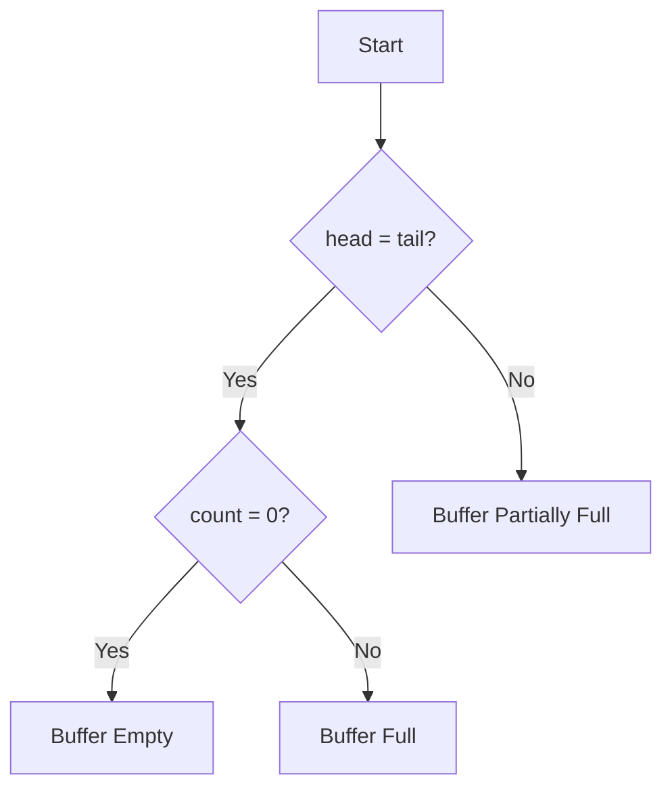

# ⚠️ Avoiding Trouble: Pitfalls and Edge Cases

Even though Ring Buffers are conceptually simple, they can be tricky to implement correctly. Let's explore common pitfalls and edge cases that you should be aware of.

## 🕳️ Common Implementation Pitfalls

### 1. The Empty vs. Full Confusion 😵

**The Problem**: When head and tail pointers are at the same position, it could mean either:
- The buffer is completely empty, or
- The buffer is completely full

```
       head/tail
          ↓
[ ?, ?, ?, ?, ? ]
```

**Solutions**:
- ✅ Track count separately (most straightforward approach)
- ✅ Always keep one slot empty (capacity - 1 usable slots)
- ✅ Use a boolean flag to track fullness

**Wrong Example**:
```typescript
// ❌ INCORRECT: This function is ambiguous
isFull(): boolean {
  return this.head === this.tail;
}
```

**Correct Example**:
```typescript
// ✅ CORRECT: Uses count for clarity
isFull(): boolean {
  return this.count === this.capacity;
}
```

### 2. Off-by-One Errors 🔢

**The Problem**: Miscalculating capacities, indices, or wrap-around logic.

**Common Mistakes**:
- Using `<=` instead of `<` when checking capacity
- Forgetting that arrays are 0-indexed
- Incorrect modulo calculations

**Example**:
```typescript
// ❌ INCORRECT: May exceed array bounds
this.head = (this.head + 1) % (this.capacity + 1);

// ✅ CORRECT: Properly bounds index to valid range
this.head = (this.head + 1) % this.capacity;
```

### 3. Inefficient Memory Management 🗑️

**The Problem**: Not clearing references to removed items can lead to memory leaks in some languages.

**Solution**: Clear references when dequeueing.

```typescript
// ✅ CORRECT: Clears reference to help garbage collection
dequeue(): T | undefined {
  if (this.isEmpty()) {
    return undefined;
  }
  
  const item = this.buffer[this.tail];
  this.buffer[this.tail] = undefined;  // Clear reference
  // ...rest of dequeue logic
}
```

## 🧪 Tricky Edge Cases

### 1. Empty Buffer Dequeue

**The Challenge**: What should happen when trying to dequeue from an empty buffer?

**Options**:
- Return undefined/null
- Throw an exception
- Return a special value

**Best Practice**: Be consistent and document your chosen behavior.

```typescript
dequeue(): T | undefined {
  if (this.isEmpty()) {
    // Option 1: Return undefined
    return undefined;
    
    // Option 2: Throw an exception
    // throw new Error("Cannot dequeue from empty buffer");
  }
  
  // ... rest of dequeue logic
}
```

### 2. Full Buffer Enqueue

**The Challenge**: What should happen when trying to enqueue to a full buffer?

**Options**:
- Overwrite the oldest element (circular buffer behavior)
- Reject the new element
- Resize the buffer (not typical for Ring Buffers)

**Implementation for Non-Overwriting Policy**:
```typescript
enqueue(item: T): boolean {
  if (this.isFull()) {
    // Reject new items when full
    return false;
  }
  
  this.buffer[this.head] = item;
  this.head = (this.head + 1) % this.capacity;
  this.count++;
  return true;
}
```

### 3. Single-Element Buffer

**The Challenge**: A buffer with capacity=1 is a special case where head and tail are always pointing to the same location.

```
   head/tail
      ↓
[    ?    ]
```

**Key Points**:
- Works correctly with a count variable
- Edge case for implementations that use head-tail relationship to determine empty/full state

### 4. Thread Safety in Concurrent Environments

**The Challenge**: Ring Buffers are often used in producer-consumer scenarios with multiple threads.

**Problems**:
- Race conditions
- Inconsistent state

**Solutions**:
- Mutex/locks
- Atomic operations
- Lock-free implementations

> [!WARNING]
> Thread safety requires additional measures beyond the basic Ring Buffer implementation we've discussed.

## 🔍 Debugging Common Issues

### Issue 1: "My buffer is losing elements!"

**Possible Causes**:
- Overwriting policy when full (expected behavior)
- Incorrect count tracking
- Head/tail pointer advancement logic errors

**Debugging Tips**:
- Add logging to track state changes
- Visualize the buffer state after each operation
- Test with a capacity of 1 to simplify

### Issue 2: "My Ring Buffer gets stuck with head = tail but isn't empty!"

**Likely Cause**: Using head = tail to determine emptiness without tracking count

**Solution**: Use a separate count variable or another method to disambiguate



### Issue 3: "My dequeue operations return undefined when there should be elements!"

**Possible Causes**:
- Incorrect isEmpty() check
- Tail pointer not updating correctly
- Count not being decremented properly

**Solution**: Add assertions or debugging statements to verify each step of dequeue

## 💭 Reflect on This

As you implement your Ring Buffer, ask yourself:

1. How will my buffer behave at the extremes (empty, full, capacity=1)?
2. Is my overwrite policy appropriate for my application?
3. Have I properly handled the empty vs. full disambiguation?
4. Is my implementation thread-safe (if needed)?

These questions will help you create a robust Ring Buffer implementation that handles edge cases gracefully!

In the next lesson, we'll look at real-world applications and variations of Ring Buffers. 