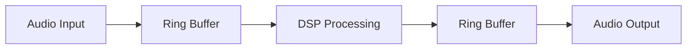
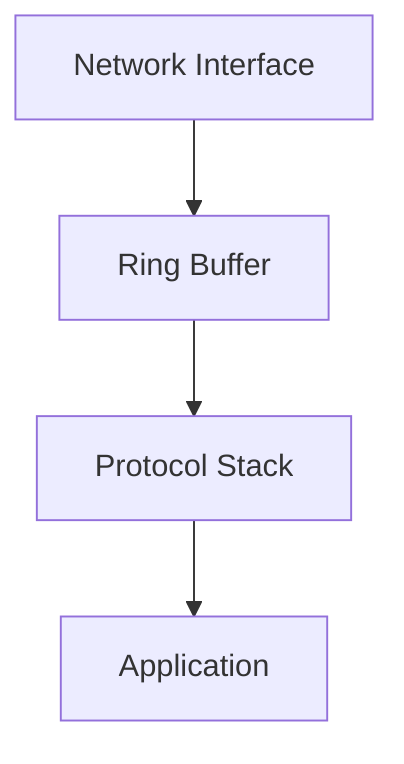

# 🌍 Ring Buffers in the Wild

Ring Buffers aren't just theoretical constructs—they're widely used in many applications and systems. Let's explore where and how they're used in the real world, along with some interesting variations.

## 🎯 Where Ring Buffers Shine

### 1. Audio Processing and Digital Signal Processing 🎵

Ring Buffers are extensively used in audio applications:



**Why it fits**:
- Audio data arrives in continuous streams
- Processing needs to happen in real-time
- Older samples become irrelevant once processed
- Fixed memory usage is critical for stable performance

**Example**: Digital audio workstations use Ring Buffers to manage the flow of audio samples between recording, processing, and playback stages.

### 2. Network Packet Processing 🌐



**Why it fits**:
- Network packets arrive at variable rates
- Processing time varies per packet
- Buffer overflows are expected and handled
- Fixed memory allocation is essential

**Example**: Network drivers use Ring Buffers to queue incoming and outgoing packets, smoothing out the differences between network and processing speeds.

### 3. Keyboard/Input Event Handling ⌨️

**Why it fits**:
- Events arrive at unpredictable times
- System needs to remember a limited history of inputs
- Older events become irrelevant after a while
- Memory footprint must be constrained

**Example**: Operating systems use Ring Buffers to store keyboard events, mouse movements, and other input events until the application is ready to process them.

### 4. Video Streaming and Playback 🎬


**Why it fits**:
- Video frames arrive in sequence
- Decoding takes variable time
- Buffering smooths out timing differences
- Memory usage must be bounded

**Example**: Video players use Ring Buffers to manage the flow of frames between network/disk and display, ensuring smooth playback.

## 🔄 Variations on the Theme

### 1. Lock-Free Ring Buffers 🔓

**What it is**: A specialized implementation designed for concurrent access without locks.

**Key features**:
- Uses atomic operations to ensure thread safety
- Avoids mutex overhead
- Minimizes thread contention
- Often uses power-of-two sizes for efficient modulo operations

**When to use it**:
- High-performance multi-threaded applications
- Real-time systems where lock contention is problematic
- Producer-consumer scenarios with multiple threads

**Example implementation hint**:
```typescript
// Using atomic operations for thread safety
enqueue(item: T): boolean {
  const currentHead = atomicLoad(this.head);
  const nextHead = (currentHead + 1) % this.capacity;
  
  if (nextHead === atomicLoad(this.tail)) {
    return false; // Buffer full
  }
  
  this.buffer[currentHead] = item;
  atomicStore(this.head, nextHead);
  return true;
}
```

### 2. Double Buffering (Ping-Pong Buffers) 🏓

**What it is**: A simplified Ring Buffer with exactly two buffers.

```
┌───────────┐           ┌───────────┐
│  Buffer A │  <---->  │  Buffer B │
└───────────┘           └───────────┘
   (Active)               (Standby)
```

**Key features**:
- Only two buffers that alternate roles
- One buffer is filled while the other is processed
- Roles switch when the active buffer is full/processed
- Simple to implement and reason about

**When to use it**:
- Graphics rendering (frame buffers)
- Audio processing with fixed block sizes
- Applications with predictable producer and consumer rates

### 3. N-Buffer 🔄🔄🔄

**What it is**: An extension of double buffering that uses more than two buffers.

**Key features**:
- Usually 3 (triple buffering) or more buffers
- Reduces waiting time for both producer and consumer
- Increases latency but improves throughput
- More complex synchronization

**When to use it**:
- Graphics applications with variable rendering times
- Systems where producer or consumer speeds vary significantly
- Applications where throughput is more important than latency

### 4. Disruptor Pattern 🔄⚡

**What it is**: A highly optimized ring buffer pattern developed by LMAX for high-throughput systems.

**Key features**:
- Designed for performance on modern CPU architectures
- Minimizes contention between producers and consumers
- Uses sequence counters instead of head/tail pointers
- Often implemented with cache-line padding to avoid false sharing

**When to use it**:
- Extremely high-throughput applications
- Systems processing millions of operations per second
- Multi-producer, multi-consumer scenarios

## 💡 Specialized Uses

### 1. Circular Logs (Ring Buffers for Logging) 📋

**What it is**: A Ring Buffer-based logging system that keeps the most recent log entries.

**Key features**:
- Maintains a fixed-size history of log messages
- Automatically discards oldest entries when full
- Constant memory usage regardless of how much is logged
- Often used in embedded systems or memory-constrained environments

**Example**: Flight data recorders (black boxes) use circular logs to maintain the most recent flight data.

### 2. History Buffers for Undo/Redo 🔙🔜

**What it is**: A Ring Buffer storing a limited history of operations or states.

**Key features**:
- Each entry represents an action or state
- Allows navigating backward and forward through history
- Limited to a fixed number of most recent actions
- Constant memory usage for history tracking

**Example**: Text editors use Ring Buffers to store a limited number of recent edits for undo/redo functionality.

## 🤔 Think About This

<details>
<summary>When would you choose a standard queue over a Ring Buffer?</summary>

You might choose a standard queue when:
- You need to process all data without any loss
- Memory usage can scale with data size
- The queue is temporary and short-lived
- You need dynamic resizing
- The data arrival rate is consistent with processing rate
</details>

<details>
<summary>How would you implement a thread-safe Ring Buffer?</summary>

Options include:
1. Use a mutex to protect all operations
2. Use atomic operations for lock-free implementation
3. Implement a separate queue for each producer-consumer pair
4. Use the disruptor pattern for multiple producers/consumers
</details>

In the next lesson, we'll bring everything together by implementing a complete Ring Buffer solution! 