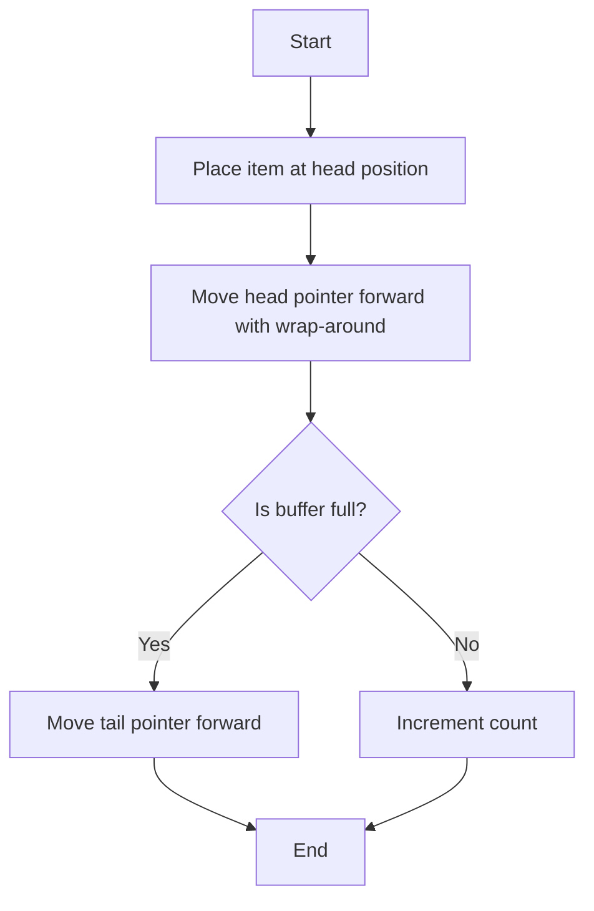
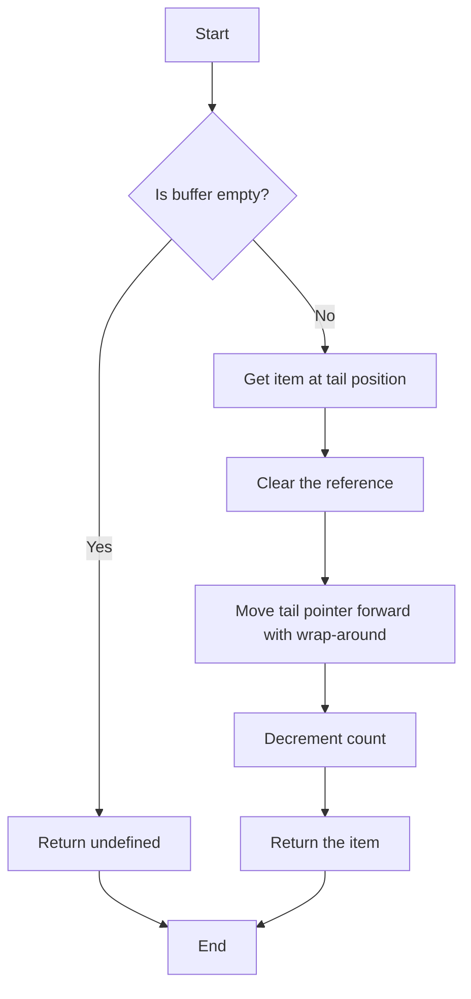
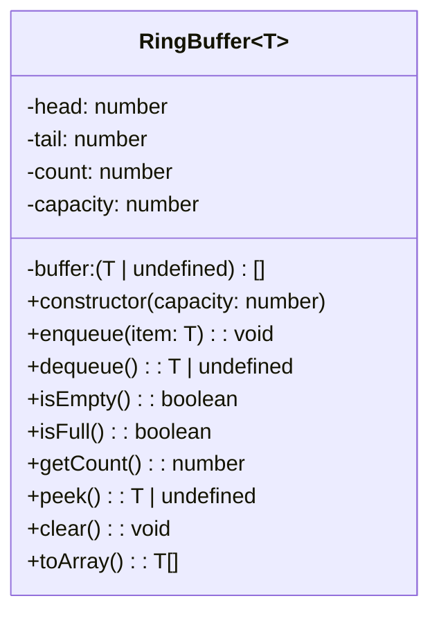

# 🔨 Building a Complete Ring Buffer

Now that we understand the key concepts, operations, and potential pitfalls, let's put everything together and implement a complete Ring Buffer from scratch.

## 📝 Planning Our Implementation

We'll build a generic Ring Buffer in TypeScript that supports:
- Basic operations: enqueue, dequeue
- Status checks: isEmpty, isFull, getCount
- Optional utility functions: peek, clear, toArray
- Proper handling of edge cases

## 💻 Step-by-Step Implementation

### Step 1: Define the Class Structure

```typescript
export class RingBuffer<T> {
  private buffer: (T | undefined)[];
  private head: number;
  private tail: number;
  private count: number;
  private readonly capacity: number;

  constructor(capacity: number) {
    if (capacity <= 0) {
      throw new Error("Capacity must be greater than 0");
    }
    this.buffer = new Array(capacity).fill(undefined);
    this.head = 0;
    this.tail = 0;
    this.count = 0;
    this.capacity = capacity;
  }

  // Methods to be implemented:
  // - enqueue(item)
  // - dequeue()
  // - isEmpty()
  // - isFull()
  // - getCount()
  // - peek()
  // - clear()
  // - toArray()
}
```

> [!NOTE]
> We're using a generic type parameter `<T>` so our Ring Buffer can store any type of element.

### Step 2: Implement Core Operations

#### The Enqueue Method

```typescript
enqueue(item: T): void {
  // Place the item at the current head position
  this.buffer[this.head] = item;
  
  // Move the head pointer (with wrap-around)
  this.head = (this.head + 1) % this.capacity;
  
  // Handle the full buffer case (overwrite policy)
  if (this.count === this.capacity) {
    // Buffer is full, move tail to "forget" oldest element
    this.tail = (this.tail + 1) % this.capacity;
  } else {
    // Buffer not full, increment count
    this.count++;
  }
}
```

Let's visualize what happens during enqueue:



#### The Dequeue Method

```typescript
dequeue(): T | undefined {
  // Check if buffer is empty
  if (this.isEmpty()) {
    return undefined;
  }
  
  // Get the item at the current tail position
  const item = this.buffer[this.tail];
  
  // Clear the reference (optional, helps with garbage collection)
  this.buffer[this.tail] = undefined;
  
  // Move the tail pointer (with wrap-around)
  this.tail = (this.tail + 1) % this.capacity;
  
  // Decrement the count
  this.count--;
  
  // Return the retrieved item
  return item;
}
```

Let's visualize what happens during dequeue:



### Step 3: Implement Status Check Methods

```typescript
isEmpty(): boolean {
  return this.count === 0;
}

isFull(): boolean {
  return this.count === this.capacity;
}

getCount(): number {
  return this.count;
}
```

### Step 4: Add Utility Methods

```typescript
peek(): T | undefined {
  if (this.isEmpty()) {
    return undefined;
  }
  
  return this.buffer[this.tail];
}

clear(): void {
  this.buffer.fill(undefined);
  this.head = 0;
  this.tail = 0;
  this.count = 0;
}

toArray(): T[] {
  if (this.isEmpty()) {
    return [];
  }
  
  const result: T[] = [];
  let current = this.tail;
  let itemsRemaining = this.count;
  
  while (itemsRemaining > 0) {
    // The ! assertion is safe because we know there are items in these positions
    result.push(this.buffer[current]!);
    current = (current + 1) % this.capacity;
    itemsRemaining--;
  }
  
  return result;
}
```

## 🧪 Testing Our Implementation

A robust Ring Buffer needs comprehensive testing. Here's a test suite that covers key functionality:

```typescript
describe('RingBuffer', () => {
  it('should initialize correctly', () => {
    const buffer = new RingBuffer<number>(3);
    expect(buffer.isEmpty()).toBe(true);
    expect(buffer.isFull()).toBe(false);
    expect(buffer.getCount()).toBe(0);
  });

  it('should enqueue and dequeue correctly', () => {
    const buffer = new RingBuffer<number>(3);
    
    buffer.enqueue(1);
    buffer.enqueue(2);
    buffer.enqueue(3);
    
    expect(buffer.isFull()).toBe(true);
    expect(buffer.getCount()).toBe(3);
    
    expect(buffer.dequeue()).toBe(1);
    expect(buffer.dequeue()).toBe(2);
    expect(buffer.dequeue()).toBe(3);
    
    expect(buffer.isEmpty()).toBe(true);
    expect(buffer.dequeue()).toBe(undefined);
  });

  it('should handle overwriting when full', () => {
    const buffer = new RingBuffer<number>(3);
    
    buffer.enqueue(1);
    buffer.enqueue(2);
    buffer.enqueue(3);
    buffer.enqueue(4); // This will overwrite 1
    
    expect(buffer.getCount()).toBe(3);
    expect(buffer.dequeue()).toBe(2); // 1 was overwritten
    expect(buffer.dequeue()).toBe(3);
    expect(buffer.dequeue()).toBe(4);
    expect(buffer.isEmpty()).toBe(true);
  });

  it('should peek without dequeueing', () => {
    const buffer = new RingBuffer<number>(3);
    
    expect(buffer.peek()).toBe(undefined);
    
    buffer.enqueue(1);
    buffer.enqueue(2);
    
    expect(buffer.peek()).toBe(1);
    expect(buffer.getCount()).toBe(2); // Count unchanged
    
    buffer.dequeue();
    expect(buffer.peek()).toBe(2);
  });

  it('should clear the buffer', () => {
    const buffer = new RingBuffer<number>(3);
    
    buffer.enqueue(1);
    buffer.enqueue(2);
    
    buffer.clear();
    
    expect(buffer.isEmpty()).toBe(true);
    expect(buffer.getCount()).toBe(0);
    expect(buffer.dequeue()).toBe(undefined);
  });

  it('should convert to array correctly', () => {
    const buffer = new RingBuffer<number>(5);
    
    buffer.enqueue(1);
    buffer.enqueue(2);
    buffer.enqueue(3);
    
    expect(buffer.toArray()).toEqual([1, 2, 3]);
    
    buffer.dequeue(); // Remove 1
    buffer.enqueue(4);
    buffer.enqueue(5);
    
    expect(buffer.toArray()).toEqual([2, 3, 4, 5]);
  });
});
```

## 📊 Visualizing The Final Solution

Let's visualize the relationship between components in our Ring Buffer:



## 🔍 Time and Space Complexity Analysis

Let's analyze the efficiency of our implementation:

| Operation | Time Complexity | Space Complexity |
|-----------|-----------------|------------------|
| enqueue   | O(1)            | O(1)             |
| dequeue   | O(1)            | O(1)             |
| isEmpty   | O(1)            | O(1)             |
| isFull    | O(1)            | O(1)             |
| getCount  | O(1)            | O(1)             |
| peek      | O(1)            | O(1)             |
| clear     | O(n)            | O(1)             |
| toArray   | O(n)            | O(n)             |

Where n is the capacity of the Ring Buffer.

> [!TIP]
> The constant-time complexity of the core operations (enqueue/dequeue) is what makes Ring Buffers so efficient for high-throughput scenarios!

## 🛡️ Making Our Implementation Robust

To make the implementation even more robust, consider these enhancements:

1. **Validation**: Add parameter validation in all public methods
2. **Error Handling**: Define clear error behavior (throw vs. return undefined)
3. **Optional Overwrite Policy**: Allow configuration of behavior when full
4. **Thread Safety**: Add synchronization for concurrent access if needed
5. **Optimization**: Consider performance optimizations like using power-of-two capacity

## 💭 Final Thoughts

Congratulations! You've now built a complete, generic Ring Buffer implementation that:
- Handles all core operations efficiently
- Properly manages circular indexing
- Includes utility functions for convenience
- Addresses common edge cases

This implementation provides a solid foundation that you can extend or adapt for specific use cases. Remember that Ring Buffers shine in scenarios where you need:
- Constant memory usage
- Fast enqueue/dequeue operations
- FIFO processing with potential for overwriting older data

In the next lesson, we'll wrap up with a conclusion and additional resources to further your understanding of this powerful data structure. 