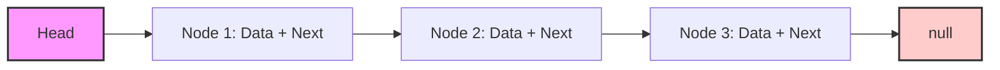

# 🔗 Understanding Singly Linked Lists

> [!NOTE]
> A singly linked list is one of the most fundamental data structures in computer science. Understanding it will help you build a solid foundation for more complex concepts!

## What is a Singly Linked List? 🤔

A singly linked list is a data structure that consists of a sequence of elements, called **nodes**, where each node contains:
1. A piece of **data** (which can be any type of information)
2. A **reference** (or pointer) to the next node in the sequence

The list maintains a reference to the **head** node (the first node in the list), which serves as the entry point to the entire structure.

## Why Learn About Linked Lists? 💡

Linked lists are important for several reasons:

- They form the foundation for other data structures like stacks, queues, and graphs
- They demonstrate fundamental programming concepts like pointers and references
- They offer efficient insertion and deletion operations at any position
- They dynamically grow and shrink based on program needs (unlike fixed-size arrays)

## The Challenge 🏆

In this learning path, you will:
1. Understand how singly linked lists work
2. Implement a complete singly linked list with key operations
3. Learn when and how to apply this data structure to real problems

> [!TIP]
> Think of a linked list like a treasure hunt, where each clue (node) contains a piece of treasure (data) and directions to the next clue (pointer). The only clue you're given to start is the first one (the head)!

## Key Operations We'll Implement ⚙️

- **Insertion**: Adding a new node at the beginning, end, or a specific position
- **Deletion**: Removing a node from the list
- **Searching**: Finding a node with specific data
- **Traversal**: Visiting each node in the list sequentially

Can you think of an everyday example of a linked list?

Think of a scavenger hunt where each clue leads to the next clue. You can only go forward, never backward, and you must start at the first clue (the head).

Or consider a train, where each car is connected to the next car, forming a sequence that can only be traversed in one direction from the engine.

Are you ready to start building your understanding of singly linked lists? Let's dive in! 🚀 