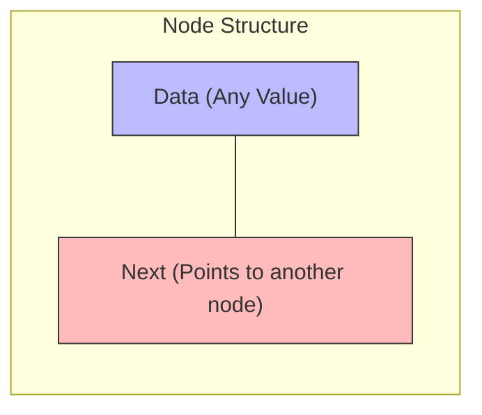
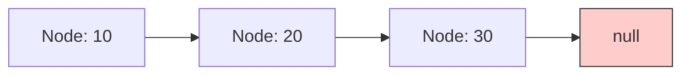

# 🧱 The Building Block: Understanding Nodes

Before we can understand the entire linked list, we need to understand its fundamental building block: **the node**.

## What is a Node? 🔍

A node in a singly linked list contains two key components:
1. **Data**: The value or information that the node stores
2. **Next pointer**: A reference to the next node in the sequence

Think of a node like a box with two compartments:
- One compartment holds your valuable item (the data)
- The other compartment holds a map to the next box (the pointer)



## Implementing a Node in Code 💻

Here's how we might implement a Node class in TypeScript:

```typescript
class Node {
  data: any;         // Stores the value
  next: Node | null; // Reference to the next node, or null if none

  constructor(data: any) {
    this.data = data;
    this.next = null; // By default, a new node doesn't point to anything
  }
}
```

> [!NOTE]
> In our implementation, we're using `any` as the data type to keep things simple. In a real production environment, you might use generics (`Node<T>`) to create type-safe nodes.

## Visualizing a Chain of Nodes 🔗

When we connect multiple nodes together, we create a chain:



In this visualization:
- Each box is a Node
- The number inside is the node's data (10, 20, 30)
- The arrow represents the next pointer
- The last node points to null, indicating the end of the list

## How Memory Works with Nodes 🧠

Unlike arrays, which store elements in contiguous memory locations, linked list nodes can be scattered throughout memory:

```
Memory
┌───────┐            ┌───────┐            ┌───────┐
│  Node │            │  Node │            │  Node │
│ Data:10│───────────▶ Data:20│───────────▶ Data:30│─────▶ null
│ Next:─┼─┐          │ Next:─┼─┐          │ Next:─┼─┐
└───────┘ │          └───────┘ │          └───────┘ │
          │                    │                    │
          └────────────────────┘                    └────────────────
```

This non-contiguous storage allows for:
- Dynamic growth without reallocation
- Efficient insertion and deletion operations

> [!TIP]
> When drawing or tracing linked lists on paper, I recommend using boxes with two parts: one for the data and one for an arrow to the next node. This visual approach helps clarify the structure.

## Think About It 🤔

<details>
<summary>Why do you think we initialize the `next` pointer as `null` in the constructor?</summary>

We initialize the `next` pointer as `null` because when a node is first created, it isn't connected to any other node yet. The `null` value explicitly indicates "this node doesn't point to anything" - it's the end of the chain. This is also how we can identify the last node in our linked list during traversal operations.
</details>

<details>
<summary>What would happen if we forgot to set the `next` pointer of the last node to `null`?</summary>

If we didn't set the `next` pointer of the last node to `null`, we wouldn't have a way to know when we've reached the end of the list. This could lead to infinite loops when traversing the list, as the code would continue trying to access the "next" node indefinitely. The `null` reference is our termination condition!
</details>

In the next lesson, we'll look at how to create a singly linked list class to manage our nodes! 🚀 