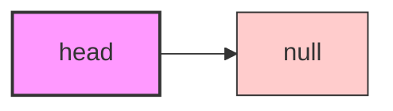
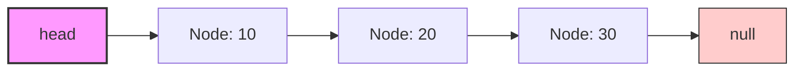

# 🏗️ Creating Our Linked List Structure

Now that we understand what a node is, let's create the actual linked list structure that will manage these nodes!

## The Linked List Class 📋

A linked list class serves as a manager for all the nodes in our list. At minimum, it needs to:

1. Maintain a reference to the **head** node (the entry point to our list)
2. Provide methods to manipulate the list (add, remove, find nodes)
3. Handle edge cases (empty lists, operations on the first/last nodes)

## Basic Implementation 💻

Here's how we implement the most basic structure of our singly linked list:

```typescript
class SinglyLinkedList {
  head: Node | null;

  constructor() {
    this.head = null; // Initially, the list is empty
  }
  
  // Methods will go here
}
```

> [!NOTE]
> Notice that we initialize the list with `head` set to `null`. This means our list starts empty - it doesn't contain any nodes yet.

## Visualizing an Empty List vs. A List with Nodes 👁️

Let's visualize both an empty list and a list with some nodes:

### Empty List:


### List with Nodes:


## List States to Consider 🧐

When working with linked lists, we need to consider different states:

1. **Empty list**: `head` is `null`
2. **Single node list**: `head` points to one node, whose `next` is `null`
3. **Multiple node list**: `head` points to the first node in a chain

> [!WARNING]
> Many linked list errors happen when we don't properly account for all these states, especially the empty list case. Always check if `head` is `null` before trying to access it!

## Thinking in Terms of the Head 🤔

The `head` reference is crucial - it's our only entry point to the entire list:

- If you lose the reference to `head`, you lose the entire list!
- Any operation on the list must start from the `head`
- The `head` can change when we add or remove elements from the beginning

<details>
<summary>Why don't we store a reference to the tail (last node) as well?</summary>

Many linked list implementations actually do store a reference to the tail node! This would allow O(1) insertions at the end of the list, rather than having to traverse from the head each time (O(n)).

However, for a basic singly linked list, we often start with just the head pointer to keep things simple. As you get more comfortable with linked lists, consider adding a tail pointer as an optimization.
</details>

## Compare & Contrast: Lists vs. Arrays 📊

| Aspect | Linked List | Array |
|--------|-------------|-------|
| Memory allocation | Dynamic, nodes can be anywhere in memory | Static, contiguous block of memory |
| Insertion at beginning | O(1) - just update `head` | O(n) - need to shift all elements |
| Insertion at end | O(n) without tail pointer | O(1) with direct access |
| Access by index | O(n) - must traverse from head | O(1) - direct access by index |
| Size flexibility | Can grow/shrink dynamically | Fixed size (in many languages) |

> [!TIP]
> Think of arrays like houses on a numbered street (sequential and fixed), while linked lists are more like a treasure hunt where each clue leads you to the next location (dynamic and scattered).

In the next lesson, we'll start implementing our first method: inserting nodes at the beginning of the list! 🚀 