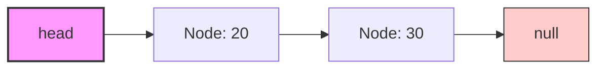
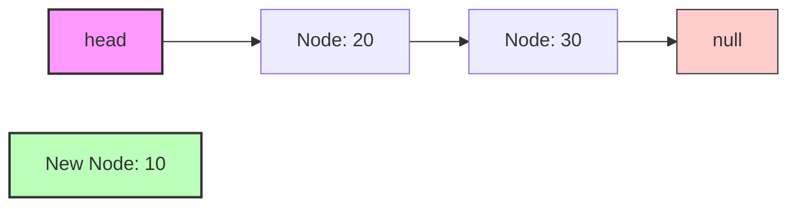
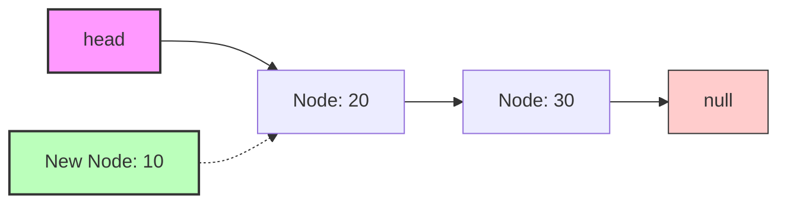
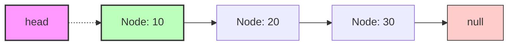
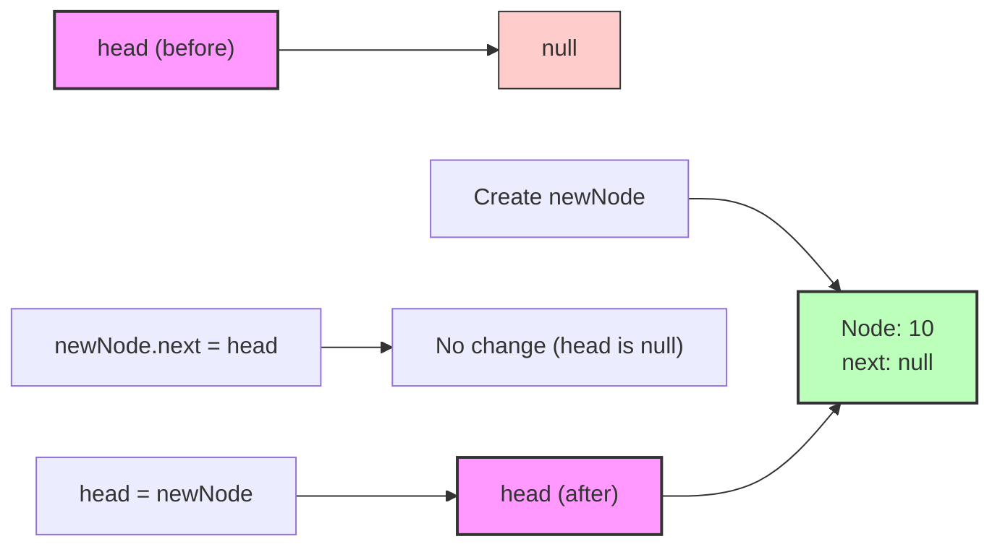
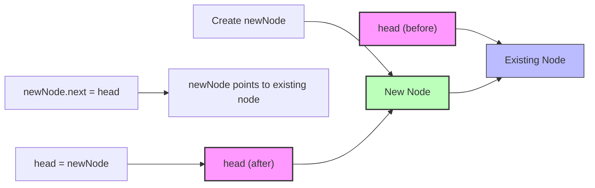

# 🎬 Insertion at the Beginning

Let's implement our first operation: adding a new node to the beginning of our linked list. This is one of the simplest and most efficient operations we can perform!

## Why Insert at the Beginning? 🤔

Insertion at the beginning of a linked list is:
- **Efficient**: It's an O(1) operation - constant time regardless of list size
- **Simple**: It requires minimal pointer manipulation
- **Useful**: Many algorithms like stack implementations use this pattern

## The Algorithm Step by Step 📝

To insert a node at the beginning of a singly linked list:

1. Create a new node with the given data
2. Set the new node's `next` pointer to the current `head`
3. Update the list's `head` to point to the new node

Let's visualize this with diagrams:

### Before Insertion:


### Step 1: Create a new node (with data 10)


### Step 2: Point new node's next to current head


### Step 3: Update head to point to new node


## Implementation in Code 💻

Here's how we implement insertion at the beginning:

```typescript
insertAtBeginning(data: any): void {
  // Step 1: Create a new node with the given data
  const newNode = new Node(data);
  
  // Step 2: Set the new node's next pointer to the current head
  newNode.next = this.head;
  
  // Step 3: Update the list's head to point to the new node
  this.head = newNode;
}
```

> [!NOTE]
> This method works for both empty and non-empty lists! If the list is empty (`this.head` is `null`), then the new node's `next` will be `null`, and the `head` will point to this new node, making it the only node in the list.

## Special Cases to Consider 🧐

This method handles two important cases:

### Case 1: Inserting into an empty list


### Case 2: Inserting into a non-empty list


> [!TIP]
> The order of operations matters! Make sure to set the new node's `next` pointer **before** updating the `head`. Otherwise, you might lose the reference to the rest of the list.

## Time and Space Complexity ⏱️

- **Time Complexity**: O(1) - constant time operation regardless of list size
- **Space Complexity**: O(1) - we only create one new node

## Try It Yourself 💪

<details>
<summary>What would happen if we switched the order of steps 2 and 3 in our code?</summary>

If we updated the head first (step 3) and then set the new node's next pointer (step 2), we would lose the connection to the rest of the list!

The code would look like:
```typescript
// INCORRECT implementation
insertAtBeginning(data: any): void {
  const newNode = new Node(data);
  this.head = newNode;        // Now head points to newNode
  newNode.next = this.head;   // newNode points to itself!
}
```

This creates a cycle where the new node points to itself, and we lose the reference to all the other nodes in the list! 🔄
</details>

In the next lesson, we'll implement another important operation: inserting a node at the end of the list! 🚀 