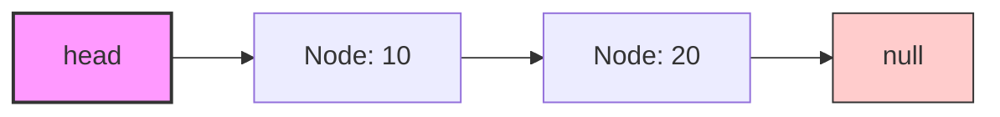
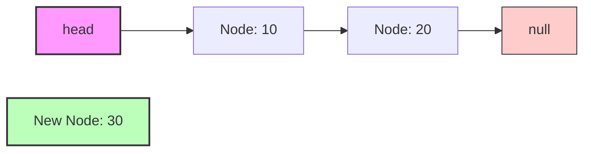
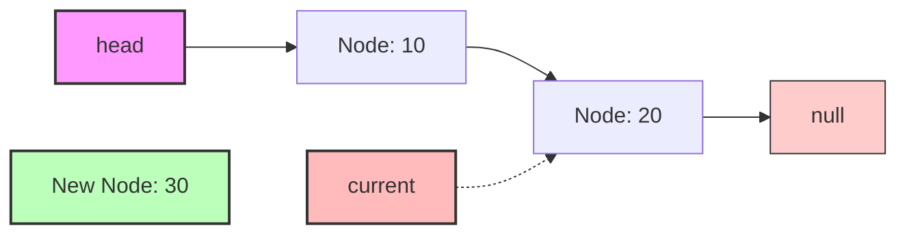
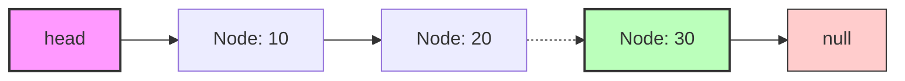
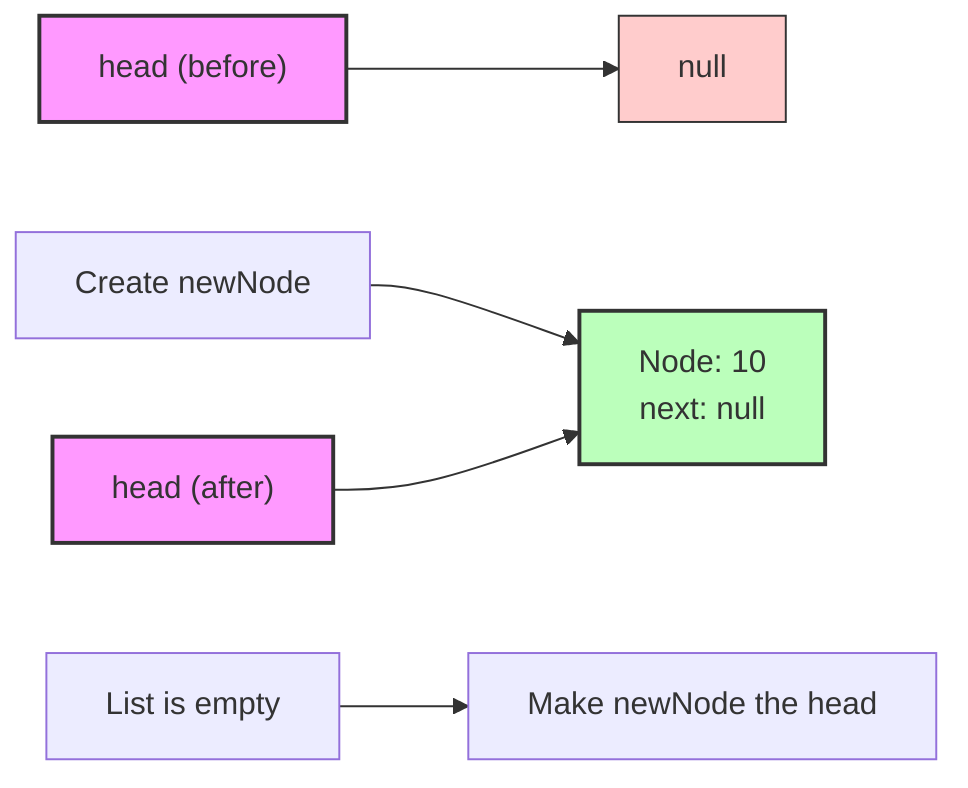
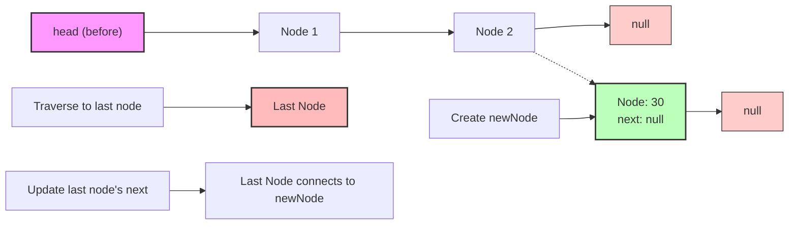

# 🔚 Insertion at the End

Now that we've learned how to insert at the beginning, let's implement another common operation: adding a new node to the end of our linked list.

## The Challenge of End Insertion 🤔

Unlike insertion at the beginning, adding a node at the end requires us to first find the last node in the list. This makes it a bit more complex:

- We need to traverse the entire list to find the last node
- We must handle the special case of an empty list
- The operation becomes slower as the list grows longer

## The Algorithm Step by Step 📝

To insert a node at the end of a singly linked list:

1. Create a new node with the given data
2. If the list is empty (`head` is `null`), make this new node the `head`
3. Otherwise, traverse the list to find the last node (the one whose `next` is `null`)
4. Update the last node's `next` pointer to reference the new node

Let's visualize this with diagrams:

### Before Insertion:


### Step 1: Create a new node (with data 30)


### Step 2 & 3: Traverse to find the last node (N2)


### Step 4: Update the last node's next to point to the new node


## Implementation in Code 💻

Here's how we implement insertion at the end:

```typescript
insertAtEnd(data: any): void {
  // Step 1: Create a new node with the given data
  const newNode = new Node(data);
  
  // Step 2: If the list is empty, make this new node the head
  if (!this.head) {
    this.head = newNode;
    return;
  }
  
  // Step 3: Traverse to find the last node
  let current = this.head;
  while (current.next) {
    current = current.next;
  }
  
  // Step 4: Update the last node's next to point to the new node
  current.next = newNode;
}
```

> [!NOTE]
> The `while (current.next)` loop will stop when `current.next` is `null`, meaning `current` is the last node.

## Special Cases to Consider 🧐

This method handles two important scenarios:

### Case 1: Inserting into an empty list


### Case 2: Inserting into a non-empty list


> [!WARNING]
> Always check for an empty list (`!this.head`) before trying to traverse it. Trying to access properties of `null` will cause a runtime error!

## Time and Space Complexity ⏱️

- **Time Complexity**: O(n) - we need to traverse the entire list to find the last node
- **Space Complexity**: O(1) - we only create one new node

## Optimizing with a Tail Pointer 🔧

For applications where you frequently insert at the end, maintaining a `tail` pointer could improve performance:

```typescript
class SinglyLinkedList {
  head: Node | null;
  tail: Node | null;  // Adding a tail pointer

  constructor() {
    this.head = null;
    this.tail = null;
  }

  insertAtEnd(data: any): void {
    const newNode = new Node(data);
    
    if (!this.head) {
      this.head = newNode;
      this.tail = newNode;
      return;
    }
    
    this.tail.next = newNode;
    this.tail = newNode;
  }
}
```

With a tail pointer, insertion at the end becomes an O(1) operation!

## Compare: Beginning vs. End Insertion 📊

| Aspect | Insert at Beginning | Insert at End |
|--------|---------------------|---------------|
| Time complexity | O(1) - constant time | O(n) - linear time (or O(1) with tail) |
| Pointer updates | 2 (newNode.next, head) | 1 (lastNode.next) or 2 with tail |
| Traversal needed | No | Yes (without tail) |
| Code complexity | Simpler | More complex |

<details>
<summary>Why might we choose to insert at the end rather than the beginning?</summary>

Inserting at the end maintains the natural order of elements as they are added. If you need to preserve the sequence of elements exactly as they are inserted (like in a queue data structure), then insertion at the end is necessary.

Think of it like people standing in line - new people join at the end of the line, not the beginning!
</details>

In the next lesson, we'll learn how to delete nodes from our linked list! 🚀 