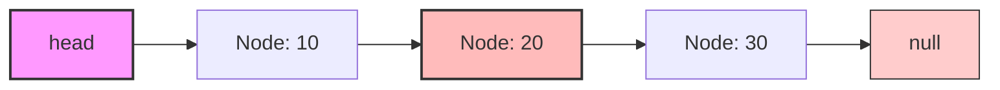
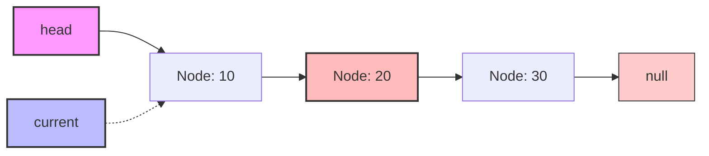
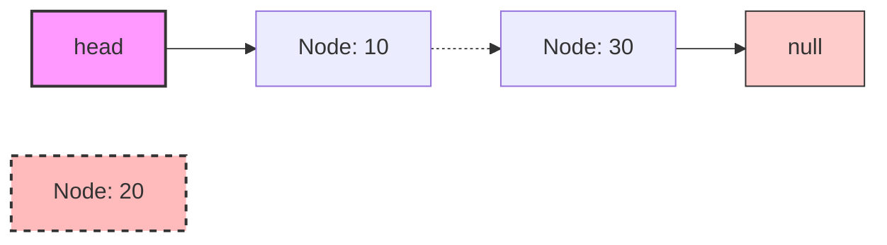
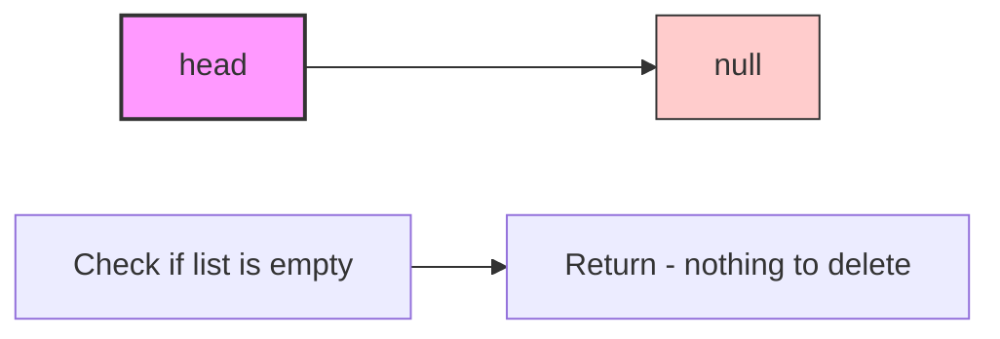
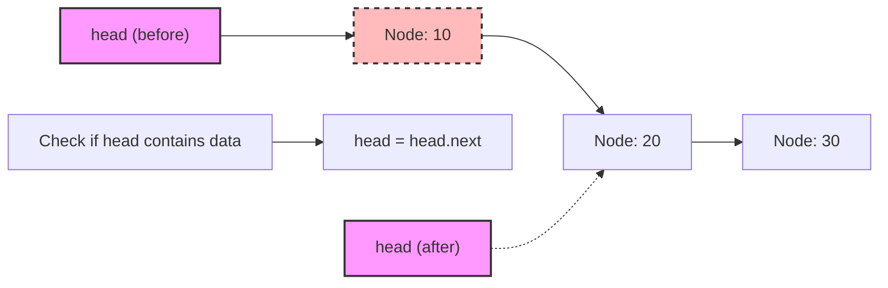
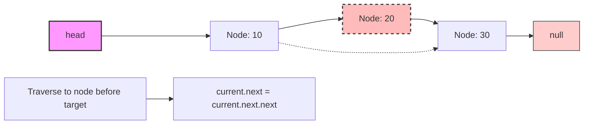
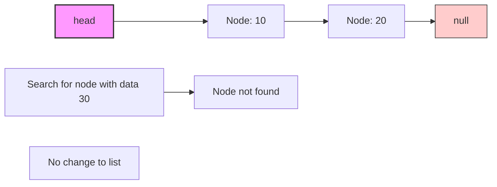

# 🗑️ Deleting Nodes from a Linked List

Now that we know how to add nodes to our linked list, let's learn how to remove them. Deletion is a key operation for any data structure.

## The Challenge of Node Deletion 🤔

Deleting a node from a singly linked list presents some interesting challenges:

- We need to find the node containing the data we want to delete
- We need to update references to "skip over" the node we're removing
- We can't directly access the previous node in a singly linked list

## The Algorithm Step by Step 📝

To delete a node with specific data from a singly linked list:

1. Check if the list is empty - if it is, there's nothing to delete
2. Check if the head node contains the data to delete
   - If yes, update head to point to the second node
3. Otherwise, traverse the list to find the node just *before* the one we want to delete
4. Once found, update the previous node's `next` pointer to skip the node we're deleting

Let's visualize this with diagrams, assuming we want to delete the node with data "20":

### Before Deletion:


### Step 3: Traverse to find the node before the one to delete


### Step 4: Update the previous node's next to skip the node to delete


## Implementation in Code 💻

Here's how we implement the delete operation:

```typescript
delete(data: any): void {
  // Step 1: Check if the list is empty
  if (!this.head) {
    return;
  }
  
  // Step 2: Check if the head node contains the data to delete
  if (this.head.data === data) {
    this.head = this.head.next;
    return;
  }
  
  // Step 3: Traverse the list to find the node before the one to delete
  let current = this.head;
  while (current.next && current.next.data !== data) {
    current = current.next;
  }
  
  // Step 4: If we found the node to delete, update references to skip it
  if (current.next) {
    current.next = current.next.next;
  }
}
```

> [!NOTE]
> After this operation, the deleted node will no longer be referenced by our linked list. In garbage-collected languages (like JavaScript), this means the node will eventually be cleaned up from memory.

## Special Cases to Consider 🧐

Let's examine the special cases our code handles:

### Case 1: Deleting from an empty list


### Case 2: Deleting the head node


### Case 3: Deleting a node in the middle


### Case 4: Node to delete doesn't exist


> [!WARNING]
> If the data we're looking for doesn't exist in the list, our delete method silently does nothing. In a production environment, you might want to return a boolean indicating whether a node was deleted or not.

## Time and Space Complexity ⏱️

- **Time Complexity**: O(n) - in the worst case, we need to traverse to the end of the list
- **Space Complexity**: O(1) - we don't need any extra space that grows with input size

## Memory Management Considerations 🧠

In some languages, you may need to explicitly free the memory of the deleted node:

```c
// C language example
void delete(struct List* list, int data) {
    // Find and set up pointers
    // ...
    
    // Store reference to the node we're deleting
    struct Node* temp = current->next;
    
    // Update the link
    current->next = current->next->next;
    
    // Free the memory
    free(temp);
}
```

Thankfully, in languages like JavaScript or TypeScript, the garbage collector handles this for us!

## Think About It 🤔

<details>
<summary>What are the differences between deleting from an array versus a linked list?</summary>

**Array Deletion:**
- Requires shifting all elements after the deleted item (O(n) operation)
- Needs to update the size/length counters
- Memory allocated for the array often remains the same
- Direct access to the index makes finding the element O(1)

**Linked List Deletion:**
- Only requires updating a few pointers (O(1) once the node is found)
- No need to shift other elements
- Memory can be freed immediately
- Finding the element requires traversal (O(n))

In general, linked lists excel at insertions and deletions, while arrays are better for random access.
</details>

<details>
<summary>What would happen if you tried to delete the last node in the list?</summary>

Deleting the last node works with our implementation:

1. We'd traverse until `current` is the second-to-last node
2. We'd set `current.next = current.next.next`, which is `current.next = null`
3. The list would now end at the second-to-last node, which becomes the new last node

The time complexity would be O(n) since we'd need to traverse almost the entire list to find the second-to-last node.
</details>

In the next lesson, we'll learn how to search for nodes in our linked list! 🚀 