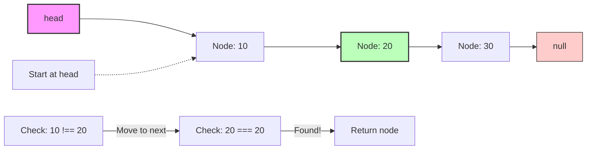

# 🔍 Searching for Nodes in a Linked List

Being able to find data in our linked list is another crucial operation. Let's learn how to implement a search function.

## The Search Operation 🧐

Searching in a singly linked list involves:
- Starting at the head
- Examining each node in sequence
- Returning the node (or its position) when a match is found
- Returning null (or -1) if no match is found

## The Algorithm Step by Step 📝

To search for a node with specific data in a singly linked list:

1. Start at the head node
2. Check if the current node contains the data we're looking for
   - If yes, return the node (or its position)
3. Move to the next node
4. Repeat steps 2-3 until we find the data or reach the end of the list
5. If we reach the end without finding the data, return null (or -1)

Let's visualize searching for a node with data "20":



## Implementation in Code 💻

Let's implement two search variants - one that returns the node and another that returns the position:

### Search that returns the node:

```typescript
search(data: any): Node | null {
  // Start at the head
  let current = this.head;
  
  // Traverse the list
  while (current) {
    // Check if current node has the data we're looking for
    if (current.data === data) {
      return current; // Found it!
    }
    // Move to the next node
    current = current.next;
  }
  
  // If we get here, we didn't find the data
  return null;
}
```

### Search that returns the position:

```typescript
findPosition(data: any): number {
  // Start at the head
  let current = this.head;
  let position = 0;
  
  // Traverse the list
  while (current) {
    // Check if current node has the data we're looking for
    if (current.data === data) {
      return position; // Found it!
    }
    // Move to the next node
    current = current.next;
    position++;
  }
  
  // If we get here, we didn't find the data
  return -1;
}
```

> [!NOTE]
> Which return value is better depends on your needs. Returning the node gives you access to both the data and the rest of the list from that point. Returning the position is useful when you need to know where in the sequence the data appears.

## Search Variations 🔄

There are several ways to extend or modify our search function:

### Search for the Nth node:

```typescript
getNodeAtPosition(position: number): Node | null {
  if (position < 0) return null;
  
  let current = this.head;
  let index = 0;
  
  while (current && index < position) {
    current = current.next;
    index++;
  }
  
  return current;
}
```

### Search with a custom comparison function:

```typescript
findWithPredicate(predicate: (data: any) => boolean): Node | null {
  let current = this.head;
  
  while (current) {
    if (predicate(current.data)) {
      return current;
    }
    current = current.next;
  }
  
  return null;
}
```

## Time and Space Complexity ⏱️

- **Time Complexity**: O(n) - in the worst case, we need to traverse the entire list
- **Space Complexity**: O(1) - we only need a few variables regardless of list size

## The Limitations of Singly Linked Lists for Searching 📊

Searching is one area where singly linked lists don't excel:

| Data Structure | Search Complexity | Why? |
|----------------|-------------------|------|
| Array | O(n) for unsorted, O(log n) for sorted binary search | Direct access to elements |
| Hash Table | O(1) average case | Hash function gives direct access |
| Singly Linked List | O(n) | Must traverse from beginning |
| Binary Search Tree | O(log n) average case | Can eliminate half the options at each step |

> [!TIP]
> If you need to frequently search for elements by value and don't need the dynamic insertion/deletion benefits of linked lists, consider using a different data structure.

## Think About It 🤔

<details>
<summary>How would searching be different in a doubly linked list?</summary>

The basic search algorithm would be the same in a doubly linked list - still O(n) time complexity. 

However, a doubly linked list could provide more flexibility:
- You could search from either the head or the tail, potentially cutting search time in half if you know roughly where the element might be
- You could search in both directions simultaneously (with two pointers moving outward from the middle)
- Once you find a node, you can traverse backward as well as forward

Despite these advantages, searching is still generally a weakness of linked lists compared to other data structures like hash tables or binary search trees.
</details>

<details>
<summary>Can we optimize searching in a singly linked list?</summary>

While the basic singly linked list doesn't offer many optimization opportunities for searching, there are a few strategies:

1. **Keep the list sorted**: This doesn't improve the worst-case time complexity, but might allow you to stop early if you pass the value you're looking for.

2. **Add a tail pointer and search from both ends**: This doesn't help with searching for values but can make searching by position more efficient by starting from the closer end.

3. **Add skip pointers**: Create an "express lane" by having some nodes point several positions ahead. This is the idea behind a "skip list" data structure.

4. **Use a hybrid approach**: Combine a linked list with an index (like an array or hash map) that provides faster access to specific positions or values.
</details>

In the next lesson, we'll learn how to display and traverse our linked list! 🚀 