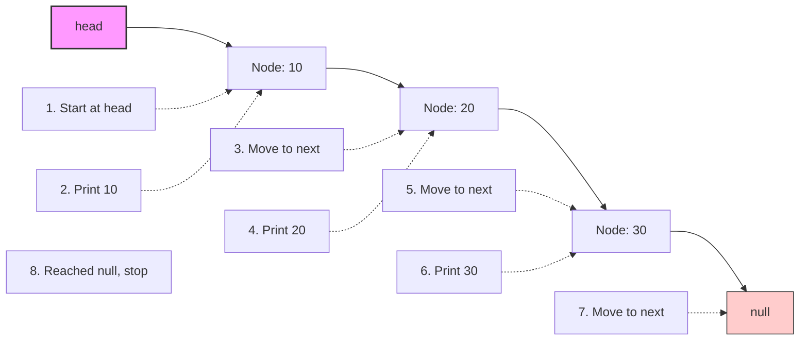
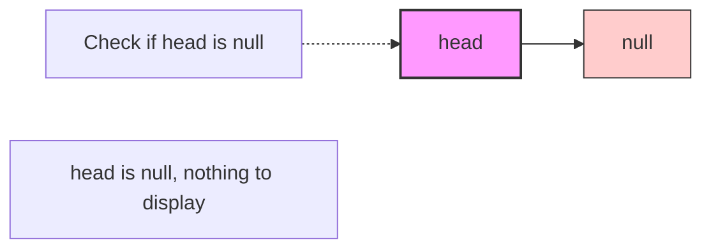

# 👀 Displaying and Traversing a Linked List

Being able to visualize and traverse our linked list is essential for debugging and confirming our operations work as expected. Let's learn how to implement these features.

## The Traverse Operation 🚶

Traversal is the foundation of many linked list operations. It involves:
- Starting at the head node
- Visiting each node in sequence
- Performing some action at each node
- Stopping when we reach the end of the list (a null reference)

## The Display Algorithm Step by Step 📝

To display the contents of our singly linked list:

1. Start at the head node
2. For each node, print/append its data
3. Move to the next node
4. Repeat steps 2-3 until we reach the end of the list

Let's visualize this traversal:



## Implementation in Code 💻

Here's how we implement a method to display our linked list:

```typescript
display(): void {
  // Start at the head
  let current = this.head;
  let result = '';
  
  // Traverse the list
  while (current) {
    // Append the current node's data to our result
    result += current.data + ' -> ';
    
    // Move to the next node
    current = current.next;
  }
  
  // Append 'null' to indicate the end of the list
  result += 'null';
  
  // Output the result
  console.log(result);
}
```

## Generic Traversal Pattern 🔄

The traversal pattern you see in the `display` method is a recurring pattern in many linked list operations:

```typescript
function traversalPattern() {
  // Start at the head
  let current = this.head;
  
  // Loop until we reach the end
  while (current) {
    // Do something with current node
    doSomething(current);
    
    // Move to the next node
    current = current.next;
  }
}
```

This pattern is used in:
- Searching (as we saw in the previous lesson)
- Counting nodes
- Applying a function to each node
- Finding maximum/minimum values
- And many more operations!

## Advanced Traversal Operations 🚀

Here are some common operations that use traversal:

### Counting nodes:

```typescript
size(): number {
  let count = 0;
  let current = this.head;
  
  while (current) {
    count++;
    current = current.next;
  }
  
  return count;
}
```

### Converting to array:

```typescript
toArray(): any[] {
  const result: any[] = [];
  let current = this.head;
  
  while (current) {
    result.push(current.data);
    current = current.next;
  }
  
  return result;
}
```

### Applying a function to each node:

```typescript
forEach(callback: (data: any, index: number) => void): void {
  let current = this.head;
  let index = 0;
  
  while (current) {
    callback(current.data, index);
    current = current.next;
    index++;
  }
}
```

## Handling Edge Cases 🧐

It's important to handle edge cases during traversal:

### Empty list:


Our `display` method already handles this case correctly! If `this.head` is `null`, the `while (current)` condition evaluates to false immediately, and we output just "null".

## Time and Space Complexity ⏱️

For the display and traversal operations:

- **Time Complexity**: O(n) - we need to visit every node in the list
- **Space Complexity**: O(1) for simple traversal, O(n) if we're building a string or array of results

## Recursive Traversal Alternative 🔄

We can also implement traversal recursively:

```typescript
displayRecursive(node: Node | null = this.head, result: string = ''): void {
  // Base case: we've reached the end of the list
  if (!node) {
    console.log(result + 'null');
    return;
  }
  
  // Append the current node's data to our result
  result += node.data + ' -> ';
  
  // Recursive call with the next node
  this.displayRecursive(node.next, result);
}
```

> [!WARNING]
> While recursive traversal can be elegant, it uses additional stack space and can cause a stack overflow for very large lists. The iterative approach is generally preferred.

## Think About It 🤔

<details>
<summary>How would you reverse the display order of a singly linked list?</summary>

Since a singly linked list only allows forward traversal, to display it in reverse order, we have a few options:

1. **Convert to an array, then reverse**:
   ```typescript
   displayReverse(): void {
     const values = this.toArray();
     values.reverse();
     console.log(values.join(' -> ') + ' -> null');
   }
   ```

2. **Use recursion**:
   ```typescript
   displayReverseRecursive(node: Node | null = this.head): void {
     // Base case: we've reached the end of the list
     if (!node) return;
     
     // First, recurse to the end
     this.displayReverseRecursive(node.next);
     
     // Then, print on the way back up
     console.log(node.data);
   }
   ```

3. **Physically reverse the list** (temporarily):
   ```typescript
   displayReverse(): void {
     // Reverse the list
     const reversed = this.reverse();
     
     // Display it
     reversed.display();
     
     // Note: this modifies the original list structure!
   }
   ```

The most memory-efficient approach is the recursive one, though it has the stack overflow risk for very large lists.
</details>

<details>
<summary>How would you check if a linked list has a cycle?</summary>

A cycle in a linked list occurs when a node's next pointer points back to a previous node, creating a loop. To detect a cycle, we can use Floyd's Cycle-Finding Algorithm (also known as the "tortoise and hare" algorithm):

```typescript
hasCycle(): boolean {
  if (!this.head) return false;
  
  let slow = this.head;  // Tortoise - moves one step at a time
  let fast = this.head;  // Hare - moves two steps at a time
  
  while (fast && fast.next) {
    slow = slow.next;       // Move one step
    fast = fast.next.next;  // Move two steps
    
    // If they meet, we have a cycle
    if (slow === fast) {
      return true;
    }
  }
  
  // If we reach the end (null), there's no cycle
  return false;
}
```

This algorithm works because if there's a cycle, the fast pointer will eventually catch up to the slow pointer from behind. If there's no cycle, the fast pointer will reach the end of the list.
</details>

In the next lesson, we'll put it all together and see a complete implementation of our linked list! 🚀 