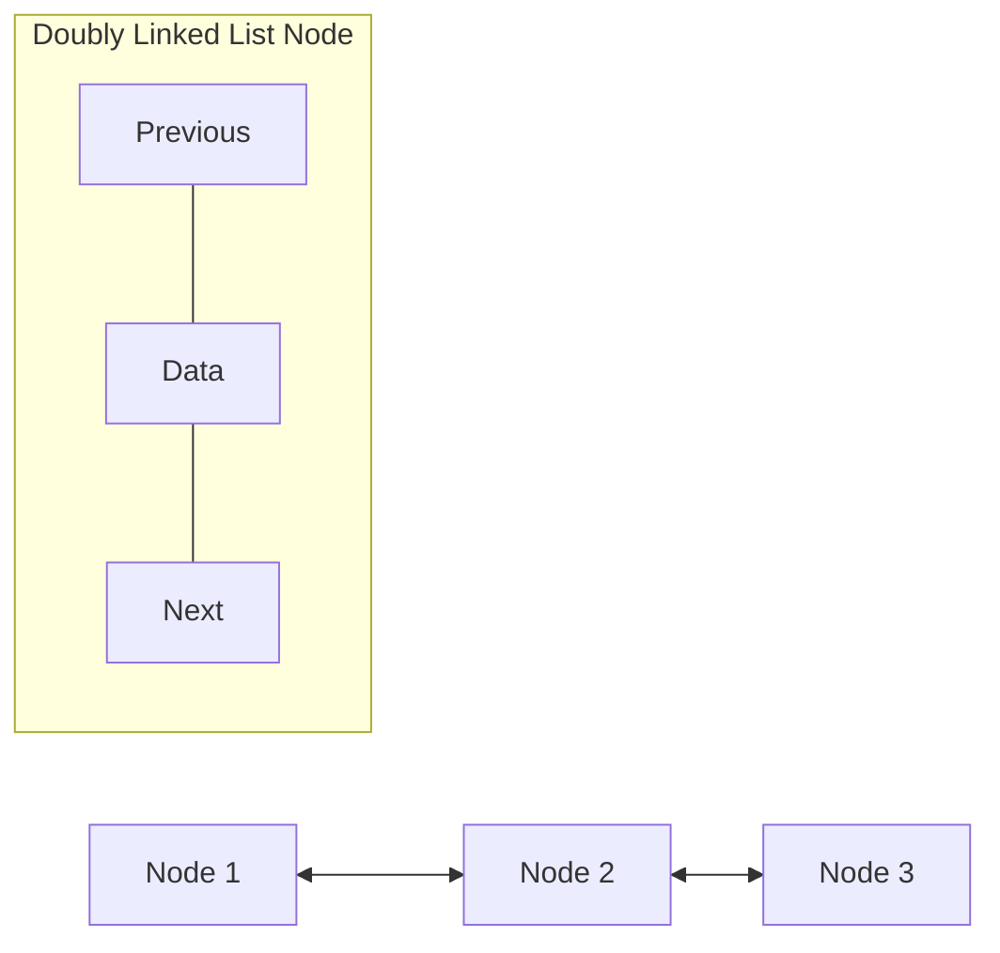
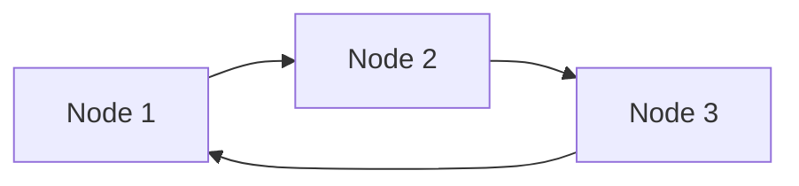

# 🏆 Complete Implementation and Advanced Topics

Congratulations! You've learned all the essential operations for a singly linked list. Let's put everything together and explore some advanced topics and real-world use cases.

## Complete Implementation 💻

Here's the complete implementation of our singly linked list, incorporating all the operations we've covered:

```typescript
class Node {
  data: any;
  next: Node | null;

  constructor(data: any) {
    this.data = data;
    this.next = null;
  }
}

class SinglyLinkedList {
  head: Node | null;

  constructor() {
    this.head = null;
  }

  // Insert at the beginning - O(1)
  insertAtBeginning(data: any): void {
    const newNode = new Node(data);
    newNode.next = this.head;
    this.head = newNode;
  }

  // Insert at the end - O(n)
  insertAtEnd(data: any): void {
    const newNode = new Node(data);
    
    if (!this.head) {
      this.head = newNode;
      return;
    }
    
    let current = this.head;
    while (current.next) {
      current = current.next;
    }
    
    current.next = newNode;
  }

  // Delete a node - O(n)
  delete(data: any): void {
    if (!this.head) {
      return;
    }
    
    if (this.head.data === data) {
      this.head = this.head.next;
      return;
    }
    
    let current = this.head;
    while (current.next && current.next.data !== data) {
      current = current.next;
    }
    
    if (current.next) {
      current.next = current.next.next;
    }
  }

  // Search for a node - O(n)
  search(data: any): Node | null {
    let current = this.head;
    
    while (current) {
      if (current.data === data) {
        return current;
      }
      current = current.next;
    }
    
    return null;
  }

  // Display the list - O(n)
  display(): void {
    let current = this.head;
    let result = '';
    
    while (current) {
      result += current.data + ' -> ';
      current = current.next;
    }
    
    result += 'null';
    console.log(result);
  }

  // Get the size of the list - O(n)
  size(): number {
    let count = 0;
    let current = this.head;
    
    while (current) {
      count++;
      current = current.next;
    }
    
    return count;
  }

  // Check if the list is empty - O(1)
  isEmpty(): boolean {
    return this.head === null;
  }

  // Clear the list - O(1)
  clear(): void {
    this.head = null;
  }

  // Get the node at a specific position - O(n)
  getNodeAtPosition(position: number): Node | null {
    if (position < 0) return null;
    
    let current = this.head;
    let index = 0;
    
    while (current && index < position) {
      current = current.next;
      index++;
    }
    
    return current;
  }
}
```

## Usage Example 🌟

Let's see a simple example of how to use our linked list:

```typescript
// Create a new linked list
const list = new SinglyLinkedList();

// Add some elements
list.insertAtEnd(10);
list.insertAtEnd(20);
list.insertAtBeginning(5);
list.insertAtEnd(30);

// Display the list
list.display();  // Output: 5 -> 10 -> 20 -> 30 -> null

// Search for an element
const node = list.search(20);
console.log(node ? `Found node with data ${node.data}` : "Node not found");

// Delete an element
list.delete(10);
list.display();  // Output: 5 -> 20 -> 30 -> null

// Get the size
console.log(`List size: ${list.size()}`);  // Output: List size: 3

// Check if the list is empty
console.log(`Is list empty? ${list.isEmpty()}`);  // Output: Is list empty? false

// Clear the list
list.clear();
console.log(`Is list empty? ${list.isEmpty()}`);  // Output: Is list empty? true
```

## Advanced Linked List Operations 🚀

Here are some advanced operations you might implement to extend your linked list:

### Reverse the List

```typescript
reverse(): void {
  let prev = null;
  let current = this.head;
  let next = null;
  
  while (current) {
    // Store the next node
    next = current.next;
    
    // Reverse the pointer
    current.next = prev;
    
    // Move pointers one position ahead
    prev = current;
    current = next;
  }
  
  // Update the head
  this.head = prev;
}
```

### Find the Middle Node (Using Fast and Slow Pointers)

```typescript
findMiddle(): Node | null {
  if (!this.head) return null;
  
  let slow = this.head;
  let fast = this.head;
  
  while (fast && fast.next) {
    slow = slow.next;
    fast = fast.next.next;
  }
  
  return slow;
}
```

### Detect and Remove a Cycle

```typescript
detectAndRemoveCycle(): boolean {
  if (!this.head) return false;
  
  let slow = this.head;
  let fast = this.head;
  
  // Detect cycle
  while (fast && fast.next) {
    slow = slow.next;
    fast = fast.next.next;
    
    if (slow === fast) {
      // Cycle detected, now find the start of the cycle
      slow = this.head;
      
      while (slow !== fast) {
        slow = slow.next;
        fast = fast.next;
      }
      
      // Find the node just before 'slow'
      let prev = fast;
      while (prev.next !== slow) {
        prev = prev.next;
      }
      
      // Remove the cycle by setting the last node's next to null
      prev.next = null;
      return true;
    }
  }
  
  return false;
}
```

## Specialized Linked List Variants 🧩

Beyond the basic singly linked list, there are several specialized variants:

### 1. Doubly Linked List

Each node has pointers to both next and previous nodes, allowing bidirectional traversal.



### 2. Circular Linked List

The last node points back to the first node, creating a circle.



### 3. Skip List

A multi-level linked list that allows for faster search operations by adding "express lanes."

```
Level 3: 1 -----------------------> 10
Level 2: 1 --------> 5 --------> 10
Level 1: 1 --> 3 --> 5 --> 7 --> 10
```

## Real-World Applications 🌍

Linked lists are used in many practical scenarios:

1. **Implementation of Other Data Structures**:
   - Stacks and queues
   - Hash tables (for handling collisions)
   - Adjacency lists for graphs

2. **Memory Management**:
   - Managing free blocks of memory in operating systems
   - Implementing garbage collectors

3. **Applications**:
   - Music playlists (next/previous track)
   - Browser history (back/forward navigation)
   - Undo functionality in applications

## When to Use a Linked List vs. Alternative Data Structures 🧠

| Use a Linked List When | Use an Alternative When |
|------------------------|-------------------------|
| You need dynamic size that grows and shrinks | You need constant-time access to elements by index |
| You frequently insert or delete from the beginning | You rarely insert or delete elements |
| Memory efficiency is a concern | You need to access random elements frequently |
| You don't need random access | You need to sort the elements frequently |

> [!TIP]
> Choose the right data structure for your specific needs! Linked lists excel in certain scenarios but may not be the best choice for others.

## Challenges and Practice Ideas 💪

To solidify your understanding, try implementing these challenges:

1. Insert a node at a specific position in the list
2. Remove duplicates from an unsorted linked list
3. Find the kth element from the end in a single pass
4. Check if a linked list is a palindrome
5. Merge two sorted linked lists into a single sorted list

## Conclusion 🎉

Congratulations! You now understand how singly linked lists work, their operations, and when to use them. This foundational data structure serves as a building block for many more complex structures and algorithms.

Key takeaways:

- Linked lists provide dynamic, flexible storage of sequential data
- They excel at insertions and deletions, especially at the beginning
- Each node contains both data and a reference to the next node
- Traversal operations form the foundation of most linked list algorithms

Keep practicing and exploring the world of data structures and algorithms! 🚀 