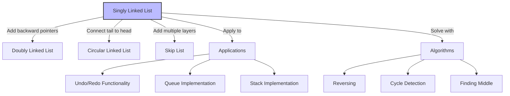

# 🎓 Wrapping Up - Your Linked List Journey

Congratulations on completing this comprehensive exploration of singly linked lists! Let's recap what you've learned and discuss where to go from here.

## What You've Learned 📚

Throughout these lessons, you've gained a solid understanding of:

1. **The Core Concept**: How linked lists store data as a sequence of nodes with references
2. **Fundamental Operations**: Insertions, deletions, searching, and traversal
3. **Time & Space Complexity**: Understanding the performance characteristics of each operation
4. **Edge Cases**: Handling empty lists, single-node lists, and other special situations
5. **Implementation Details**: How to code a complete, working linked list from scratch
6. **Advanced Topics**: Specialized variants and common extensions

## Mastering the Basics Matters 💯

While linked lists may seem simple compared to more complex data structures, they provide essential foundations for understanding:

- **Pointers and References**: The fundamental concept behind many advanced data structures
- **Dynamic Memory Allocation**: How data can grow and shrink at runtime
- **Data Structure Trade-offs**: Every structure has strengths and weaknesses for different operations

> [!NOTE]
> Most complex data structures like trees, graphs, and advanced hash tables build on the concepts you've learned with linked lists. Your understanding of linked lists will make these more advanced topics much easier to grasp!

## Practical Applications You Now Understand 🛠️

You're now equipped to understand how linked lists power many systems:

- How undo/redo functionality works in applications
- How memory allocation works at the system level
- How many collection classes are implemented internally
- How to select the right data structure for different problems

## Where to Go From Here 🚀

Now that you've mastered singly linked lists, consider exploring these related topics:

### Next Level Data Structures:

1. **Doubly Linked Lists**: Add backwards traversal capabilities
2. **Circular Linked Lists**: Connect the tail back to the head
3. **Skip Lists**: Add "express lanes" to improve search performance

### Algorithms Using Linked Lists:

1. **Merge Sort for Linked Lists**: An efficient sorting algorithm naturally suited for linked lists
2. **Cycle Detection**: Floyd's Tortoise and Hare algorithm for finding cycles
3. **Two-Pointer Techniques**: Using fast and slow pointers for various algorithms

### Common Interview Questions:

1. Finding the middle element in one pass
2. Reversing a linked list in-place
3. Detecting and removing cycles
4. Finding intersections of two linked lists
5. Determining if a linked list is a palindrome

## Practice Makes Perfect 💪

The best way to cement your knowledge is through practice! Try these approaches:

- **Code Exercises**: Implement the challenges mentioned in the previous lesson
- **System Design**: Design a music playlist system using linked lists
- **Open Source Contribution**: Find a project using linked lists and contribute improvements
- **Teaching Others**: Explaining concepts to others reinforces your own understanding



## Final Thoughts 💭

Linked lists may not always be the most efficient data structure for every problem, but understanding them provides invaluable insights into the principles of data organization, memory management, and algorithm design.

The skills you've developed through these lessons will serve as building blocks for your continued growth as a programmer and computer scientist.

> [!TIP]
> Remember that the most important skill in programming isn't memorizing implementations, but understanding the underlying concepts and knowing when and how to apply different data structures to solve real problems.

<details>
<summary>A Note on Generics and Production Code</summary>

In a production environment, you'd likely want to implement your linked list using generics for type safety:

```typescript
class Node<T> {
  data: T;
  next: Node<T> | null;

  constructor(data: T) {
    this.data = data;
    this.next = null;
  }
}

class SinglyLinkedList<T> {
  head: Node<T> | null;
  
  // Methods would be implemented as before, but with proper typing
}
```

This allows you to create type-safe linked lists for any data type:

```typescript
const numberList = new SinglyLinkedList<number>();
const stringList = new SinglyLinkedList<string>();
```
</details>

Thank you for joining me on this journey through one of computer science's most fundamental data structures. I hope these lessons have provided you with both knowledge and inspiration for your programming adventures!

Happy coding! 🚀 