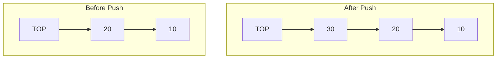
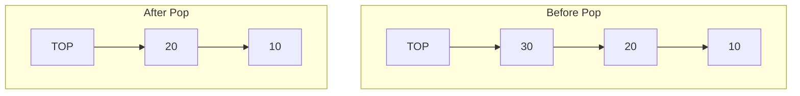
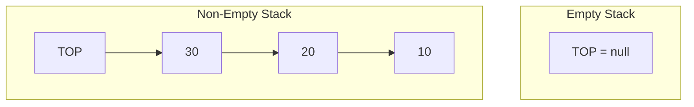

# 🛠️ Understanding Stack Operations

Let's dive into the four fundamental operations that define a stack data structure!

## 1. Push Operation 📥

The `push` operation adds a new element to the top of the stack.



> [!TIP]
> When implementing `push`, you'll need to:
> - Add the new element to the top
> - Update the TOP reference to point to this new element

## 2. Pop Operation 📤

The `pop` operation removes and returns the element at the top of the stack.



> [!WARNING]
> Always check if the stack is empty before attempting to pop an element. Trying to pop from an empty stack is a common error called "stack underflow."

## 3. Peek Operation 👀

The `peek` operation (sometimes called `top`) returns the element at the top of the stack without removing it.

```mermaid
graph TD
    subgraph Stack
    T[TOP] --> N3[30] 
    N3 --> N2[20]
    N2 --> N1[10]
    end
    
    peek[peek() returns 30] -.-> N3
```

Unlike `pop`, the `peek` operation doesn't modify the stack—it just "looks" at the top element.

## 4. isEmpty Operation 🔍

The `isEmpty` operation checks if the stack contains any elements.



This operation is crucial for preventing stack underflow errors by checking before performing `pop` or `peek`.

## 💻 Example Usage

Here's how these operations work together:

```javascript
// Create a new stack
let stack = new Stack();

// Push elements
stack.push(10);
stack.push(20);
stack.push(30);

// Peek at top element
console.log(stack.peek()); // Output: 30

// Pop elements
console.log(stack.pop()); // Output: 30
console.log(stack.pop()); // Output: 20

// Check if empty
console.log(stack.isEmpty()); // Output: false
```

<details>
<summary>Stack State Visualization</summary>

Let's track how the stack changes with each operation:

1. Initial state: `[]` (empty)
2. After `push(10)`: `[10]` (10 is at the top)
3. After `push(20)`: `[10, 20]` (20 is at the top)
4. After `push(30)`: `[10, 20, 30]` (30 is at the top)
5. After `peek()`: `[10, 20, 30]` (stack unchanged, returns 30)
6. After `pop()`: `[10, 20]` (returns 30)
7. After `pop()`: `[10]` (returns 20)
8. `isEmpty()` check: returns `false` (still has 10)

</details>

## 🧠 Think About It

> [!NOTE]
> Each of these operations must have an O(1) time complexity (constant time). This is a key requirement for an efficient stack implementation.

Can you think about why stacks are designed to have only these specific operations? Why not allow access to elements in the middle?

## 🔄 In Our Next Lesson

Now that we understand the basic operations, we'll explore two different ways to implement a stack: using an array and using a linked list. 