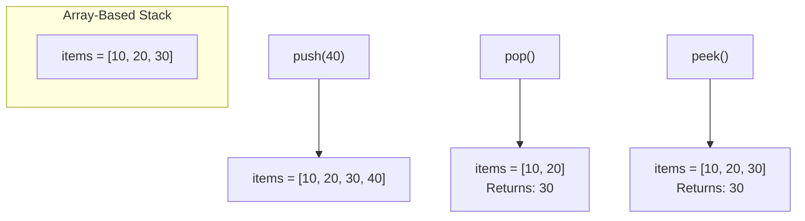

# 📚 Array-Based Stack Implementation

One of the most straightforward ways to implement a stack is using an array. Let's see how we can translate the stack operations into code using this approach!

## 🧰 Setting Up the Stack Class

```javascript
class Stack {
  constructor() {
    this.items = [];  // Initialize an empty array to store our stack elements
  }
  
  // Methods will go here
}
```

The array will store our stack elements, with the end of the array representing the top of the stack.

## ▶️ Implementing the Push Operation

```javascript
push(value) {
  this.items.push(value);
}
```

> [!NOTE]
> We're using the built-in `push` method of JavaScript arrays, which adds an element to the end of the array—exactly what we need for our stack's push operation!

## ◀️ Implementing the Pop Operation

```javascript
pop() {
  if (this.isEmpty()) {
    return undefined;  // Return undefined if stack is empty
  }
  return this.items.pop();  // Remove and return the last element
}
```

> [!WARNING]
> Always check if the stack is empty before popping to avoid errors. Here we're returning `undefined` to indicate there was nothing to pop.

## 👁️ Implementing the Peek Operation

```javascript
peek() {
  if (this.isEmpty()) {
    return undefined;  // Return undefined if stack is empty
  }
  return this.items[this.items.length - 1];  // Return the last element
}
```

Notice we're accessing the last element without removing it.

## 🔍 Implementing the isEmpty Operation

```javascript
isEmpty() {
  return this.items.length === 0;
}
```

This simply checks if the array has zero elements.

## 🔄 Putting It All Together

Here's our complete array-based stack implementation:

```javascript
class Stack {
  constructor() {
    this.items = [];
  }

  push(value) {
    this.items.push(value);
  }

  pop() {
    if (this.isEmpty()) {
      return undefined;
    }
    return this.items.pop();
  }

  peek() {
    if (this.isEmpty()) {
      return undefined;
    }
    return this.items[this.items.length - 1];
  }

  isEmpty() {
    return this.items.length === 0;
  }
}
```

## 💡 Visualizing the Array Implementation



<details>
<summary>Advantages and Disadvantages</summary>

### Advantages of Array Implementation ✅
- Simple and easy to implement
- Memory efficient for a fixed-size stack
- Fast access to the top element
- Typically has better memory locality and cache performance

### Disadvantages of Array Implementation ❌
- May need resizing if implemented with a fixed-size array
- Less flexible for dynamic memory allocation
- Could waste memory if allocated size is much larger than needed

</details>

## 🤔 Things to Consider

> [!TIP]
> In JavaScript, arrays automatically resize, making them convenient for stack implementation. In other languages like C or Java, you might need to handle resizing manually or use dynamic arrays (ArrayList in Java).

## 💪 Coding Challenge

Try implementing a `size()` method that returns the number of elements in the stack. How would you implement this using our array-based approach?

<details>
<summary>Solution</summary>

```javascript
size() {
  return this.items.length;
}
```

This is straightforward because the array already tracks its size!
</details>

## 🔄 In Our Next Lesson

Next, we'll explore an alternative approach to implementing a stack using a linked list, which offers different advantages and tradeoffs. 