# 🔗 Linked List-Based Stack Implementation

Another common way to implement a stack is using a linked list. This approach offers different advantages and is particularly useful in certain scenarios.

## 🧱 Building Blocks: The Node Class

First, we need a Node class to represent each element in our linked list:

```javascript
class Node {
  constructor(data) {
    this.data = data;   // The value stored in this node
    this.next = null;   // Reference to the next node (initially null)
  }
}
```

Each node contains:
- `data`: The value stored in the node
- `next`: A reference to the next node in the list

## 🏗️ Setting Up the Stack Class

```javascript
class Stack {
  constructor() {
    this.top = null;  // Initialize top as null (empty stack)
  }
  
  // Methods will go here
}
```

In this implementation, `top` is a reference to the head node of our linked list.

## ▶️ Implementing the Push Operation

```javascript
push(value) {
  const newNode = new Node(value);  // Create a new node
  newNode.next = this.top;         // Point new node to current top
  this.top = newNode;              // Update top to be the new node
}
```

> [!NOTE]
> With linked lists, we insert at the beginning (head) for stack operations because it's O(1) time complexity.


## ◀️ Implementing the Pop Operation

```javascript
pop() {
  if (this.isEmpty()) {
    return undefined;  // Return undefined if stack is empty
  }
  
  const value = this.top.data;  // Store the value to return
  this.top = this.top.next;     // Move top to the next node
  return value;                 // Return the stored value
}
```

> [!WARNING]
> Always check if the stack is empty before attempting to access `this.top.data`.


## 👁️ Implementing the Peek Operation

```javascript
peek() {
  if (this.isEmpty()) {
    return undefined;  // Return undefined if stack is empty
  }
  
  return this.top.data;  // Return data from the top node
}
```

## 🔍 Implementing the isEmpty Operation

```javascript
isEmpty() {
  return this.top === null;
}
```

## 🔄 Putting It All Together

Here's our complete linked list-based stack implementation:

```javascript
class Node {
  constructor(data) {
    this.data = data;
    this.next = null;
  }
}

class Stack {
  constructor() {
    this.top = null;
  }

  push(value) {
    const newNode = new Node(value);
    newNode.next = this.top;
    this.top = newNode;
  }

  pop() {
    if (this.isEmpty()) {
      return undefined;
    }
    const value = this.top.data;
    this.top = this.top.next;
    return value;
  }

  peek() {
    if (this.isEmpty()) {
      return undefined;
    }
    return this.top.data;
  }

  isEmpty() {
    return this.top === null;
  }
}
```

<details>
<summary>Advantages and Disadvantages</summary>

### Advantages of Linked List Implementation ✅
- Dynamic size - grows and shrinks with stack usage
- No need to declare size beforehand
- No need to handle resizing
- Memory is allocated as needed, potentially reducing waste

### Disadvantages of Linked List Implementation ❌
- Requires additional memory for storing node pointers
- Slightly more complex implementation
- May have worse cache performance due to non-contiguous memory
- Each node requires extra memory for the `next` reference

</details>

## 💡 Comparison with Array Implementation

> [!TIP]
> **When to choose linked list over array:**
> - When memory usage needs to be as efficient as possible
> - When stack size is unpredictable
> - When you want to avoid the cost of array resizing operations

## 🤓 Visualization of Memory Layout

```mermaid
graph LR
    subgraph "Linked List Stack"
    top[TOP] --> node1["Node {data: 30, next: →}"]
    node1 --> node2["Node {data: 20, next: →}"]
    node2 --> node3["Node {data: 10, next: null}"]
    end
```



Each node is allocated separately in memory, connected by references.

## 💪 Coding Challenge

Try implementing a `size()` method that returns the number of elements in the stack. How would you implement this using our linked list-based approach?

<details>
<summary>Solution</summary>

```javascript
size() {
  let count = 0;
  let current = this.top;
  
  while (current !== null) {
    count++;
    current = current.next;
  }
  
  return count;
}
```

Unlike the array implementation, we need to traverse the list to count the elements.
</details>

## 🔄 In Our Next Lesson

Now that we've covered both implementation approaches, we'll explore common applications and use cases for stacks in real-world programming scenarios. 