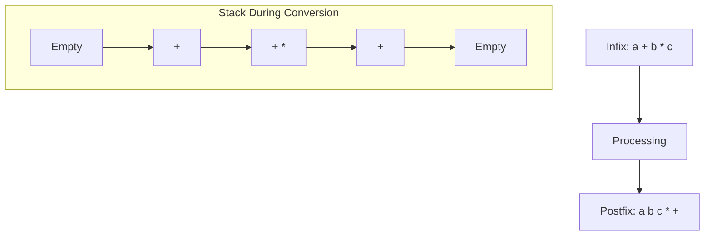
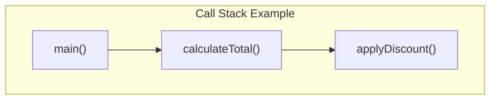
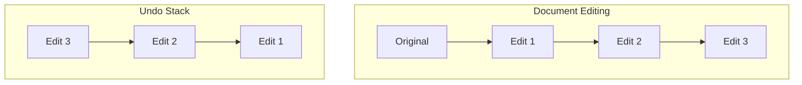
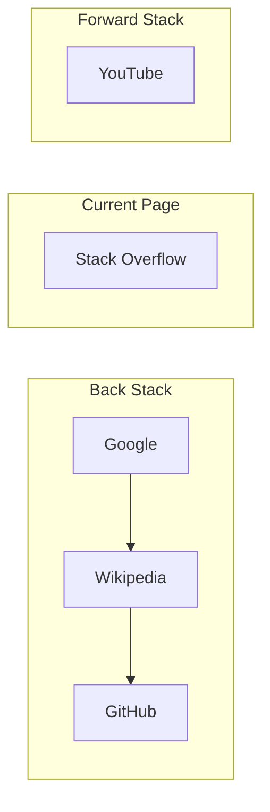
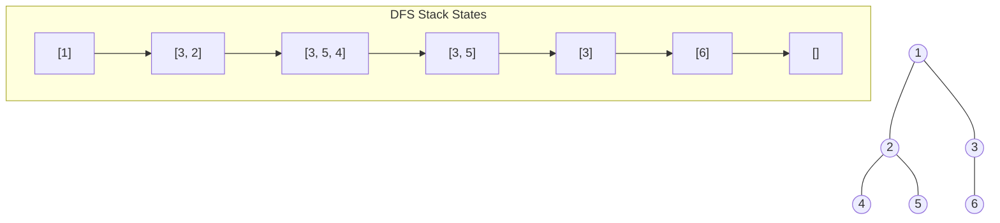

# 🌍 Stack Applications in the Real World

Now that we understand how stacks work and how to implement them, let's explore some fascinating applications where stacks play a crucial role in modern computing.

## 1. 🧮 Expression Evaluation and Syntax Parsing

### Infix to Postfix Conversion

Stacks are used to convert infix expressions (e.g., `a + b * c`) to postfix notation (e.g., `a b c * +`), which is easier for computers to evaluate.



### Parentheses Balancing

Stacks can check if parentheses in an expression are balanced.

```javascript
function isBalanced(expression) {
  const stack = new Stack();
  
  for (let char of expression) {
    if (char === '(' || char === '[' || char === '{') {
      stack.push(char);
    } else if (char === ')' || char === ']' || char === '}') {
      if (stack.isEmpty()) return false;
      
      const top = stack.pop();
      if ((char === ')' && top !== '(') || 
          (char === ']' && top !== '[') || 
          (char === '}' && top !== '{')) {
        return false;
      }
    }
  }
  
  return stack.isEmpty();
}
```

> [!TIP]
> This pattern is frequently used in code editors, IDEs, and linters to check for matching brackets!

## 2. 📞 Function Call Management

### The Call Stack

Programming languages use a stack to keep track of function calls and their local variables.



When a function is called, it's pushed onto the stack. When it returns, it's popped off, and execution continues from where it left off.

> [!NOTE]
> The "stack trace" you see in error messages is literally showing you the contents of the call stack at the time of the error!

## 3. ⏪ Undo Mechanisms

Text editors, graphic design software, and many other applications use stacks to implement undo functionality.



Each operation is pushed onto a stack, and when the user presses "undo," the most recent operation is popped and reversed.

## 4. 🌐 Browser History

Web browsers use stacks to track browsing history for the back and forward buttons.



- When you navigate to a new page, it's pushed onto the back stack
- When you click "back," the current page is pushed onto the forward stack, and the top page from the back stack becomes the current page
- When you click "forward," the reverse happens

## 5. 🔍 Depth-First Search (DFS)

Stacks are used to implement DFS algorithms for traversing or searching tree or graph data structures.



For example, to traverse a binary tree using DFS:

```javascript
function depthFirstTraversal(root) {
  if (!root) return [];
  
  const result = [];
  const stack = new Stack();
  stack.push(root);
  
  while (!stack.isEmpty()) {
    const node = stack.pop();
    result.push(node.value);
    
    // Push right child first so left is processed first (LIFO)
    if (node.right) stack.push(node.right);
    if (node.left) stack.push(node.left);
  }
  
  return result;
}
```

## 6. 🎮 Game Development

Stacks are used to:
- Track states in game engines
- Implement "undo" in puzzle games
- Manage layers in graphics programs
- Save game history for replays

<details>
<summary>Other Interesting Applications</summary>

### String Reversal
```javascript
function reverseString(str) {
  const stack = new Stack();
  // Push all characters onto stack
  for (let char of str) {
    stack.push(char);
  }
  
  let reversed = '';
  // Pop all characters to get them in reverse order
  while (!stack.isEmpty()) {
    reversed += stack.pop();
  }
  
  return reversed;
}
```

### Tower of Hanoi
The famous Tower of Hanoi puzzle is often solved using a stack-based recursive approach.

### Memory Management
Stacks are used in memory allocation strategies like stack-based allocation.

### Expression Evaluation
Calculators use stacks to evaluate complex expressions following operator precedence.

</details>

## 💭 Reflection Questions

1. Can you think of an application in your daily life that might be using a stack behind the scenes?
2. How might you use a stack to solve a problem in your own programming projects?
3. Why is a stack appropriate for these applications rather than other data structures?

## 🔄 In Our Next Lesson

Next, we'll look at some common techniques and patterns for solving stack-based problems in interviews and competitive programming. 