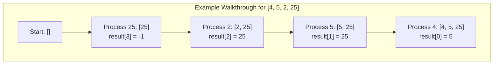

# 🧩 Common Stack Problems and Solution Patterns

Stack problems are a popular category in coding interviews and competitive programming. Let's explore some of the most common problems and develop strategies to solve them.

## 1. 🔄 Valid Parentheses

**Problem:** Given a string containing just the characters `(`, `)`, `{`, `}`, `[` and `]`, determine if the input string is valid (i.e., brackets open and close in the correct order).

**Example:** 
- `"()"` → Valid
- `"()[]{}"` → Valid
- `"(]"` → Invalid
- `"([)]"` → Invalid

### Solution Strategy:
1. Initialize an empty stack
2. Scan the string from left to right
3. If the current character is an opening bracket, push it onto the stack
4. If it's a closing bracket, check if the stack is empty (invalid) or if the top of the stack matches the current bracket (pop if it does, return false if it doesn't)
5. After scanning, the stack should be empty for a valid string

```javascript
function isValid(s) {
  const stack = new Stack();
  const pairs = {
    ')': '(',
    '}': '{',
    ']': '['
  };
  
  for (let char of s) {
    if (!pairs[char]) {
      // Opening bracket
      stack.push(char);
    } else {
      // Closing bracket
      if (stack.isEmpty() || stack.pop() !== pairs[char]) {
        return false;
      }
    }
  }
  
  return stack.isEmpty();
}
```

> [!TIP]
> This pattern of using a stack to track matching pairs is common in parser design and can be extended to more complex language processing tasks.

## 2. 📊 Next Greater Element

**Problem:** Given an array, print the Next Greater Element (NGE) for every element. The NGE for an element x is the first greater element on the right side of x in the array. If no such element exists, the answer is -1.

**Example:**
- Input: [4, 5, 2, 25]
- Output: [5, 25, 25, -1]

### Solution Strategy:
1. Initialize an empty stack and result array
2. Iterate through the array from right to left
3. While the stack is not empty and the current element is greater than the top of the stack, pop elements
4. If the stack is empty, there's no greater element
5. Otherwise, the top of the stack is the next greater element
6. Push the current element onto the stack

```javascript
function nextGreaterElements(nums) {
  const result = new Array(nums.length).fill(-1);
  const stack = new Stack();
  
  for (let i = nums.length - 1; i >= 0; i--) {
    while (!stack.isEmpty() && nums[i] >= stack.peek()) {
      stack.pop();
    }
    
    if (!stack.isEmpty()) {
      result[i] = stack.peek();
    }
    
    stack.push(nums[i]);
  }
  
  return result;
}
```



## 3. 📝 Min Stack

**Problem:** Design a stack that supports push, pop, top, and retrieving the minimum element in constant time.

**Example Operations:**
- push(x) -- Push element x onto stack
- pop() -- Removes the element on top of the stack
- top() -- Get the top element
- getMin() -- Retrieve the minimum element in the stack

### Solution Strategy:
Keep track of the minimum value at each level of the stack by using a second stack or by storing pairs of values.

```javascript
class MinStack {
  constructor() {
    this.stack = [];
    this.minStack = []; // Tracks minimum at each level
  }
  
  push(val) {
    this.stack.push(val);
    
    // If minStack is empty or new value is less than current min
    if (this.minStack.length === 0 || val <= this.minStack[this.minStack.length - 1]) {
      this.minStack.push(val);
    }
  }
  
  pop() {
    const val = this.stack.pop();
    
    // If we're removing the current minimum
    if (val === this.minStack[this.minStack.length - 1]) {
      this.minStack.pop();
    }
    
    return val;
  }
  
  top() {
    return this.stack[this.stack.length - 1];
  }
  
  getMin() {
    return this.minStack[this.minStack.length - 1];
  }
}
```

> [!NOTE]
> This problem tests your ability to think outside the box. The key insight is maintaining state (the minimum) as the stack changes.

## 4. 📈 Stock Span Problem

**Problem:** The stock span problem is a financial problem where we have a series of n daily price quotes for a stock, and we need to calculate the span of the stock's price for all n days. The span of the stock's price on a given day i is defined as the maximum number of consecutive days just before the given day, for which the stock price on the current day is greater than or equal to its price on the previous days.

**Example:**
- Input: [100, 80, 60, 70, 60, 75, 85]
- Output: [1, 1, 1, 2, 1, 4, 6]

### Solution Strategy:
Use a stack to keep track of indices of elements that are greater than the current element.

```javascript
function calculateSpan(prices) {
  const spans = new Array(prices.length).fill(1);
  const stack = new Stack();
  
  stack.push(0); // Push first index
  
  for (let i = 1; i < prices.length; i++) {
    // Pop elements while stack top has smaller price
    while (!stack.isEmpty() && prices[stack.peek()] <= prices[i]) {
      stack.pop();
    }
    
    // Calculate span
    spans[i] = stack.isEmpty() ? i + 1 : i - stack.peek();
    
    // Push current index
    stack.push(i);
  }
  
  return spans;
}
```

<details>
<summary>More Stack Problems</summary>

### Largest Rectangle in Histogram
Using a stack to find the area of the largest rectangle in a histogram.

### Expression Evaluation
Converting infix expressions to postfix, then evaluating them.

### Iterator for Flatten Nested List
Using a stack to iterate through a nested structure.

### Decode String
Using a stack to decode strings like "3[a2[c]]" -> "accaccacc".

### Online Stock Span
A variation of the stock span problem where you need to answer queries online.
</details>

## 🔑 Key Patterns to Remember

When tackling stack problems, look for these patterns:

1. **Matching Pairs**: Opening and closing elements (parentheses, tags, etc.)
2. **Next Greater/Lesser Element**: Finding the next element that is greater/lesser than the current one
3. **Monotonic Stacks**: Maintaining a stack that is either increasing or decreasing
4. **Tracking State History**: Keeping track of previous states to revert or compare
5. **Parsing and Evaluation**: Handling expressions, formulas, or nested structures

> [!TIP]
> When you see problems involving:
> - Matching or nesting
> - "Most recent" operations
> - Parsing expressions
> - Backtracking
> - Undo operations
>
> Consider if a stack might be the right data structure!

## 💪 Practice Challenge

Try solving this problem:

**Evaluate Reverse Polish Notation (RPN)**: Evaluate the value of an arithmetic expression in Reverse Polish Notation. Valid operators are +, -, *, /. Each operand may be an integer or another expression.

Example:
- ["2", "1", "+", "3", "*"] → ((2 + 1) * 3) → 9
- ["4", "13", "5", "/", "+"] → (4 + (13 / 5)) → 6

<details>
<summary>Solution</summary>

```javascript
function evalRPN(tokens) {
  const stack = new Stack();
  const operators = {
    '+': (a, b) => a + b,
    '-': (a, b) => a - b,
    '*': (a, b) => a * b,
    '/': (a, b) => Math.trunc(a / b) // Integer division
  };
  
  for (let token of tokens) {
    if (operators[token]) {
      const b = stack.pop();
      const a = stack.pop();
      stack.push(operators[token](a, b));
    } else {
      stack.push(Number(token));
    }
  }
  
  return stack.pop();
}
```
</details>

## 🔄 In Our Next Lesson

In our final lesson, we'll review everything we've learned about stacks and discuss how to optimize stack operations for specific use cases. 