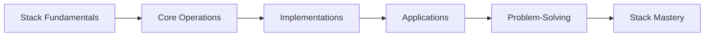
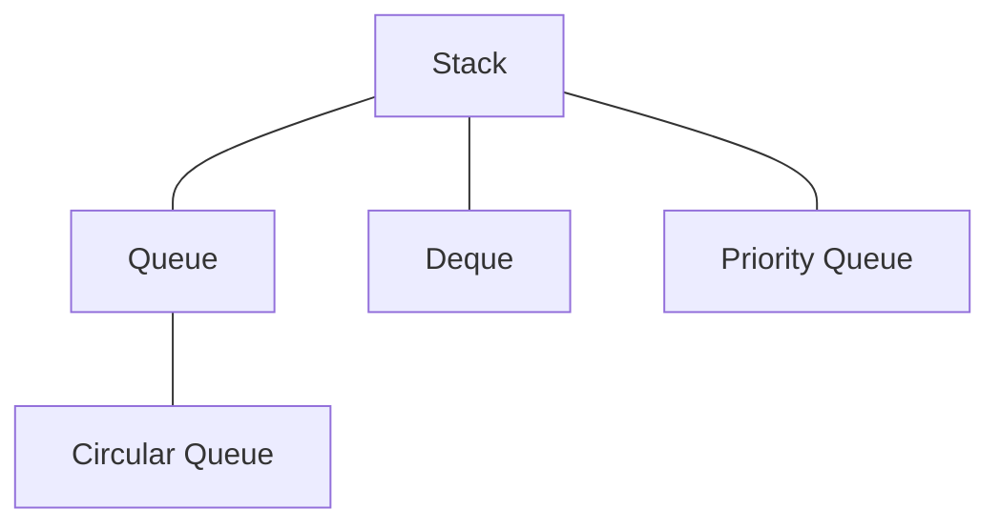

# 🎓 Stack Mastery - Conclusion and Next Steps

Congratulations on completing this comprehensive journey through the stack data structure! Let's review what we've learned and discuss where to go from here.

## 🔄 Review of Key Concepts

Throughout these lessons, we've covered:

1. **Fundamentals**: Understanding the Last In First Out (LIFO) principle that defines a stack
2. **Core Operations**: Mastering push, pop, peek, and isEmpty operations
3. **Implementation Methods**: Learning both array-based and linked list-based implementations
4. **Applications**: Exploring real-world use cases for stacks
5. **Problem-Solving Patterns**: Developing strategies for solving stack-related problems



## 💡 Key Takeaways

> [!NOTE]
> Stacks shine in scenarios where we need to process items in reverse order or maintain a history of operations.

Here are the most important insights to remember:

- **Simplicity is Power**: The stack's simplicity (operating only on one end) makes it perfect for specific problems
- **O(1) Operations**: All core operations (push, pop, peek, isEmpty) should have constant time complexity
- **Implementation Tradeoffs**: Array implementations are simpler but may require resizing; linked lists offer dynamic sizing but use more memory per element
- **Real-World Relevance**: Stacks are everywhere - from browser history to compiler design to graphic applications

## 🚀 Where to Go From Here

Now that you have a solid understanding of stacks, here are some next steps to deepen your knowledge:

### 1. Related Data Structures



- **Queues**: First In First Out (FIFO) data structures
- **Deques**: Double-ended queues that allow insertion and deletion at both ends
- **Priority Queues**: Queue variants where elements have priorities

### 2. Advanced Stack Applications

- **Expression Parsing and Compilation**: Understanding how compilers use stacks
- **Memory Management**: Learning about call stacks and memory allocation
- **Algorithm Design**: Using stacks in more complex algorithms like Tarjan's algorithm for strongly connected components

### 3. Performance Optimization

Consider:
- **Custom Stack Implementations**: For specific use cases (e.g., fixed-size, thread-safe)
- **Memory Layout**: Optimizing for cache locality
- **Lock-Free Stacks**: For concurrent applications

## 💪 Practice Makes Perfect

To truly master stacks, consistent practice is key:

> [!TIP]
> Start by implementing variations of stacks, like:
> - A stack with a `max()` function
> - A stack that can be efficiently serialized
> - A thread-safe stack

Then, challenge yourself with these advanced problems:
- **Largest Rectangle in Histogram**
- **The Celebrity Problem**
- **Design a Stack with Increment Operation**
- **Maximum Frequency Stack**

<details>
<summary>Sample Advanced Problem: Largest Rectangle in Histogram</summary>

**Problem**: Given an array of integers heights representing the histogram's bar height where the width of each bar is 1, return the area of the largest rectangle in the histogram.

**Key Insight**: Use a stack to keep track of increasing heights and their positions, popping when a shorter bar is encountered to calculate the maximum area.

```javascript
function largestRectangleArea(heights) {
  const stack = [];
  let maxArea = 0;
  let i = 0;
  
  while (i < heights.length) {
    // If stack is empty or current height is higher, push to stack
    if (stack.length === 0 || heights[stack[stack.length - 1]] <= heights[i]) {
      stack.push(i++);
    } else {
      // Pop and calculate area
      const top = stack.pop();
      const area = heights[top] * (stack.length === 0 ? i : i - stack[stack.length - 1] - 1);
      maxArea = Math.max(maxArea, area);
    }
  }
  
  // Process remaining items in stack
  while (stack.length > 0) {
    const top = stack.pop();
    const area = heights[top] * (stack.length === 0 ? i : i - stack[stack.length - 1] - 1);
    maxArea = Math.max(maxArea, area);
  }
  
  return maxArea;
}
```
</details>

## 🌟 Final Thoughts

The stack may be one of the simplest data structures, but its applications are vast and powerful. By understanding stacks deeply, you've added an essential tool to your algorithmic toolkit.

Remember that many complex algorithms and systems are built from simple building blocks like stacks. As you continue your programming journey, you'll find yourself reaching for a stack more often than you might expect.

> [!NOTE]
> The best programmers don't just know how to use data structures—they understand when and why to use them. You now have that understanding for stacks!

## 🙋‍♂️ Reflection Questions

As you complete your stack learning journey, consider:

1. What was the most surprising application of stacks you learned about?
2. How might you use a stack in a project you're currently working on?
3. Which implementation approach (array or linked list) would you choose for different scenarios?
4. What patterns did you notice in the stack-based problems we solved?

Thank you for completing this stack algorithm learning path. Keep building, keep practicing, and keep pushing your knowledge to new heights! 🚀 