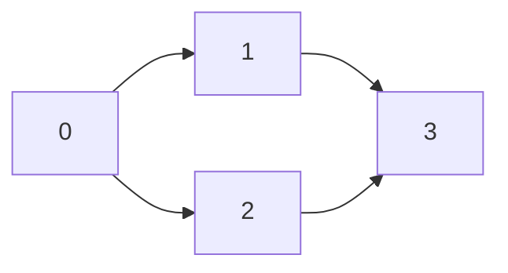

# 📊 Graph Representation for Topological Sort

Before we dive into the algorithm, we need to understand how to represent our directed graph in code.

## 🧱 Building Blocks

When we work with graphs, we have two primary ways to represent them:

### 1️⃣ Adjacency List

```
0 → [1, 2]
1 → [3]
2 → [3]
3 → []
```

This representation:
- Maps each vertex to a list of its neighbors
- Is space-efficient (only stores existing edges)
- Is the preferred choice for sparse graphs (where E << V²)

### 2️⃣ Adjacency Matrix

```
  | 0 1 2 3
-----------
0 | 0 1 1 0
1 | 0 0 0 1
2 | 0 0 0 1
3 | 0 0 0 0
```

This representation:
- Uses a V×V matrix where cell [i][j] is 1 if edge i→j exists
- Can be less efficient for memory use in sparse graphs
- Allows O(1) lookup of edges

> [!TIP]
> For topological sort, an adjacency list is typically more efficient and intuitive.

## 💻 Code Representation

Here's how we represent a graph with an adjacency list in TypeScript:

```typescript
function createGraph(n: number, edges: number[][]): { [key: number]: number[] } {
  const graph: { [key: number]: number[] } = {};
  
  // Initialize empty lists for all vertices
  for (let i = 0; i < n; i++) {
    graph[i] = [];
  }
  
  // Add edges to the graph
  for (const [u, v] of edges) {
    graph[u].push(v);
  }
  
  return graph;
}
```

## 🔄 Example Transformation

Let's transform this simple graph:



Into adjacency list representation:

Input:
```
n = 4
edges = [[0,1], [0,2], [1,3], [2,3]]
```

Output (adjacency list):
```
{
  0: [1, 2],
  1: [3],
  2: [3],
  3: []
}
```

## 🧠 Why This Matters for Topological Sort

For topological sort, we need to:
1. Track which vertices we've visited
2. Efficiently find all neighbors of a vertex
3. Keep the final sorted order

The adjacency list makes these operations easy and efficient.

## 🤔 Critical Thinking Question

Consider this graph:
```
n = 6
edges = [[5,2], [5,0], [4,0], [4,1], [2,3], [3,1]]
```

**Question**: Try to draw this graph, then convert it to an adjacency list representation yourself. What would be a valid topological order for this graph?

<details>
<summary>Adjacency List Solution</summary>

```
{
  0: [],
  1: [],
  2: [3],
  3: [1],
  4: [0, 1],
  5: [2, 0]
}
```

</details>

In the next lesson, we'll explore the two main approaches to implementing topological sort: Depth-First Search (DFS) and Breadth-First Search (BFS/Kahn's algorithm). 