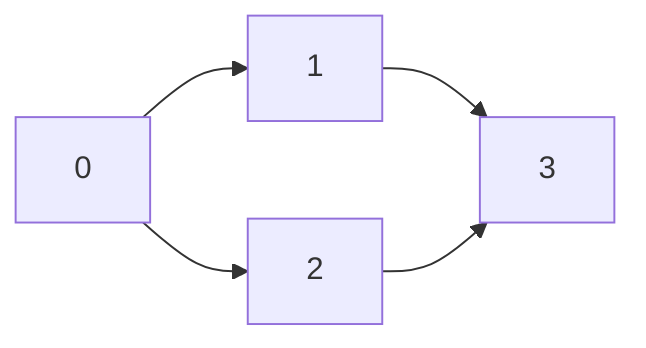
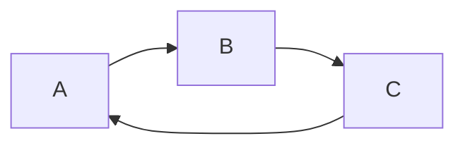

# 🔍 Topological Sort: The DFS Approach

## 🌟 The Intuition Behind DFS Topological Sort

Depth-First Search (DFS) for topological sorting is elegant in its simplicity:

> [!NOTE]
> The key insight: If we explore a graph using DFS and add each vertex to our result **after** we've explored all its descendants, we'll get a valid topological ordering (in reverse).

Think of it like this: imagine exploring a maze by always going as deep as possible before backtracking. When you reach a dead end, you mark it as "completed." In topological sort, we mark vertices as "completed" only after we've handled all their dependencies.

## 🔄 The Algorithm

1. Create an adjacency list representation of the graph
2. Use a boolean array to track visited vertices
3. Create a result array (or stack) to store the sorted order
4. For each unvisited vertex in the graph:
   - Perform DFS starting from that vertex
   - After exploring all neighbors of a vertex, add it to the beginning of the result

## 💻 DFS Implementation

Here's how we implement it in TypeScript:

```typescript
function topologicalSort(n: number, edges: number[][]): number[] {
  // Create the graph (adjacency list)
  const graph: { [key: number]: number[] } = {};
  for (let i = 0; i < n; i++) {
    graph[i] = [];
  }
  for (const [u, v] of edges) {
    graph[u].push(v);
  }

  // Arrays to track visited nodes and store the result
  const visited: boolean[] = new Array(n).fill(false);
  const result: number[] = [];
  
  // Helper function for DFS traversal
  function dfs(node: number): boolean {
    // Mark the current node as being processed
    visited[node] = true;
    
    // Explore all neighbors
    for (const neighbor of graph[node]) {
      if (!visited[neighbor]) {
        // If not visited yet, visit recursively
        if (!dfs(neighbor)) {
          return false; // Cycle detected
        }
      } else if (result.indexOf(neighbor) === -1) {
        // If we see a node that's in process but not yet in result, we found a cycle
        return false;
      }
    }
    
    // After visiting all neighbors, add this node to the result (prepend)
    result.unshift(node);
    return true;
  }
  
  // Perform DFS for all vertices
  for (let i = 0; i < n; i++) {
    if (!visited[i]) {
      if (!dfs(i)) {
        return []; // Cycle detected, no valid topological sort
      }
    }
  }
  
  return result;
}
```

## 🧠 Understanding the Flow

Let's trace through a simple example:



1. Start DFS at vertex 0
   - Visit vertex 1 (a neighbor of 0)
     - Visit vertex 3 (a neighbor of 1)
       - No neighbors, add 3 to result: [3]
     - Add 1 to result: [1, 3]
   - Visit vertex 2 (another neighbor of 0)
     - Try to visit vertex 3, but it's already visited
     - Add 2 to result: [2, 1, 3]
   - Add 0 to result: [0, 2, 1, 3]

Final topological sort: [0, 2, 1, 3]

> [!TIP]
> The DFS approach naturally produces a reverse topological order when you add vertices to a stack. This is why we use `unshift()` to add elements to the beginning of our result array.

## 🔍 Detecting Cycles

A crucial aspect of topological sort is cycle detection. If the graph contains a cycle, no valid topological ordering exists.

In our DFS implementation, we detect cycles by:
1. Marking vertices as "visited" when we start processing them
2. Checking if we encounter a vertex that's already being processed but hasn't been added to our result yet

If we find such a vertex, it means we've found a cycle, and we return an empty array to indicate that no valid topological sort exists.

## 🤔 Critical Thinking Question

Consider this graph:



**Question**: Why is it impossible to create a valid topological sort for this graph? Try to trace the DFS algorithm on it to see what happens!

<details>
<summary>Answer</summary>

This graph contains a cycle: A → B → C → A.

When running DFS:
1. Start at A, mark A as visited
2. Visit B, mark B as visited
3. Visit C, mark C as visited
4. Try to visit A, but A is already visited and not in our result yet
5. This indicates a cycle, so no valid topological sort exists

The issue is that in a cycle, each vertex depends on itself (indirectly), which creates an impossible constraint for ordering.
</details>

In the next lesson, we'll explore the alternative BFS approach (Kahn's algorithm) for topological sorting. 