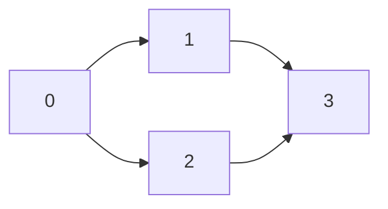

# 🌊 Topological Sort: The BFS Approach (Kahn's Algorithm)

## 🌟 The Intuition Behind Kahn's Algorithm

While DFS explores as deeply as possible before backtracking, Breadth-First Search (BFS) explores all neighbors at the current depth before moving deeper.

> [!NOTE]
> Kahn's algorithm uses a key insight: **Vertices with no incoming edges** can safely be placed first in a topological ordering.

Think of it like this: if no tasks depend on task X, you can safely do X first. After completing X, you can "remove" it from the graph, potentially creating new tasks with no dependencies.

## 🔄 The Algorithm

1. Calculate the in-degree (number of incoming edges) for each vertex
2. Identify all vertices with in-degree 0 (no dependencies) and add them to a queue
3. While the queue is not empty:
   - Remove a vertex from the queue and add it to the result
   - For each neighbor of the removed vertex:
     - Decrease its in-degree by 1 (we've fulfilled one of its dependencies)
     - If its in-degree becomes 0, add it to the queue
4. If we've processed all vertices, return the result; otherwise, the graph has a cycle

## 💻 BFS Implementation (Kahn's Algorithm)

Here's how we implement it in TypeScript:

```typescript
function topologicalSort(n: number, edges: number[][]): number[] {
  // Create the graph (adjacency list)
  const graph: { [key: number]: number[] } = {};
  const inDegree: number[] = new Array(n).fill(0);
  
  // Initialize the graph
  for (let i = 0; i < n; i++) {
    graph[i] = [];
  }
  
  // Add edges and calculate in-degrees
  for (const [u, v] of edges) {
    graph[u].push(v);
    inDegree[v]++;
  }
  
  // Queue for BFS (start with all vertices that have no dependencies)
  const queue: number[] = [];
  for (let i = 0; i < n; i++) {
    if (inDegree[i] === 0) {
      queue.push(i);
    }
  }
  
  const result: number[] = [];
  let count = 0;
  
  // Process vertices in topological order
  while (queue.length > 0) {
    const u = queue.shift()!;
    result.push(u);
    count++;
    
    // For each neighbor, remove the edge from u to v
    for (const v of graph[u]) {
      inDegree[v]--;
      // If v has no more dependencies, add to queue
      if (inDegree[v] === 0) {
        queue.push(v);
      }
    }
  }
  
  // If count != n, there is a cycle
  return count === n ? result : [];
}
```

## 🧠 Understanding the Flow

Let's trace through the same example as before:



**Step 1**: Calculate in-degrees
- In-degree[0] = 0
- In-degree[1] = 1
- In-degree[2] = 1
- In-degree[3] = 2

**Step 2**: Add vertices with in-degree 0 to the queue
- Queue = [0]
- Result = []

**Step 3**: Process vertex 0
- Remove 0 from queue
- Add 0 to result: Result = [0]
- Decrement in-degree for neighbors 1 and 2:
  - In-degree[1] = 0
  - In-degree[2] = 0
- Add 1 and 2 to queue: Queue = [1, 2]

**Step 4**: Process vertex 1
- Remove 1 from queue
- Add 1 to result: Result = [0, 1]
- Decrement in-degree for neighbor 3:
  - In-degree[3] = 1
- Queue = [2]

**Step 5**: Process vertex 2
- Remove 2 from queue
- Add 2 to result: Result = [0, 1, 2]
- Decrement in-degree for neighbor 3:
  - In-degree[3] = 0
- Add 3 to queue: Queue = [3]

**Step 6**: Process vertex 3
- Remove 3 from queue
- Add 3 to result: Result = [0, 1, 2, 3]
- No neighbors to process
- Queue = []

Final topological sort: [0, 1, 2, 3]

> [!TIP]
> Notice how Kahn's algorithm produces a different valid ordering than the DFS approach for the same graph. This highlights that multiple valid topological orderings can exist for a single graph!

## 🔄 Comparison with DFS Approach

### BFS/Kahn's Advantages:
- More intuitive to understand for many people
- Directly produces the topological order (no need to reverse)
- Explicitly tracks dependencies through in-degree counts
- Can easily be modified to find the lexicographically smallest ordering

### DFS Advantages:
- Often requires less bookkeeping (no need to calculate in-degrees)
- Can be more memory-efficient in some cases
- Naturally extends to strongly connected components algorithms

## 🤔 Critical Thinking Question

Consider this problem: You want to build a new video game that depends on several libraries, each with their own dependencies. You need to decide in which order to download and install them.

**Question**: Which approach (DFS or BFS) would you use to solve this problem, and why?

<details>
<summary>Thought Process</summary>

Either approach would work correctly, but Kahn's algorithm (BFS) might be more intuitive here because:

1. You can clearly visualize "starting" with libraries that have no dependencies
2. As you install each library, you're "removing" it from the dependency graph
3. At each step, you know exactly which libraries are ready to be installed (those with in-degree 0)

However, if you wanted to prioritize installing groups of interdependent libraries together, the DFS approach might be more suitable.
</details>

In the next lesson, we'll examine some common applications and variations of topological sort. 