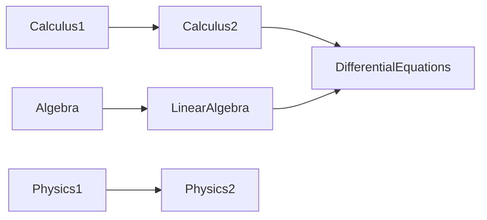
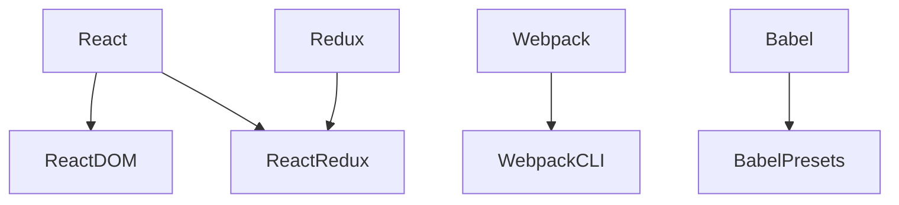
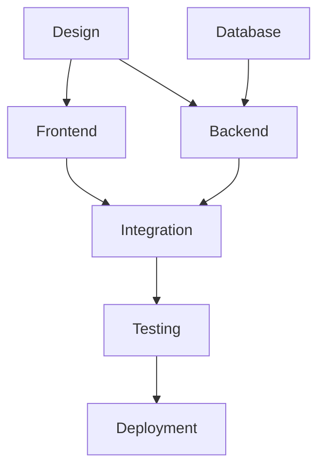
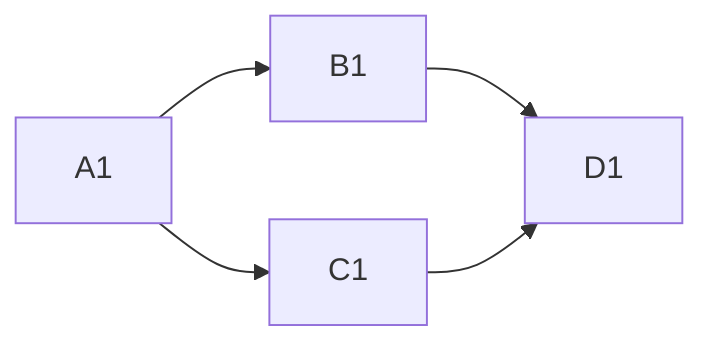

# 🌐 Topological Sort: Real-World Applications and Variations

## 🚀 Real-World Applications

Topological sort is more than just a theoretical algorithm—it solves many practical problems:

### 📚 Academic Prerequisites

Universities use topological sorting to help students plan their course schedules:



### 📦 Package Dependency Management

Modern software relies on numerous dependencies that must be installed in the correct order:



> [!NOTE]
> This is why tools like npm, yarn, and pip use topological sorting internally!

### 📅 Task Scheduling

Project management tools use topological sort to schedule tasks based on dependencies:



### 🧮 Spreadsheet Cell Evaluation

When you change a value in a spreadsheet, all dependent cells need to be recalculated in the correct order:



## 🔄 Variations of Topological Sort

### 📊 Lexicographically Smallest Topological Sort

Sometimes we want the "smallest" topological ordering according to some criteria. By using a min-heap or priority queue instead of a regular queue in Kahn's algorithm, we can find the lexicographically smallest valid ordering:

```typescript
function lexicographicalTopologicalSort(n: number, edges: number[][]): number[] {
  // ... (setup code same as in Kahn's algorithm)
  
  // Use a priority queue (min heap) instead of a regular queue
  const priorityQueue = new MinHeap();
  for (let i = 0; i < n; i++) {
    if (inDegree[i] === 0) {
      priorityQueue.insert(i);
    }
  }
  
  const result: number[] = [];
  
  while (!priorityQueue.isEmpty()) {
    const u = priorityQueue.extractMin();
    result.push(u);
    
    for (const v of graph[u]) {
      inDegree[v]--;
      if (inDegree[v] === 0) {
        priorityQueue.insert(v);
      }
    }
  }
  
  return result.length === n ? result : [];
}
```

### 🔍 All Possible Topological Orderings

Sometimes we need to enumerate all valid topological orderings of a graph:

```typescript
function allTopologicalSorts(n: number, edges: number[][]): number[][] {
  // ... (setup code)
  
  const result: number[][] = [];
  const visited: boolean[] = new Array(n).fill(false);
  const currentPath: number[] = [];
  
  function backtrack() {
    let flag = false;
    
    for (let i = 0; i < n; i++) {
      // If in-degree is 0 and not visited
      if (inDegree[i] === 0 && !visited[i]) {
        // Reduce in-degree of neighbors
        for (const neighbor of graph[i]) {
          inDegree[neighbor]--;
        }
        
        // Include in result, mark visited
        currentPath.push(i);
        visited[i] = true;
        
        // Recurse
        backtrack();
        
        // Backtrack
        visited[i] = false;
        currentPath.pop();
        for (const neighbor of graph[i]) {
          inDegree[neighbor]++;
        }
        
        flag = true;
      }
    }
    
    // If all vertices are included
    if (!flag && currentPath.length === n) {
      result.push([...currentPath]);
    }
  }
  
  backtrack();
  return result;
}
```

> [!WARNING]
> This approach can generate a large number of orderings for complex graphs. Use it only when necessary!

### 🔄 Partial Topological Sort

Sometimes we only need to sort a subset of vertices. We can modify our algorithm to stop after processing the vertices we care about:

```typescript
function partialTopologicalSort(n: number, edges: number[][], targetVertices: Set<number>): number[] {
  // ... (setup code similar to Kahn's algorithm)
  
  const result: number[] = [];
  
  while (queue.length > 0) {
    const u = queue.shift()!;
    
    if (targetVertices.has(u)) {
      result.push(u);
    }
    
    // ... (rest of Kahn's algorithm)
    
    // Stop when we've processed all target vertices
    if (result.length === targetVertices.size) {
      break;
    }
  }
  
  return result;
}
```

## 🧮 Complexity Analysis

Understanding the time and space complexity of topological sort helps us assess its efficiency:

### Time Complexity

Both DFS and BFS approaches have a time complexity of **O(V + E)**, where:
- V is the number of vertices
- E is the number of edges

This is because:
- We visit each vertex once: O(V)
- We process each edge once: O(E)

### Space Complexity

The space complexity is **O(V)** for both approaches, which accounts for:
- The adjacency list: O(V + E)
- The visited array/in-degree array: O(V)
- The recursion stack (DFS) or queue (BFS): O(V)

> [!TIP]
> Topological sort is remarkably efficient, even for large graphs, making it suitable for real-time applications like build systems and dependency resolution.

## 🤔 Critical Thinking Question

You're designing a build system for a large software project with hundreds of modules. Some modules take much longer to compile than others.

**Question**: How might you modify the topological sort algorithm to not only respect dependencies but also minimize the total build time by prioritizing long-compiling modules as early as possible?

<details>
<summary>Solution Approach</summary>

You could assign weights to each module based on its compilation time and modify Kahn's algorithm to use a priority queue that prioritizes modules with:

1. Zero in-degree (ready to compile)
2. Longer compilation time

This way, longer-compiling modules start earlier, and shorter ones can run in parallel later, minimizing the critical path of the build process.

The algorithm would look like Kahn's algorithm but would select the next vertex based on a priority score that factors in compilation time.
</details>

In the next lesson, we'll explore optimization techniques and advanced implementation details for topological sort. 