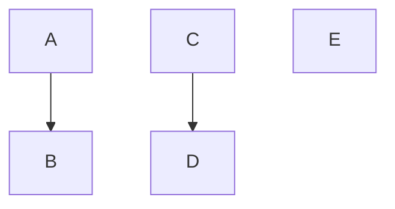
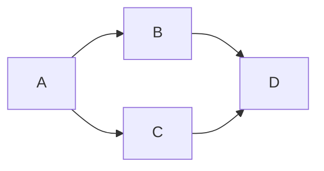

# ⚠️ Topological Sort: Common Pitfalls and Tips

## 🚫 Common Pitfalls

When implementing or using topological sort, watch out for these common errors:

### 1️⃣ Forgetting to Check for Cycles

One of the most common mistakes is assuming your input graph is always a valid DAG.

```typescript
// Incorrect: Missing cycle detection
function incorrectTopologicalSort(n: number, edges: number[][]): number[] {
  // ... implementation without cycle detection
  return result; // May return an invalid ordering if there's a cycle!
}
```

> [!WARNING]
> Always validate that your graph is acyclic or explicitly handle cycles in your implementation.

### 2️⃣ Incorrectly Building the Graph

Sometimes, the direction of edges in the graph can be misconstrued:

```typescript
// Incorrect: Edges are added in the wrong direction
for (const [u, v] of edges) {
  graph[v].push(u); // Wrong! This reverses the dependency relationship
}
```

Remember: an edge (u, v) means u must come before v in the ordering.

### 3️⃣ Incorrect Cycle Detection in DFS

DFS-based cycle detection requires careful tracking of vertices being processed:

```typescript
// Incorrect: Insufficient cycle detection
function dfs(node: number): void {
  visited[node] = true;
  
  for (const neighbor of graph[node]) {
    if (!visited[neighbor]) {
      dfs(neighbor);
    }
    // Missing the check for cycles here!
  }
  
  result.unshift(node);
}
```

A more correct approach uses an additional array to track vertices in the current DFS path:

```typescript
function dfs(node: number): boolean {
  // Mark as being processed (in the current path)
  visited[node] = true;
  inProcess[node] = true;
  
  for (const neighbor of graph[node]) {
    if (!visited[neighbor]) {
      if (!dfs(neighbor)) return false;
    } else if (inProcess[neighbor]) {
      // Found a back edge to a node in the current path = cycle
      return false;
    }
  }
  
  // Done processing this node
  inProcess[node] = false;
  result.unshift(node);
  return true;
}
```

### 4️⃣ Misunderstanding Multiple Valid Orderings

A common conceptual mistake is assuming there's only one valid topological ordering:

> [!NOTE]
> Most DAGs have multiple valid topological orderings. Your algorithm should generate a valid one, but not necessarily a specific one.

## 💡 Tips for Success

### Visualizing the Problem

Drawing the graph can help immensely:


For this graph, valid topological orderings include:
- [A, B, C, D]
- [A, C, B, D]

### Implementation Tips

#### 1️⃣ Use Clear Variable Names

Good naming makes your code more readable and less error-prone:

```typescript
// Clear naming
const incomingEdges = new Array(n).fill(0);
const noIncomingEdgesQueue = [];
const sortedOrder = [];

// vs.

// Confusing naming
const deg = new Array(n).fill(0);
const q = [];
const ans = [];
```

#### 2️⃣ Add Debugging Support

When implementing, include print statements or logging to help trace through the algorithm:

```typescript
function topologicalSort(n: number, edges: number[][]): number[] {
  // ... setup code
  
  console.log("Initial in-degrees:", inDegree);
  
  while (queue.length > 0) {
    const u = queue.shift()!;
    result.push(u);
    console.log(`Processing vertex ${u}, result so far:`, result);
    
    // ... rest of algorithm
  }
  
  return result;
}
```

#### 3️⃣ Validate Your Results

Always check that your topological ordering is valid:

```typescript
function isValidTopologicalOrder(n: number, edges: number[][], order: number[]): boolean {
  // Create a map of vertex positions
  const position: { [key: number]: number } = {};
  for (let i = 0; i < order.length; i++) {
    position[order[i]] = i;
  }
  
  // Check that for each edge (u,v), u comes before v
  for (const [u, v] of edges) {
    if (position[u] >= position[v]) {
      return false;
    }
  }
  
  return true;
}
```

## 🔍 Edge Cases to Consider

### Empty Graph

```typescript
// n = 0, edges = []
```

Most algorithms should return an empty array.

### Graph with No Edges

```typescript
// n = 5, edges = []
```

Any permutation of [0, 1, 2, 3, 4] is a valid topological ordering.

### Disconnected Graph



Your algorithm should handle disconnected components correctly.

### Sinks and Sources

A **source** is a vertex with no incoming edges (in-degree 0).
A **sink** is a vertex with no outgoing edges (out-degree 0).



In this graph:
- A is a source (can start first)
- D is a sink (must finish last)

> [!TIP]
> In Kahn's algorithm, sources are the initial vertices in the queue. In any valid topological ordering, sources must come before their descendants.

## 🤔 Critical Thinking Questions

### Question 1

Given two different valid topological orderings of the same graph, what can you say about the relative positions of any two vertices that are connected by an edge?

<details>
<summary>Answer</summary>

If there's an edge (u, v) in the graph, then u must come before v in **every** valid topological ordering. The relative positions of vertices that don't have a path between them may vary between different valid orderings.
</details>

### Question 2

Can a valid topological ordering be used to determine if two vertices are connected in the original graph?

<details>
<summary>Answer</summary>

No, a topological ordering alone cannot tell you if two vertices are connected. Even if u comes before v in a topological order, there might not be a path from u to v in the graph. You would need additional information about the graph structure.
</details>

In the next lesson, we'll put everything together and walk through some complete examples of solving real problems with topological sort. 