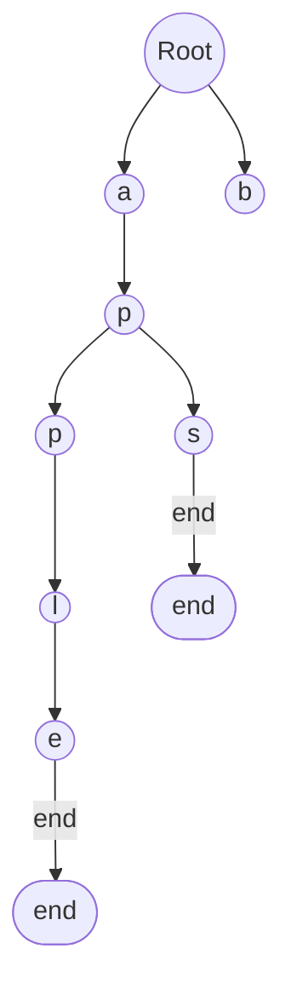

# 🌳 Understanding the Trie Data Structure

> [!NOTE]
> A Trie (pronounced "try") is also called a prefix tree or digital tree.

## The Problem 🤔

Imagine you're building an autocomplete feature for a search engine or a spell checker for a text editor. You need to efficiently:

1. Store a large collection of words
2. Quickly look up if a word exists
3. Find all words that start with a specific prefix
4. Count words with the same prefix

Traditional data structures like arrays or hash tables can be inefficient for these operations, especially when dealing with prefixes.

## Why Tries Are Special ✨

Tries are specialized tree-based data structures designed for efficient string operations. They excel by:

- **Sharing common prefixes** to save space
- Providing **O(m) time complexity** for key operations (where m is the length of the string)
- Supporting **specialized string operations** that other data structures don't handle well

> [!TIP]
> Think of a Trie as a tree where each path from root to node represents a word or prefix, with characters stored along the edges or nodes.

Real-world applications of Tries

- 📱 Autocomplete features in search engines and text editors
- 📖 Spell checkers and dictionaries
- 🗺️ IP routing tables in network routers
- 🎮 Word games like Scrabble for validating words
- 📊 Predictive text systems

## What We'll Build 🛠️

In this lesson series, we'll implement a Trie data structure with these key operations:

- `insert(word)`: Add a word to the Trie
- `search(word)`: Check if a word exists in the Trie
- `startsWith(prefix)`: Check if any word starts with a given prefix
- `countWordsEqualTo(word)`: Count occurrences of a specific word
- `countWordsStartingWith(prefix)`: Count words starting with a prefix
- `erase(word)`: Remove a word from the Trie

### Visual Preview

*This diagram shows a Trie containing the words "apple" and "aps".*

## Let's Get Started! 🚀

In the next lesson, we'll look at the basic structure of a Trie and understand how to represent it in code.

> [!TIP]
> As you follow along, think about how you might solve these problems without a Trie, and consider the advantages and disadvantages of different approaches. 