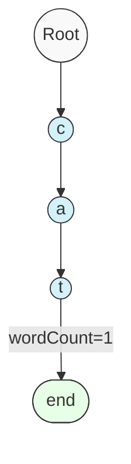
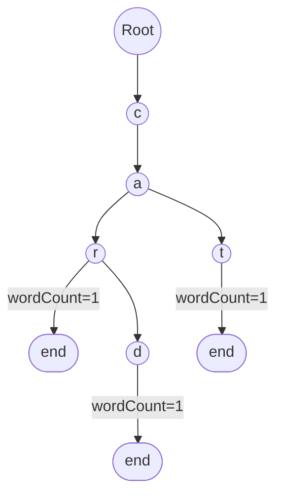

# 🏗️ Building the Foundation of Our Trie

Before we implement any operations, we need to understand and create the basic structure of a Trie.

## The Building Block: TrieNode 🧱

Every Trie is composed of interconnected nodes. Each node in our Trie will need:

1. A way to track its **children** (links to other characters)
2. A way to know if it represents the **end of a word**
3. Counters to track the **number of words and prefixes**

> [!NOTE]
> Unlike binary trees where nodes have at most 2 children, a Trie node can have multiple children - one for each possible character!

### Let's Code Our TrieNode

```javascript
class TrieNode {
  constructor() {
    // Store children characters with their corresponding nodes
    this.children = new Map();
    
    // Counter for complete words ending at this node
    this.wordCount = 0;
    
    // Counter for words that pass through this node (prefixes)
    this.prefixCount = 0;
  }
}
```

> [!TIP]
> We're using a Map instead of an array or object because it provides efficient key-value operations and can use any data type as keys, not just strings.

## The Trie Class 🌳

Now let's create our main Trie class that will use these nodes:

```javascript
class Trie {
  constructor() {
    // Start with an empty root node
    this.root = new TrieNode();
  }
  
  // We'll add our operations here in upcoming lessons
}
```

## Visualizing Our Structure

Let's visualize what happens when we insert the word "cat" into our Trie:



Each node holds a character, and we've marked the last node with `wordCount=1` to indicate a complete word ends there.

## How the Structure Enables Efficiency 🚀

The Trie structure achieves its efficiency through:

1. **Character sharing**: Common prefixes are stored only once
2. **Direct indexing**: When navigating the Trie, we directly access the next character's node
3. **Path representation**: Each path from root to a node represents a string

<details>
<summary>Why is this better than other data structures?</summary>

Compared to alternatives:

- **Hash Tables**: Tries excel at prefix operations which hash tables can't do efficiently
- **Arrays**: Tries don't require scanning the entire dataset for lookups
- **Binary Search Trees**: Tries offer O(m) lookups where m is string length, regardless of dataset size

</details>

## Memory Considerations 💭

While Tries are efficient for operations, they can use more memory than other structures:

> [!WARNING]
> For small datasets with few common prefixes, a Trie might consume more memory than simpler structures like hash tables.

This trade-off between time efficiency and space is a classic computer science consideration!

## Think About This 🤔

Imagine we want to store the words: "car", "cat", "card". 

How many nodes would our Trie have? Draw it out and count!

<details>
<summary>See the answer</summary>

The Trie would have 7 nodes total:
- 1 root node
- Nodes for 'c', 'a', 'r', 'd', 't'
- The 'r' node would be used in both "car" and "card"



</details>

In the next lesson, we'll implement our first operation: inserting words into the Trie! 