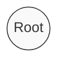
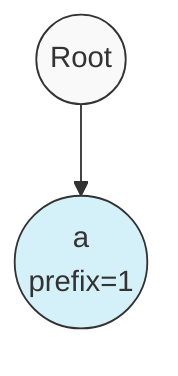
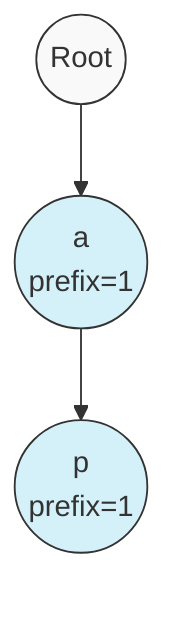
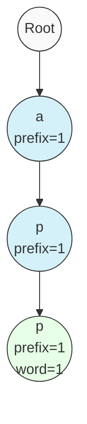
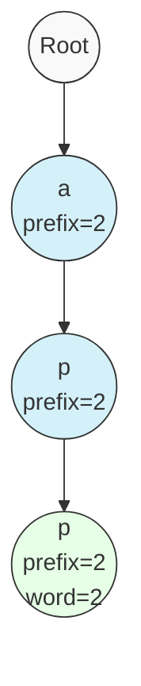
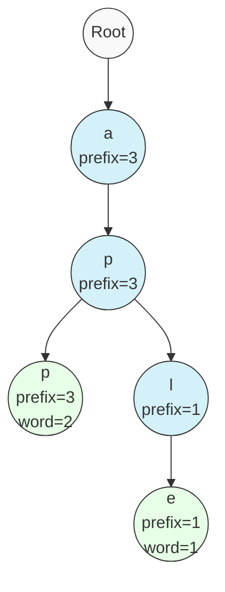
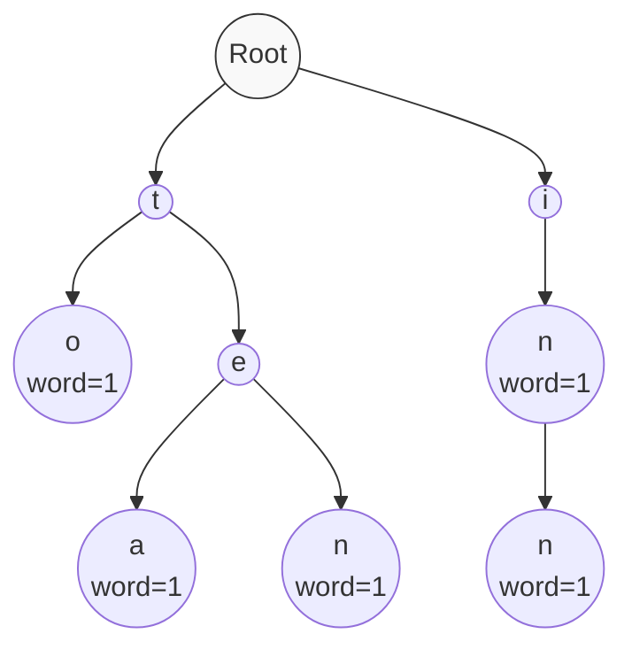

# 📥 Inserting Words into a Trie

Now that we have our basic Trie structure, let's implement our first and most fundamental operation: **inserting** a word into the Trie.

## The Insertion Process 🔄

When we insert a word into a Trie, we need to:

1. Start at the root node
2. Process the word **character by character**
3. For each character, check if a path exists and create one if it doesn't
4. Increment prefix counts along the way
5. Mark the end of the word by incrementing the word count at the final node

## Let's Code the Insert Method ⌨️

```javascript
insert(word) {
  // Start at the root of the Trie
  let node = this.root;
  
  // Process each character in the word
  for (const char of word) {
    // If this character doesn't exist as a child, create a new path
    if (!node.children.has(char)) {
      node.children.set(char, new TrieNode());
    }
    
    // Move to the child node
    node = node.children.get(char);
    
    // Increment the prefix count for this node
    node.prefixCount++;
  }
  
  // Mark the end of the word by incrementing the word count
  node.wordCount++;
}
```

> [!TIP]
> The `prefixCount` helps us quickly determine how many words pass through each node, which will be useful for operations like `countWordsStartingWith()`.

## Visualizing Insertion Step by Step 🔍

Let's visualize the process of inserting the word "app" into an empty Trie:

### Step 1: Start at the Root


### Step 2: Process 'a', Create New Node


### Step 3: Process 'p', Create New Node


### Step 4: Process 'p' Again, Create New Node


### Step 5: Mark the End of Word
We've incremented the `wordCount` to 1 at the final 'p' node.

## Handling Duplicates 🔄

What happens if we insert the same word twice? Let's insert "app" again:



Notice that:
- All `prefixCount` values increase along the path
- The `wordCount` at the final node increases to 2

This counter approach allows our Trie to handle duplicate words efficiently!

## Time and Space Complexity ⏱️

For inserting a word:

- **Time Complexity**: O(m) where m is the length of the word
- **Space Complexity**: O(m) in the worst case if we need to create a new node for each character

> [!NOTE]
> This is much more efficient than some operations in other data structures, particularly for string operations!

## Inserting Multiple Words: Prefix Sharing ✨

Let's see what happens when we insert a new word "apple" into our Trie that already contains "app":



Notice how:
- We reuse the existing prefix "app"
- Only add new nodes for the characters 'l' and 'e'
- The `prefixCount` increases for all shared nodes (a, p, p)

This prefix sharing is what makes Tries so powerful for storing related strings!

## 🧠 Exercise: Inserting into a Trie

Try inserting these words into a Trie on paper: "to", "tea", "ten", "in", "inn".

<details>
<summary>See the solution</summary>



</details>

## Next Up 🔜

In the next lesson, we'll implement the `search` method to find out if a word exists in our Trie! 