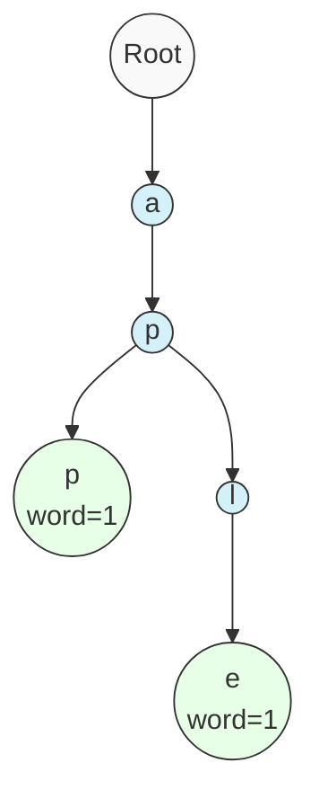
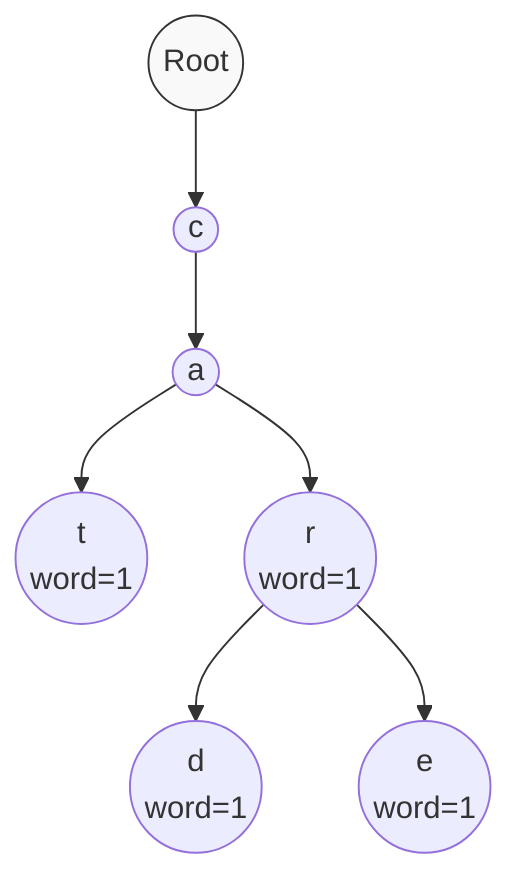

# 🔍 Searching for Words in a Trie

Now that we can insert words into our Trie, let's implement the `search` method to check if a specific word exists in our Trie.

## The Search Process 🔎

Searching for a word in a Trie follows a straightforward process:

1. Start at the root node
2. For each character in the word, follow the corresponding path in the Trie
3. If at any point the path doesn't exist, the word is not in the Trie
4. If we reach the end of the word, check if it's a complete word by looking at the `wordCount`

## Let's Code the Search Method ⌨️

```javascript
search(word) {
  // Start at the root of the Trie
  let node = this.root;
  
  // Process each character in the word
  for (const char of word) {
    // If this character doesn't exist as a child, the word is not in the Trie
    if (!node.children.has(char)) {
      return false;
    }
    
    // Move to the child node
    node = node.children.get(char);
  }
  
  // We've reached the end of the word
  // Return true if this is a complete word (wordCount > 0)
  return node.wordCount > 0;
}
```

> [!TIP]
> Notice how we need to check `wordCount > 0` at the end. Just because we can follow a path doesn't mean it's a word - it could just be a prefix of another word!

## Visualizing the Search 🖼️

Let's visualize searching in a Trie that contains "app" and "apple":



### Scenario 1: Searching for "app" ✅

1. Follow path: root → a → p → p
2. Arrive at node with `wordCount = 1`
3. Return `true` (word exists)

### Scenario 2: Searching for "ap" ❌

1. Follow path: root → a → p
2. Arrive at node with `wordCount = 0` (no word ends here)
3. Return `false` (not a complete word)

### Scenario 3: Searching for "apis" ❌

1. Follow path: root → a → p
2. Try to follow 'i', but no such child exists
3. Return `false` immediately (path doesn't exist)

## The Critical Distinction: Words vs. Prefixes 📝

A key insight about Tries is that **not every valid path represents a word**. Consider this distinction:

- **Word**: A complete string intentionally inserted into the Trie (`wordCount > 0`)
- **Prefix**: A partial path that might lead to one or more words but isn't necessarily a word itself

> [!NOTE]
> This is why checking `wordCount > 0` at the end of our search is crucial!

## Edge Cases ⚠️

What about these edge cases?

1. **Empty String**: If we search for `""` (empty string), we'll immediately reach the end of the "word" and check the `wordCount` of the root node (which is 0 by default)
2. **Non-Existent Prefixes**: If the beginning of the word doesn't even exist in the Trie, we'll quickly return false

## Time and Space Complexity ⏱️

For searching a word:

- **Time Complexity**: O(m) where m is the length of the word
- **Space Complexity**: O(1) - we only need a few variables regardless of input size

## 🧠 Thinking Exercise

Given this Trie containing ["cat", "car", "card", "care"]:



<details>
<summary>What would the following searches return?</summary>

- `search("cat")` → `true` (complete word)
- `search("ca")` → `false` (valid prefix but not a word)
- `search("care")` → `true` (complete word)
- `search("card")` → `true` (complete word)
- `search("cars")` → `false` (path doesn't exist)
- `search("")` → `false` (empty string, not inserted)

</details>

## Next Up 🔜

In the next lesson, we'll learn how to check if any word in our Trie starts with a given prefix using the `startsWith` method! 