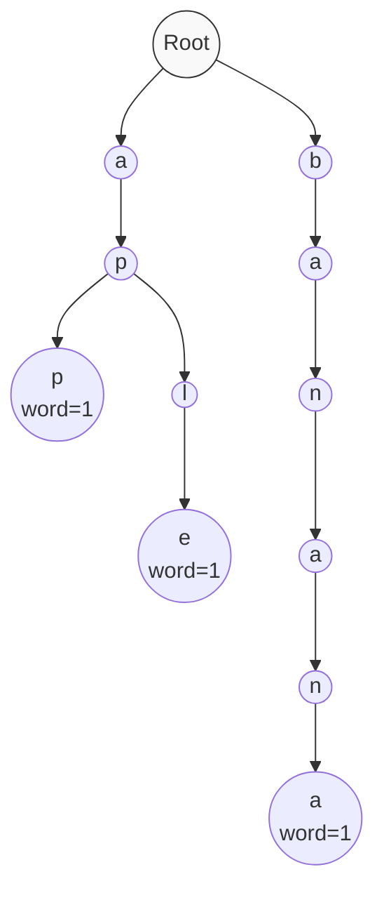
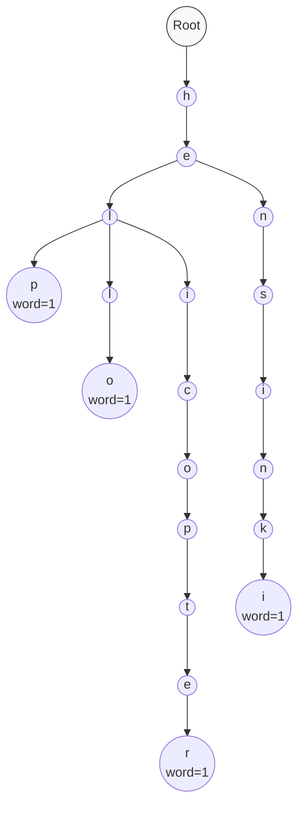

# 🔖 Checking for Prefixes in a Trie

One of the most powerful features of a Trie is its ability to efficiently find all words that share a common prefix. In this lesson, we'll implement the `startsWith` method to check if any word in our Trie starts with a given prefix.

## The Prefix Check Process 🔄

The process for checking prefixes is similar to searching for words:

1. Start at the root node
2. For each character in the prefix, follow the corresponding path in the Trie
3. If at any point the path doesn't exist, no word starts with this prefix
4. If we successfully reach the end of the prefix, check if this node has any descendants that form complete words

## Let's Code the StartsWith Method ⌨️

```javascript
startsWith(prefix) {
  // Start at the root of the Trie
  let node = this.root;
  
  // Process each character in the prefix
  for (const char of prefix) {
    // If this character doesn't exist as a child, no word starts with this prefix
    if (!node.children.has(char)) {
      return false;
    }
    
    // Move to the child node
    node = node.children.get(char);
  }
  
  // We've reached the end of the prefix
  // Return true if this node has any words passing through it
  return node.prefixCount > 0;
}
```

> [!TIP]
> We're using the `prefixCount` property we've been tracking during insertion. This makes the prefix check extremely efficient!

## Why We Need PrefixCount 📊

The `prefixCount` of a node tells us how many complete words pass through this node. This is different from `wordCount`, which only tells us how many words end at this node.

For example, in a Trie with words ["car", "card"]:
- The node for 'r' would have `wordCount = 1` (because "car" ends here)
- But its `prefixCount` would be 2 (because both "car" and "card" pass through here)

## Visualizing Prefix Checking 🖼️

Let's visualize checking prefixes in a Trie that contains "app", "apple", and "banana":



### Scenario 1: Checking prefix "ap" ✅

1. Follow path: root → a → p
2. Arrive at 'p' node with `prefixCount > 0` (words pass through here)
3. Return `true` (prefix exists)

### Scenario 2: Checking prefix "app" ✅

1. Follow path: root → a → p → p
2. Arrive at 'p' node with `prefixCount > 0`
3. Return `true` (prefix exists)

### Scenario 3: Checking prefix "z" ❌

1. Try to follow 'z' from root, but no such child exists
2. Return `false` immediately (path doesn't exist)

## The Power of Prefix Checking 💡

This ability to quickly check for prefixes is what makes Tries especially valuable for:

- **Autocomplete systems**: Suggesting completions as users type
- **Spell checking**: Finding similar words by prefix
- **Search engines**: Matching partial queries efficiently

> [!NOTE]
> Without a Trie, checking for all words with a given prefix would require scanning the entire word list!

## Practical Example: Autocomplete 🚀

Let's see how this would work in an autocomplete system:

1. User types "ap"
2. We call `startsWith("ap")` which returns `true`
3. We could then traverse the Trie from the "ap" node to find all possible completions: "app", "apple", etc.

> [!TIP]
> While we're not implementing the retrieval of all matching words in this lesson, it would be a natural extension of the `startsWith` method!

## Edge Cases ⚠️

Consider these edge cases:

1. **Empty Prefix**: If we check for `""` (empty string), we'll return `true` if the Trie contains any words at all
2. **Prefix is a Word**: A string can be both a complete word and a prefix for other words

## Time and Space Complexity ⏱️

For checking if any word starts with a prefix:

- **Time Complexity**: O(p) where p is the length of the prefix
- **Space Complexity**: O(1) - we only need a few variables

## 🧠 Exercise: Prefix Checking

Given this Trie containing ["help", "hello", "helicopter", "helsinki"]:



<details>
<summary>What would the following prefix checks return?</summary>

- `startsWith("he")` → `true` (leads to all four words)
- `startsWith("help")` → `true` (leads to "help" and "helicopter")
- `startsWith("hel")` → `true` (leads to all four words)
- `startsWith("helsink")` → `true` (leads to "helsinki")
- `startsWith("hm")` → `false` (path doesn't exist)
- `startsWith("")` → `true` (empty prefix matches everything)

</details>

## Next Up 🔜

In the next lesson, we'll implement methods to count words in our Trie! 