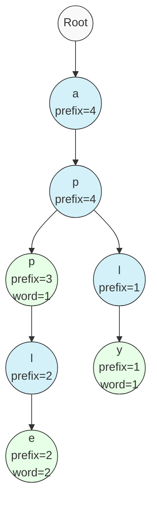
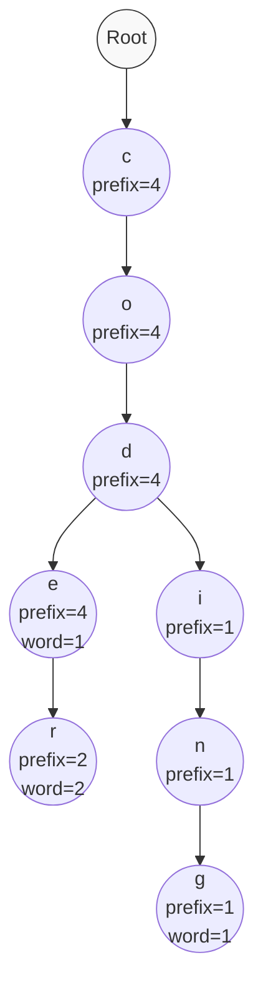

# 🔢 Counting Words in a Trie

One of the advantages of our Trie implementation is that we've been tracking word and prefix counts, making it easy to implement powerful counting operations. In this lesson, we'll implement two counting methods:

1. `countWordsEqualTo(word)`: Count the occurrences of a specific word
2. `countWordsStartingWith(prefix)`: Count all words that start with a given prefix

## Counting Exact Words 📊

The first method allows us to count how many times a specific word has been inserted into our Trie.

### Let's Code the CountWordsEqualTo Method ⌨️

```javascript
countWordsEqualTo(word) {
  // Start at the root of the Trie
  let node = this.root;
  
  // Process each character in the word
  for (const char of word) {
    // If this character doesn't exist as a child, the word is not in the Trie
    if (!node.children.has(char)) {
      return 0;
    }
    
    // Move to the child node
    node = node.children.get(char);
  }
  
  // We've reached the end of the word
  // Return the wordCount at this node
  return node.wordCount;
}
```

> [!NOTE]
> This is very similar to our `search` method, but instead of returning a boolean, we return the actual count of words.

## Counting Words with a Prefix 📈

The second method counts how many words in our Trie start with a given prefix.

### Let's Code the CountWordsStartingWith Method ⌨️

```javascript
countWordsStartingWith(prefix) {
  // Start at the root of the Trie
  let node = this.root;
  
  // Process each character in the prefix
  for (const char of prefix) {
    // If this character doesn't exist as a child, no word starts with this prefix
    if (!node.children.has(char)) {
      return 0;
    }
    
    // Move to the child node
    node = node.children.get(char);
  }
  
  // We've reached the end of the prefix
  // Return the prefixCount at this node
  return node.prefixCount;
}
```

> [!TIP]
> Notice how we're leveraging the `prefixCount` we've been maintaining during insertion. This is why we took the time to track this value!

## Visualizing Counting Operations 🖼️

Let's visualize these operations in a Trie with words: "apple" (inserted twice), "app" (inserted once), and "apply" (inserted once):



### Scenario 1: Counting "apple" 🍎

1. Follow path: root → a → p → p → l → e
2. Check `wordCount` at final node, which is 2
3. Return 2 (word occurs twice)

### Scenario 2: Counting words with prefix "ap" 🔤

1. Follow path: root → a → p
2. Check `prefixCount` at final node, which is 4
3. Return 4 (four words start with "ap")

### Scenario 3: Counting words with prefix "appl" 📝

1. Follow path: root → a → p → p → l
2. Check `prefixCount` at final node, which is 2
3. Return 2 (two words start with "appl")

## Why Counting Operations Matter 💡

These counting operations are extremely valuable in many applications:

- **Search engines**: Showing how many results match a query
- **Autocomplete systems**: Ranking suggestions by frequency
- **Text analytics**: Analyzing word frequencies in documents
- **Data storage**: Maintaining a compact frequency dictionary

> [!NOTE]
> Without our prefix and word counter design, these operations would require expensive traversals of the Trie!

## Edge Cases ⚠️

Consider these edge cases:

1. **Empty String**: Counting words equal to `""` will return 0 unless we explicitly inserted the empty string
2. **Non-existent Words/Prefixes**: Both methods properly return 0 for paths that don't exist

## Time and Space Complexity ⏱️

For both counting operations:

- **Time Complexity**: O(m) where m is the length of the word/prefix
- **Space Complexity**: O(1) - we only use a few variables

## Real-World Application: Word Frequency Analysis 📊

Imagine you're building a text editor that suggests the most common words as users type. With our Trie:

1. Insert each word from a large corpus, incrementing counts for duplicates
2. When a user types a prefix, use `countWordsStartingWith` to determine if suggestions are likely
3. Traverse from that prefix node to find the most frequent completions (based on wordCount)

This is exactly how many modern predictive text systems work!

## 🧠 Exercise: Counting in a Trie

Given this Trie with the following insertion history:
- "code" inserted once
- "coder" inserted twice
- "coding" inserted once



<details>
<summary>What would the following counting operations return?</summary>

- `countWordsEqualTo("code")` → `1` (inserted once)
- `countWordsEqualTo("coder")` → `2` (inserted twice)
- `countWordsEqualTo("cod")` → `0` (not a complete word)
- `countWordsStartingWith("cod")` → `4` (all four words start with "cod")
- `countWordsStartingWith("coder")` → `2` (only "coder" starts with "coder")
- `countWordsStartingWith("x")` → `0` (no words start with "x")

</details>

## Next Up 🔜

In the next lesson, we'll learn how to remove words from our Trie by implementing the `erase` method! 