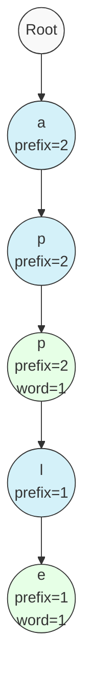
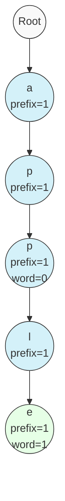
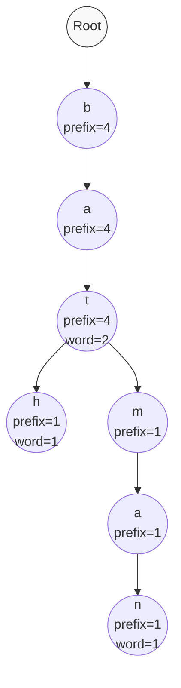
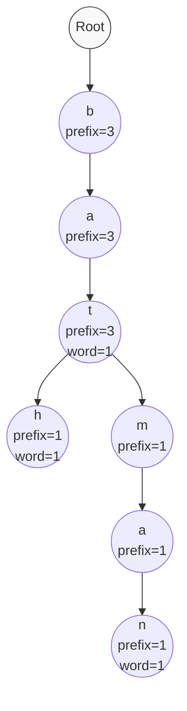

# 🗑️ Removing Words from a Trie

So far, we've learned how to add words to our Trie and perform various lookup operations. Now let's implement the final core operation: removing (erasing) words from our Trie using the `erase` method.

## The Challenge of Word Removal 🤔

Removing a word from a Trie is more complex than removal in simpler data structures because:

1. We need to maintain the integrity of other words that share prefixes
2. We need to update all the prefix and word counts along the path
3. We don't want to leave "orphaned" nodes that are no longer part of any word

## Let's Code the Erase Method ⌨️

```javascript
erase(word) {
  // First check if the word exists
  if (!this.search(word)) return;
  
  // Start at the root of the Trie
  let node = this.root;
  
  // Process each character in the word
  for (const char of word) {
    // Get the child node
    let child = node.children.get(char);
    
    // Decrement the prefix count
    child.prefixCount--;
    
    // Move to the child node
    node = child;
  }
  
  // Decrement the word count at the final node
  node.wordCount--;
}
```

> [!TIP]
> Notice how we first check if the word exists before attempting to erase it. This prevents us from incorrectly decrementing counts for words that aren't in the Trie.

## Understanding the Erase Logic 🧩

Our approach to erasing words focuses on maintaining accurate counts:

1. We verify the word exists using our `search` method
2. We traverse to each node along the word's path
3. We decrement the `prefixCount` at each node
4. We decrement the `wordCount` at the final node

Importantly, we're not physically removing nodes from the Trie structure. Instead, we're updating the counts to reflect that a word has been removed.

## Visualizing Erasure 🖼️

Let's see what happens when we erase a word from our Trie. Consider a Trie with words "app" (inserted once) and "apple" (inserted once):



### After Erasing "app"



Notice how:
- All nodes along the path from root to "app" have their `prefixCount` decremented
- The final 'p' node has its `wordCount` decremented to 0
- The structure remains intact because "apple" still needs these nodes

## Node Cleanup Strategy 🧹

In our current implementation, we don't physically remove nodes, even when their counts reach 0. This is a design choice that:

- Simplifies the implementation
- Keeps the Trie ready for future insertions
- Avoids complex node deletion logic

> [!NOTE]
> In memory-constrained environments, you might want to extend the `erase` method to physically remove nodes when their `prefixCount` reaches 0, but this requires more complex recursive deletion logic.

## Handling Edge Cases ⚠️

Our implementation handles these important edge cases:

1. **Word Not in Trie**: We check if the word exists before attempting to erase it
2. **Multiple Insertions**: If a word was inserted multiple times, one call to `erase` only removes a single instance
3. **Shared Prefixes**: Words that share prefixes with the erased word remain intact

## Time and Space Complexity ⏱️

For erasing a word:

- **Time Complexity**: O(m) where m is the length of the word
- **Space Complexity**: O(1) - we only use a few variables

## Potential Enhancements 🚀

While our implementation is solid, here are some potential enhancements:

1. **Recursive Node Deletion**: Physically remove nodes when they're no longer needed
2. **Batch Erasure**: Efficiently remove multiple instances of a word at once
3. **Node Compression**: Merge single-child nodes to save space (creating a compressed trie)

> [!TIP]
> For most applications, the current implementation is sufficient and provides a good balance of simplicity and efficiency.

## Real-World Application: Dynamic Dictionary 📖

Imagine you're building a spell checker with a custom dictionary. The user can:

1. Add new words to the dictionary (insert)
2. Check if a word is spelled correctly (search)
3. Remove words they accidentally added (erase)

Our Trie implementation perfectly supports this use case!

## 🧠 Exercise: Practicing Erasure

Given this Trie containing ["bat", "bath", "bat", "batman"]:



<details>
<summary>What would the Trie look like after erasing one instance of "bat"?</summary>



Only the counts change:
- The prefixCount along the path "b" → "a" → "t" decreases by 1
- The wordCount at the "t" node decreases from 2 to 1
- All other nodes remain unchanged

</details>

## Next Up 🔜

In our final lesson, we'll bring everything together and discuss optimizations and variations of the Trie data structure! 